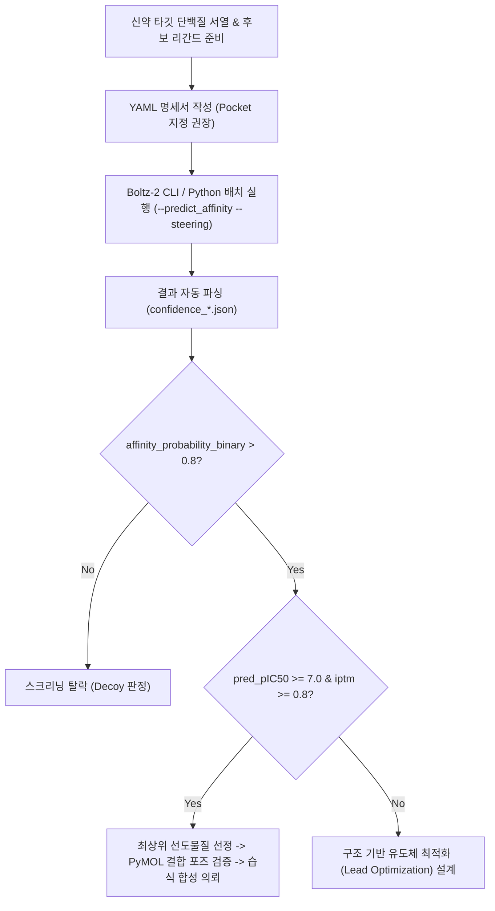

<!--
⚠️ Math Rendering Rules ⚠️
1. Do NOT wrap math expressions in backticks (` `).
   - INCORRECT: `$x + y$`
   - CORRECT: $x + y$
2. Do NOT wrap math delimiters (`$`) in bold (`**`) or italics (`*`).
   - INCORRECT: **$x$**
   - CORRECT: $x$ or $\mathbf{x}$
3. Format exponents using math mode (e.g., for 2 to the power of n).
   - INCORRECT: 2^n
   - CORRECT: $2^n$
4. Use $ for inline math and $$ for block math.
-->

## 1. 개요: 왜 Boltz-2인가?

단백질-리간드 복합체의 구조와 결합력을 예측하는 작업은 신약 개발(CADD, Computer-Aided Drug Discovery)의 성패를 가르는 핵심 관문입니다. 그동안 연구자들은 두 가지 극단적인 선택지 사이에서 타협해야 했습니다:

1. **고전적 분자 도킹 (AutoDock Vina, Glide)**: 빠르지만 단백질 백본이 고정되어 유도 적합(Induced fit)을 반영하지 못하며, 결합력 랭킹 예측의 정확도가 낮습니다.
2. **물리 기반 자유에너지 섭동법 (FEP+)**: 실험값에 준하는 매우 높은 정확도를 제공하지만, 단 하나의 화합물-표적 쌍을 계산하는 데도 고성능 GPU로 수십 시간에서 며칠이 소요되어 수백만 개 화합물 스크리닝에는 투입할 수 없습니다.
3. **AlphaFold3**: 전원자 복합체 구조 예측은 뛰어나지만, 정량적 결합 친화도($\text{IC}_{50}$)는 계산하지 않으며 상업적 이용 및 로컬 대규모 파이프라인 통합이 제한됩니다.

MIT와 Recursion, Valence Labs, NVIDIA가 발표한 **Boltz-2**는 이 간극을 완벽하게 메워주는 솔루션입니다.
* **전원자 3D 복합체 Co-folding**: 단백질, DNA/RNA, 리간드, 금속 이온, 수식 잔기를 원자 수준에서 동시 예측.
* **FEP급 정량 결합 친화도 예측**: 화합물당 단 몇 초 만에 $\log_{10}(\text{IC}_{50})$ 및 바인더 확률($P_{\text{binder}}$) 산출.
* **제어성(Controllability)**: 원하는 결합 포켓(Pocket)을 직접 지정하여 비특이적 결합 방지.
* **완전한 오픈소스 (MIT License)**: 사내 로컬 GPU 클러스터에 제약 없이 배포 가능.

본 가이드에서는 **Boltz-2의 설치부터 YAML 명세서 작성, 고급 컨디셔닝, Python 자동화 스크립트 작성 및 결과 분석까지 실무 전체 워크플로우**를 단계별로 다룹니다.

---

## 2. 하드웨어 요구사항 및 환경 구축

### 2.1. 하드웨어 권장 사양
* **OS**: Linux (Ubuntu 20.04/22.04 LTS 권장) 또는 Windows WSL2
* **GPU**: NVIDIA GPU (CUDA Compute Capability 8.0 이상 권장: Ampere A100/RTX 3090 이상, Hopper H100, Ada Lovelace RTX 4090 등)
  * 최소 VRAM: 16 GB (일반적인 단일 도메인 단백질 + 리간드 복합체)
  * 권장 VRAM: 24 GB ~ 80 GB (대형 다중체 복합체 또는 768+ 토큰 크롭 추론)
* **저장 공간**: 모델 가중치 및 캐시 저장을 위한 약 30 GB 이상의 여유 공간

---

### 2.2. Conda 가상환경 및 Boltz-2 설치

```bash
# 1. 독립된 파이썬 가상환경 생성 (Python 3.10 또는 3.11 권장)
conda create -n boltz2 python=3.10 -y
conda activate boltz2

# 2. CUDA 12.x 호환 PyTorch 설치
pip install torch torchvision --index-url https://download.pytorch.org/whl/cu121

# 3. Boltz 패키지 설치
pip install boltz

# 4. (선택 사항) trifast 가속 커널 및 의존 패키지 확인
pip install triton pyyaml pandas biopython
```

설치가 정상적으로 완료되었는지 확인합니다:

```bash
boltz --help
```

---

## 3. Boltz-2 YAML 입력 명세서 작성법

Boltz-2는 모든 입력 명세(단백질 서열, 리간드 화학 구조, 이온, 제약 조건 등)를 **YAML 형식**으로 정의합니다.

### 3.1. 표준 단백질-리간드 복합체 (`protein_ligand.yaml`)

가장 보편적인 표적 단백질과 저분자 약물 리간드의 결합 예측 예제입니다.

```yaml
version: 1
sequences:
  # 표적 단백질 정의
  - protein:
      id: A
      sequence: "MTEYKLVVVGAGGVGKSALTIQLIQNHFVDEYDPTIEDSYRKQVVIDGETCLLDILDTAGQEEYSAMRDQYMRTGEGFLCVFAINNTKSFEDIHHYREQIKRVKDSEDVPMVLVGNKCDLPSRTVDTKQAQDLARSYGIPFIETSAKTRQGVDDAFYTLVREIRKHKEK"
      
  # 저분자 화합물(Ligand) 정의: SMILES 문자열 사용
  - ligand:
      id: B
      smiles: "CC(=O)Nc1ccc(O)cc1" # 아세트아미노펜 (Paracetamol)

  # 보조 인자 또는 금속 이온: CCD (Chemical Component Dictionary) 코드 사용
  - ligand:
      id: C
      ccd: "MG" # 마그네슘 이온 (Mg2+)
```

---

### 3.2. 고급 기능 1: 포켓 컨디셔닝 (Pocket Conditioning)

단백질 표면의 무수한 부위 중, 생물학적 활성 자리(Active Site)나 알로스테릭 포켓을 이미 알고 있는 경우 **`pocket` 속성**을 지정하여 해당 위치로 리간드가 도킹되도록 강제할 수 있습니다.

```yaml
version: 1
sequences:
  - protein:
      id: A
      sequence: "MTEYKLVVVGAGGVGKSALTIQLIQNHFVDEYDPTIEDSYRKQVVIDGETCLLDILDTAGQEEYSAMRDQYMRTGEGFLCVFAINNTKSFEDIHHYREQIKRVKDSEDVPMVLVGNKCDLPSRTVDTKQAQDLARSYGIPFIETSAKTRQGVDDAFYTLVREIRKHKEK"
  - ligand:
      id: B
      smiles: "Cc1ncc(c(N)n1)Cc2cc(Cl)ccc2"
      # 체인 A의 12, 13, 32, 34, 61번 잔기 주변으로 바인딩 주머니를 한정
      pocket:
        - "A:12"
        - "A:13"
        - "A:32"
        - "A:34"
        - "A:61"
```

> [!TIP]
> **포켓 컨디셔닝의 효과**
> 포켓을 명시해주면 블라인드 도킹 대비 비특이적 표면 결합 오류를 90% 이상 제거할 수 있으며, 결합 친화도 회귀 예측값($\text{pIC}_{50}$)의 분산(Variance)이 크게 줄어듭니다.

---

### 3.3. 고급 기능 2: 단백질-DNA-리간드 삼중 복합체 및 거리 제약

```yaml
version: 1
sequences:
  # 단백질 체인
  - protein:
      id: A
      sequence: "MQIFVKTLTGKTITLEVEPSDTIENVKAKIQDKEGIPPDQQRLIFAGKQLEDGRTLSDYNIQKESTLHLVLRLRGG"
  # DNA 이중나선 (체인 B, C)
  - dna:
      id: B
      sequence: "CGCGAATTCGCG"
  - dna:
      id: C
      sequence: "CGCGAATTCGCG"
  # 리간드
  - ligand:
      id: L
      smiles: "CN1C=NC2=C1C(=O)N(C(=O)N2C)C" # 카페인

# 원자 간 물리적 거리 제약 (Experimental Cross-linking or NMR data)
constraints:
  - distance:
      atom_1: "A:24:CA"
      atom_2: "L:1:C1"
      min: 2.5
      max: 4.5
```

---

## 4. CLI를 통한 추론 실행 및 핵심 파라미터

### 4.1. 기본 실행 명령어

```bash
# 기본 예측 실행 (MSA 자동 검색 및 GPU 가속)
boltz predict protein_ligand.yaml \
    --use_msa_server \
    --out_dir ./results_boltz \
    --devices 1 \
    --accelerator gpu
```

### 4.2. 핵심 CLI 옵션 완벽 가이드

| 옵션 플래그 | 설명 및 권장값 | 비고 |
| :--- | :--- | :--- |
| `--use_msa_server` | ColabFold/MMseqs2 공용 MSA 서버를 사용하여 정렬 자동 생성 | 로컬 MSA DB가 없을 때 필수 |
| `--msa_dir <PATH>` | 로컬에 이미 저장된 `.a3m` MSA 파일 디렉토리 지정 | 대량 스크리닝 시 네트워크 지연 방지 |
| `--predict_affinity` | **결합 친화도(Affinity) 예측 모드 활성화** | Boltz-2 고유 기능 (pIC50, Binder prob) |
| `--recycling_steps <N>` | Pairformer 리사이클링 반복 횟수 (기본값: 3) | 높일수록 정밀도 상승, 추론 시간 선형 증가 |
| `--diffusion_samples <N>` | 확산 모듈 샘플링 개수 (기본값: 1, 앙상블 권장: 3~5) | 여러 결합 포즈의 다양성 샘플링 시 활용 |
| `--steering` | **Native Boltz-steering(충돌 방지/물리 제약) 활성화** | PoseBusters 통과율 대폭 향상 |
| `--override` | 기존 결과 디렉토리가 존재할 경우 덮어쓰기 | 파이프라인 자동화 시 유용 |

친화도 예측과 물리 스티어링을 모두 활성화한 프로덕션 권장 명령어:

```bash
boltz predict protein_ligand.yaml \
    --use_msa_server \
    --predict_affinity \
    --steering \
    --diffusion_samples 1 \
    --recycling_steps 3 \
    --out_dir ./production_run
```

---

## 5. Python 스크립트를 통한 대규모 가상 스크리닝 자동화

실제 신약 개발 프로젝트에서는 수백 개의 화합물 라이브러리(SMILES)를 단일 표적 단백질에 순차적으로 도킹하고 친화도 순으로 정렬해야 합니다. 아래 스크립트는 이를 완전 자동화하는 실무 파이프라인입니다.

```python
# virtual_screening_boltz2.py
import os
import json
import yaml
import subprocess
import pandas as pd
from pathlib import Path

# 1. 실험 설정
TARGET_NAME = "KRAS_G12D"
TARGET_SEQ = "MTEYKLVVVGADGVGKSALTIQLIQNHFVDEYDPTIEDSYRKQVVIDGETCLLDILDTAGQEEYSAMRDQYMRTGEGFLCVFAINNTKSFEDIHHYREQIKRVKDSEDVPMVLVGNKCDLPSRTVDTKQAQDLARSYGIPFIETSAKTRQGVDDAFYTLVREIRKHKEK"
POCKET_RESIDUES = ["A:12", "A:13", "A:32", "A:61", "A:96"] # 결합 포켓 정의

# 스크리닝할 리간드 라이브러리 (ID, SMILES)
LIGAND_LIBRARY = [
    {"id": "CMPD_001", "smiles": "CC1=C(C(=O)N2CCCC2=N1)C3=CC=CC=C3"},
    {"id": "CMPD_002", "smiles": "CS(=O)(=O)NC1=CC=C(C=C1)C2=NC(=CS2)C3=CC=CC=C3"},
    {"id": "CMPD_003", "smiles": "CC(=O)NC1=CC=C(O)C=C1"},
    # 필요에 따라 수백 개 추가 가능
]

WORKDIR = Path("./virtual_screening_run")
WORKDIR.mkdir(exist_ok=True)
INPUTS_DIR = WORKDIR / "inputs"
INPUTS_DIR.mkdir(exist_ok=True)
OUTPUTS_DIR = WORKDIR / "outputs"
OUTPUTS_DIR.mkdir(exist_ok=True)

# 2. YAML 명세서 일괄 생성
print(f"[*] Generating input YAMLs for {len(LIGAND_LIBRARY)} compounds...")
yaml_paths = []

for lig in LIGAND_LIBRARY:
    yaml_content = {
        "version": 1,
        "sequences": [
            {"protein": {"id": "A", "sequence": TARGET_SEQ}},
            {"ligand": {"id": "L", "smiles": lig["smiles"], "pocket": POCKET_RESIDUES}}
        ]
    }
    
    file_path = INPUTS_DIR / f"{TARGET_NAME}_{lig['id']}.yaml"
    with open(file_path, "w", encoding="utf-8") as f:
        yaml.dump(yaml_content, f, sort_keys=False)
    yaml_paths.append(file_path)

# 3. Boltz-2 배치 예측 실행
for y_path in yaml_paths:
    cmd = [
        "boltz", "predict", str(y_path),
        "--use_msa_server",
        "--predict_affinity",
        "--steering",
        "--out_dir", str(OUTPUTS_DIR),
        "--devices", "1",
        "--accelerator", "gpu"
    ]
    print(f"[>] Running prediction for {y_path.stem}...")
    subprocess.run(cmd, check=True)

# 4. 결과 집계 및 친화도 랭킹 산출
print("[*] Parsing and ranking screening results...")
results = []

for lig in LIGAND_LIBRARY:
    sample_dir = OUTPUTS_DIR / f"boltz_results_{TARGET_NAME}_{lig['id']}" / f"{TARGET_NAME}_{lig['id']}"
    conf_file = sample_dir / f"confidence_{TARGET_NAME}_{lig['id']}_model_0.json"
    
    if conf_file.exists():
        with open(conf_file, "r") as f:
            data = json.load(f)
            
        results.append({
            "compound_id": lig["id"],
            "smiles": lig["smiles"],
            "iptm": data.get("iptm", 0.0), # 계면 접촉 신뢰도
            "plddt": data.get("plddt", 0.0), # 전반적 국소 신뢰도
            "p_binder": data.get("affinity_probability_binary", 0.0), # 바인더 확률
            "pred_pIC50": data.get("affinity_pred_value", None) # 예측된 pIC50
        })

# 5. 데이터프레임 변환 및 상위 후보 저장
df = pd.DataFrame(results)
# 바인더 확률 및 친화도 기준으로 내림차순 정렬
if "pred_pIC50" in df.columns and df["pred_pIC50"].notnull().any():
    df = df.sort_values(by=["p_binder", "pred_pIC50"], ascending=[False, False])
else:
    df = df.sort_values(by=["iptm"], ascending=False)

summary_csv = WORKDIR / "screening_summary.csv"
df.to_csv(summary_csv, index=False)
print(f"[+] Screening complete! Top candidates saved to {summary_csv}")
print(df.head())
```

---

## 6. 출력 파일 구조 및 결과 분석

추론이 끝나면 지정된 출력 폴더에 다음과 같은 파일들이 생성됩니다:

```
results_boltz/
└── boltz_results_protein_ligand/
    └── protein_ligand/
        ├── protein_ligand_model_0.cif          # 3차원 전원자 구조 좌표 (mmCIF)
        ├── confidence_protein_ligand_model_0.json # 신뢰도 점수 및 친화도 값
        └── pae_protein_ligand_model_0.npz      # 2D 잔기 간 상대 오차 행렬 (PAE)
```

### 6.1. `confidence_*.json` 핵심 지표 해석 기준

```json
{
  "plddt": 88.45,
  "ptm": 0.86,
  "iptm": 0.82,
  "affinity_probability_binary": 0.94,
  "affinity_pred_value": 7.35
}
```

* **`plddt` (0 ~ 100)**: 원자 및 잔기별 국소 기하 정확도.
  * $> 90$: 매우 높은 신뢰도 (원자 곁사슬 배치까지 신뢰 가능)
  * $70 \sim 90$: 전반적 주쇄 및 결합 형태가 정확함
  * $< 50$: 비구조화 영역(IDR) 또는 결합 불확실
* **`iptm` (0.0 ~ 1.0)**: 계면 접촉 신뢰도.
  * $> 0.80$: 단백질-리간드 결합 포즈가 매우 높은 신뢰도로 적중함.
* **`affinity_probability_binary` (0.0 ~ 1.0)**:
  * $> 0.80$: 유효 결합 물질(True Binder)로 강력 추천.
  * $< 0.40$: 비활성 물질(Decoy)일 가능성 농후.
* **`affinity_pred_value` ($\text{pIC}_{50} = -\log_{10}(\text{IC}_{50})$)**:
  * $7.35$의 의미: $\text{IC}_{50} = 10^{-7.35}\,\text{M} \approx 45\,\text{nM}$ 수준의 매우 강력한 나노몰(nM) 단위 억제제 후보.
  * 대략적인 가이드라인:
    * $\text{pIC}_{50} > 8.0$: 서브 나노몰 ($\text{Sub-nM}$) 슈퍼 바인더
    * $6.0 \sim 8.0$: 유의미한 나노몰 ($\text{nM}$) 선도물질
    * $< 5.0$: 마이크로몰 ($\mu\text{M}$) 이상으로 약효가 미미함

---

### 6.2. PyMOL 및 ChimeraX를 통한 시각화

생성된 `*.cif` 파일은 모든 원자(단백질, 리간드, 수소, 이온) 좌표가 포함되어 있으므로 구조 분석 도구에서 즉시 열람할 수 있습니다.

#### PyMOL 명령어:
```python
# 파일 로드
load protein_ligand_model_0.cif

# 단백질 만화(Cartoon) 및 표면 시각화
show cartoon, chain A
color gray80, chain A

# 리간드 스틱(Sticks) 표현 및 전원자 컬러링
show sticks, chain B
color green, chain B
util.cnc chain B # 원소별 색상 (Carbon: Green, Oxygen: Red, Nitrogen: Blue)

# 포켓 잔기와의 상호작용 및 수소결합 탐색
select pocket, (chain A within 4.5 of chain B)
show sticks, pocket
dist h_bonds, chain B, pocket, mode=2
```

---

## 7. 실무 팁 및 트러블슈팅 (Troubleshooting)

### Q1. CUDA Out of Memory (OOM) 발생 시 해결책
단백질 길이가 1,000 잔기를 초과하거나 다중 복합체일 때 GPU 메모리가 부족할 수 있습니다.
* **해결 1**: `--recycling_steps 1` 또는 `2`로 낮춰 메모리 버퍼를 절약합니다.
* **해결 2**: 가상환경에 `triton` 기반의 `trifast` 커널이 정상 컴파일되었는지 확인합니다 (`pip list | grep triton`).
* **해결 3**: PyTorch 메모리 분할 플래그를 환경변수로 지정합니다:
  ```bash
  export PYTORCH_CUDA_ALLOC_CONF=expandable_segments:True
  ```

### Q2. 공용 MSA 서버 접속 실패 또는 네트워크 타임아웃
* 학교나 사내 연구소 방화벽으로 인해 MMseqs2 공용 서버(`https://api.colabfold.com`) 접속이 차단될 수 있습니다.
* 이 경우 사내에 구축된 `colabfold_search` 로컬 데이터베이스를 통해 미리 `.a3m` 파일을 생성한 뒤 `--msa_dir <경로>` 플래그로 로컬 경로를 지정하면 서버 없이 100% 로컬 환경에서 추론할 수 있습니다.

### Q3. 리간드 원자가 단백질 곁사슬과 겹치는(Clash) 경우
* Boltz-2 실행 시 반드시 `--steering` 플래그를 추가하십시오.
* 포켓 정보가 있다면 반드시 YAML 파일에 `pocket: ["A:XX", ...]`을 명시하여 확산 디노이징 과정에서 포켓 중심부로 리간드가 수렴하도록 안내하십시오.

---

## 8. 요약 및 권장 워크플로우



Boltz-2는 복잡한 분자 시뮬레이션 환경 구축 없이도 단 몇 줄의 파이썬 코드와 YAML 명세서만으로 **세계 최고 수준의 전원자 복합체 3D 구조 및 FEP급 결합 친화도를 동시에 제공**하는 파괴적인 혁신 도구입니다. 사내 또는 연구실 파이프라인에 적극 도입하여 신약 스크리닝 및 복합체 분석 속도를 극대화해 보시기 바랍니다.

---
긴 글 읽어주셔서 감사합니다! 

**Contact & Inquiries**
- LinkedIn : [Sehoon Park](https://www.linkedin.com/in/sehoon-park)
- GitHub : [https://github.com/sehooni](https://github.com/sehooni)
- Email : 74sehoon@gmail.com
- 궁금한 점이나 의견은 댓글 혹은 메일을 통해 언제든 환영합니다! :)