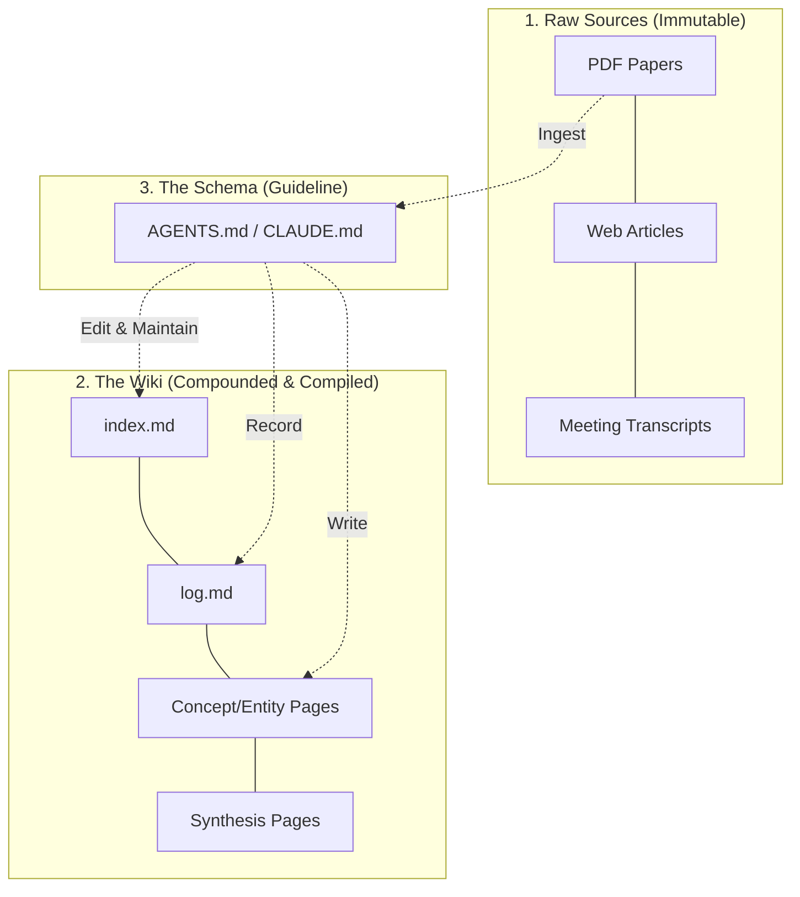

## Introduction

최근 AI 학계와 현업에서 가장 널리 사용되는 LLM(대형 언어 모델) 연동 패턴은 단연 <strong>RAG(Retrieval-Augmented Generation, 검색 증강 생성)</strong>입니다. 하지만 현재 대다수의 RAG 시스템은 문서를 단순 파싱해 벡터 데이터베이스에 올려두고, 사용자가 질문할 때마다 필요한 조각을 임시로 찾아와 대답하는 수준에 머물러 있습니다. 이는 정보가 유기적으로 연결되거나 시간이 지남에 따라 스스로 축적·진화하는 구조와는 거리가 멉니다.

이러한 상황에서, 전 OpenAI 공동 창립자이자 Tesla AI 디렉터였던 <strong>안드레이 카파시(Andrej Karpathy)</strong>가 제안한 <strong>'LLM Wiki'</strong> 패턴은 LLM 기반의 개인 지식 관리 시스템(PKM, Personal Knowledge Management)에 새로운 이정표를 제시합니다. 

카파시는 최근 자신의 Gist를 통해 <strong>"Obsidian은 IDE이고, LLM은 개발자이며, Wiki는 소스 코드이다(Obsidian is the IDE; the LLM is the programmer; the wiki is the codebase)"</strong>라는 매력적인 비유와 함께, LLM이 스스로 편집하고 조율하는 정적 마크다운 지식 컴파일 레이어의 설계 방법론을 공개했습니다. 

본 포스팅에서는 LLM Wiki가 등장하게 된 배경과 전통적인 RAG의 한계점, 그리고 카파시가 제안한 구체적인 아키텍처 및 동작 메커니즘을 상세히 분석합니다.

---

## 1. LLM Wiki의 탄생 배경: 전통적 RAG와 Human Wiki의 한계

카파시가 LLM Wiki라는 새로운 개념을 꺼내 든 이유는 기존의 지식 저장 방식과 AI 연동 방식이 가진 두 가지 근본적인 문제점 때문이었습니다.

### 1) 전통적인 RAG의 한계: "지식의 무(無)누적성과 매번 반복되는 재발견"
대부분의 RAG 시스템(NotebookLM, ChatGPT 파일 업로드, 커스텀 엔터프라이즈 RAG 등)은 사용자 쿼리가 들어오는 순간에만 작동합니다.
- **휘발성 콘텍스트**: 원시 문서(Raw Documents)는 가만히 있고, 사용자가 질문하면 유사도가 높은 문서 조각(Chunk)을 임베딩 검색으로 찾아와 LLM 콘텍스트 윈도우에 집어넣습니다.
- **재컴파일의 낭비**: LLM은 질문을 받을 때마다 매번 생판 처음 보는 문맥에서 지식을 재발견하고 짜깁기(Re-derivation)해야 합니다.
- **종합적 추론의 한계**: 5개의 서로 다른 문서에 걸쳐 흩어져 있는 미묘한 인과관계를 종합하여 결론을 내려야 하는 경우, 단순 임베딩 검색으로는 조각들을 유기적으로 다 가져오지 못하거나 매 질문마다 거대한 문서군을 반복 로드해야 하므로 비효율적이고 일관성이 떨어집니다. 지식의 '축적(Accumulation)'이 일어나지 않는 것입니다.

### 2) 인간이 관리하는 위키(Human-maintained Wiki)의 한계: "기하급수적인 유지보수 비용"
개인 지식 베이스를 위키 형식으로 만들어 보려고 시도했던 많은 사람들이 결국 도중에 포기하곤 합니다.
- **책임감 없는 북키핑(Bookkeeping)**: 위키를 최신 상태로 유지하려면 문서 간 상호 링크 추가, 새로운 데이터에 따른 기존 요약본 업데이트, 모순되는 내용 수정, 색인 정리 등의 지루한 작업을 인간이 지속해야 합니다.
- **유지보수 정체기**: 지식이 늘어날수록 위키를 읽고 생각하는 시간보다 **위키를 정리하고 관리하는 오버헤드**가 훨씬 더 커집니다. 결국 유지보수 비용이 그 효용을 넘어서는 순간, 지식 베이스는 유령 도시처럼 방치됩니다.

> 💡 **LLM Wiki의 핵심 통찰**: LLM은 지루해하지 않고, 상호 참조 링크 추가를 까먹지 않으며, 한 번의 처리(Pass)로 10~15개의 관련 마크다운 파일을 정교하게 읽고 쓸 수 있습니다. 따라서 <strong>"인간이 수집하고 기획하며(Curate), 갱신과 조율 등의 단순 노동은 LLM에게 맡기는 위키"</strong>를 구축하자는 것이 LLM Wiki의 핵심입니다.

---

## 2. LLM Wiki의 3계층 아키텍처

LLM Wiki는 극도로 단순하면서도 강력한 **3개의 레이어**로 구성됩니다. 복잡한 클라우드 데이터베이스나 벡터 DB 인프라 대신, 사람이 직접 디렉터리를 열어보고 형상 관리를 할 수 있는 **로컬 정적 마크다운 파일**들의 구조를 사용합니다.



### 1) 원시 소스 레이어 (Raw Sources - Immutable)
- 사용자가 직접 큐레이션하여 넣어두는 원본 문서 집합입니다.
- 논문 PDF, 웹 스크랩 문서, 회의 록, 팟캐스트 전사 스크립트, 이미지 및 데이터 파일 등이 포함됩니다.
- 이 레이어는 <strong>불변(Immutable)</strong>입니다. LLM은 이 문서들을 읽어서 지식을 축적할 뿐, 원본 파일을 임의로 수정하거나 삭제하지 않습니다. 위키 내 모든 합성 정보의 신뢰성을 담보하는 '최종 진실의 원천(Source of Truth)' 역할을 합니다.

### 2) 위키 레이어 (The Wiki - Compounded)
- 오직 LLM에 의해서만 작성되고 갱신되는 마크다운(`.md`) 파일들로 구성된 디렉터리입니다.
- 콘셉트 요약본, 인물/엔티티 요약, 여러 문서의 내용을 수렴한 종합 분석(Synthesis) 페이지, 그리고 전체 페이지 지도를 나타내는 인덱스가 위치합니다.
- 이 레이어는 지속적으로 <strong>컴파일 및 병합(Compiled & Compounded)</strong>되는 지식의 실체입니다.

### 3) 스키마 레이어 (The Schema - System Instructions)
- 위키의 핵심 규칙을 정의한 문서 파일입니다 (예: `CLAUDE.md`, `AGENTS.md`, `SCHEMA.md` 등).
- 위키가 어떤 디렉터리 구조를 갖는지, 마크다운의 포맷과 네이밍 규칙은 무엇인지, 새로운 정보 소스가 들어왔을 때 어떤 과정을 거쳐 기존 파일들을 갱신해야 하는지에 대한 가이드라인이 명시되어 있습니다.
- LLM Agent(예: Claude Code, OpenAI Codex 등)는 세션이 바뀔 때마다 이 스키마를 먼저 읽고 위키의 엄격한 편집자로 행동하게 됩니다.

---

## 3. LLM Wiki의 3대 핵심 오퍼레이션 (Operations)

LLM Wiki는 크게 세 가지 주기적 동작 프로세스(Ingest, Query, Lint)를 통해 유지되고 성장합니다.

### 1) 정보 주입 (Ingest)
사용자가 새로운 자료(예: 신규 논문)를 Raw 소스 폴더에 넣고 "이 자료 주입해 줘"라고 요청하면 다음 프로세스가 실행됩니다.

1. **상세 분석**: LLM이 원본 자료 전체를 정독하고 중요 발견과 사실들을 추출합니다.
2. **파급 효과 분석**: 신규 정보가 위키 내 기존 어떤 콘셉트나 엔티티 페이지와 연결되는지 추적합니다.
3. **다중 파일 업데이트**: 
   - 새로운 요약 페이지를 작성합니다.
   - 기존의 연관 엔티티 페이지 및 주제 분석 페이지들에 새로운 사실을 덧붙이고 수정합니다.
   - 전체 인덱스 문서(`index.md`)에 신규 페이지 정보를 갱신합니다.
   - 타임라인 로그(`log.md`)에 주입 이력을 기록합니다.
   
> [!NOTE]
> 단 하나의 문서가 추가되더라도, LLM은 위키 내 10~15개의 마크다운 문서를 유기적으로 탐색하여 동시다발적으로 내용을 보강하고 연결 링크를 추가합니다.

### 2) 질의 및 피드백 루프 (Query & Accumulate)
위키를 향해 복잡하고 정교한 지식 탐구를 수행하는 과정입니다.
- **지식 검색**: LLM이 구조화된 위키와 인덱스를 먼저 확인하고 필요한 문서들을 추출해 내어 답변을 생성합니다.
- **피드백 결합**: 만약 사용자가 "A 기법과 B 기법의 장단점을 표로 정리해 줘"라고 요청하고 LLM이 내놓은 비교 결과가 훌륭하다면, 이 답변은 일회성 채팅으로 끝나는 것이 아니라 <strong>"A_vs_B_Comparison.md"와 같은 신규 위키 페이지로 자동 컴파일되어 저장</strong>됩니다. 사용자의 모든 탐구 활동의 흔적이 고스란히 위키의 자산으로 영구 누적됩니다.

### 3) 린팅 및 헬스 체크 (Lint & Repair)
위키가 방대해짐에 따라 발생할 수 있는 품질 저하를 막기 위해 주기적으로 정밀 검사를 수행하는 과정입니다.
- **모순 탐지**: 최신 자료의 주장과 기존 자료의 주장이 서로 상충되거나 충돌하는 지점이 있는지 탐지하여 경고를 띄우거나 해결 시도를 기록합니다.
- **링크 정합성**: 링크가 깨진 곳(Broken links), 아직 문서가 만들어지지 않은 자리 표시자 링크, 인바운드 링크가 하나도 없어서 격리된 '고아 페이지(Orphan Pages)'를 식별해 연결해 줍니다.
- **정보 공백 탐지**: 핵심적으로 자주 언급되지만 전용 요약 페이지가 아직 확보되지 않은 개념을 식별하여 사용자에게 웹 검색이나 신규 자료 탐색을 권고합니다.

---

## 4. 인덱싱(index.md)과 로깅(log.md)

검색 효율성을 높이기 위해 카파시는 두 개의 아주 단순하지만 효율적인 메타 파일을 정의했습니다.

```markdown
# index.md (콘텐츠 카탈로그 예시)
- ## Concepts
  - [[Vector Search]]: 임베딩 코사인 유사도 기반 검색 기법 (Sources: 3)
  - [[Re-ranking]]: 고비용 교차 어텐션을 통한 검색 순위 재조정 기법 (Sources: 2)
- ## Entities
  - [[Andrej Karpathy]]: 전 OpenAI 연구원, Tesla AI 디렉터 (Sources: 1)
```

- **`index.md` (콘텐츠 중심 색인)**: 모든 위키 페이지의 주제 카테고리, 한 줄 요약, 참조 소스 개수를 기록한 허브 문서입니다. LLM은 사용자의 질문이 들어오면 우선 이 `index.md`를 스캔하여 필요한 페이지들을 타깃 선정한 뒤 본 내용을 읽어 들이므로, 번거로운 임베딩 데이터베이스나 벡터 검색 서버 없이도 중간 규모(~수백 개 페이지)의 검색을 극도로 정확하게 수행할 수 있습니다.

```markdown
# log.md (시간 순 로그 예시)
## [2026-04-07] ingest | Andrej Karpathy's LLM Wiki Gist
- Created [[Andrej_Karpathy_LLM_Wiki]] summary.
- Updated [[RAG_Limitations]] and [[Knowledge_Management]] pages.
- Appended index entry.
```

- **`log.md` (시간 순 활동 기록)**: 매 주입, 질의 축적, 린트 수행마다 추가되는 추가 전용(Append-only) 타임라인입니다. 로그의 각 항목 제목 접두사 규격을 일관되게 정의해 놓으면(예: `## [YYYY-MM-DD] action`), 터미널 상에서 `grep`과 `tail` 같은 간단한 유닉스 명령어로 위키의 최근 변화 상태를 손쉽게 트래킹할 수 있습니다.

---

## 5. 카파시의 Obsidian + LLM Workflow 조화

카파시가 권장하는 실제 작업 흐름의 구성 환경은 놀랍도록 직관적입니다.

> 🛠 **Obsidian (IDE) + LLM Agent (Programmer) = Wiki (Codebase)**

1. **Obsidian(옵시디언) 활용**: 왼쪽 화면에는 옵시디언을 열어두고 위키 마크다운 폴더를 로드해 둡니다. 옵시디언은 로컬 마크다운 파일들의 연결 구조를 시각적인 링크 그래프(Graph View)로 아주 아름답게 펼쳐 보여줍니다.
2. **LLM 에이전트 연동**: 오른쪽 화면(CLI 혹은 챗 인터페이스)에는 터미널 기반의 LLM 에이전트(예: Claude Code 등)를 실행하여 위키 폴더에 직접적인 파일 읽기/쓰기 권한을 부여합니다.
3. **협업 방식**: 인간은 옵시디언을 통해 시각적으로 실시간 변화하는 위키 그래프와 업데이트된 문서들을 더블클릭해 가며 링크를 따라 읽고, 에이전트에게는 자연어로 명령을 하달합니다.

### 추천 부가 도구
- **Obsidian Web Clipper**: 웹서핑 중 얻은 지식을 손쉽게 마크다운으로 스크랩하여 Raw Sources 폴더에 안착시켜 줍니다.
- **Obsidian Attachment Localizer**: 문서 내 이미지들을 `raw/assets/` 등의 로컬 고정 디렉터리로 자동 다운로드하여, 멀티모달 LLM이 로컬 파일 권한만으로 이미지들을 정독하고 분석에 반영할 수 있도록 돕습니다.
- **qmd (Query Markdown)**: 로컬 마크다운 파일에 대해 하이브리드 검색(BM25 + Vector Search)과 LLM 리랭킹을 지원하는 도구로, 위키 볼륨이 커졌을 때 에이전트가 이를 CLI 도구처럼 호출하여 검색하도록 구성할 수 있습니다.

---

## Conclusion & Insights: 프롬프트 엔지니어링에서 메모리 아키텍처로

과거에는 LLM이 더 똑똑하게 답변하도록 유도하기 위해 프롬프트를 다듬는 '프롬프트 엔지니어링(Prompt Engineering)'이 주를 이루었습니다. 하지만 모델들의 콘텍스트 윈도우 크기와 검색 효율성이 비약적으로 증가함에 따라, 이제 초점은 단일 질문의 고도화가 아닌 <strong>'메모리 아키텍처(Memory Architecture)'</strong>로 이동하고 있습니다.

안드레이 카파시가 제안한 <strong>LLM Wiki</strong>는 LLM을 단순한 '일회용 대화 상대'가 아니라, <strong>시간에 따라 스스로 정리되고 공고화되는 지식의 집적 체계를 코딩하는 주체</strong>로 재설정합니다. RAG의 한계인 무누적성과 반복 비용을 극복하고, 인간의 위키 관리 오버헤드를 제로에 수렴하게 함으로써 진정으로 나와 호흡하는 개인용 비서의 든든한 뇌 세포망을 손쉽게 구축할 수 있게 되었습니다.

---

## 필자의 고찰: "생각의 지속적 통합(Continuous Integration for Thoughts)"과 지식의 코드화

카파시의 LLM Wiki 패턴을 깊이 분석하고 직접 로컬 환경에서 테스트해보며 느낀 점은, 이것이 단순한 메모 작성법의 변화가 아니라 <strong>'인간의 지적 생산 프로세스의 전면적인 재컴파일'</strong>에 가깝다는 사실이었습니다. 본 포스팅의 핵심 요약에 더해, 필자가 느낀 세 가지 주요 패러다임 시프트와 실전 적용 시의 극복 과제를 정리해 봅니다.

### 1) 생각의 지속적 통합 (Continuous Integration for Thoughts)
소프트웨어 엔지니어링에서 코드의 품질을 유지하기 위해 CI/CD 파이프라인을 돌리듯, 이제는 <strong>'생각의 CI/CD'</strong>가 가능한 시대가 되었습니다. 
인간이 수집한 새로운 논문 요약이나 단상들을 `raw/` 폴더에 던져 넣는 행위는 마치 코드 저장소에 `git commit`을 날리는 것과 같습니다. LLM 에이전트는 이 커밋을 감지하여 전체 지식 베이스를 상대로 컴파일(새 개념 페이지 작성, 기존 관련 페이지 병합 및 갱신)을 실행하고, 링크 무결성과 모순 여부를 확인하는 린팅(Linting) 단계를 자동으로 밟습니다. 

이 과정에서 우리의 지식은 파편화된 메모(Orphan Notes)로 남지 않고, 기존의 생각 체계와 유기적으로 결합된 상태(Unified State)로 끊임없이 유지됩니다.

### 2) 주니어 개발자(LLM)와 시니어 설계자(인간)의 완벽한 역할 분담
과거의 개인 지식 관리는 수집, 분류, 요약, 태깅, 링크 연결 등 모든 번거로운 단순 수작업(Bookkeeping)을 인간이 직접 해야 했습니다. 결국 지식이 늘어날수록 관리에 필요한 인지 부하가 지식의 효용을 압도하는 '위키의 열역학적 종말'을 맞이하게 됩니다.

LLM Wiki 체제 아래에서 인간은 철저히 <strong>'시니어 아키텍트(Senior Architect)'</strong>로 포지셔닝합니다. 어떤 정보를 수집할지 기획(Curation)하고, 위키의 전반적인 방향성과 규칙(Schema)을 정의하는 고도의 추론에만 집중합니다. 반면, 지루하고 반복적이지만 극도의 정밀함을 요구하는 문서 간 상호 링크 연결, 메타데이터 업데이트, 인덱스 갱신 등의 실무 작업은 지치지 않는 <strong>'주니어 개발자(LLM)'</strong>에게 위임합니다. 이는 인간의 두뇌를 지식 정리라는 노동으로부터 완전히 해방시켜 주는 <strong>'인지적 오프로딩(Cognitive Offloading)'</strong>의 극치입니다.

### 3) 무상태(Stateless) 대화에서 상태유지(Stateful) 메모리로의 진화
우리가 일상적으로 나누는 ChatGPT나 Claude와의 대화는 기본적으로 '무상태(Stateless)'입니다. 대화 세션이 종료되는 순간 우리가 나눈 통찰과 지식은 허공으로 날아갑니다. RAG 역시 질문하는 순간에만 임시로 작동하는 휘발성 콘텍스트 삽입에 불과합니다.

반면 LLM Wiki는 로컬 마크다운 파일들의 연결망이라는 <strong>'영구적인 외부 상태(Persistent Stateful Memory)'</strong>를 가집니다. AI와 나눈 모든 깊이 있는 토론의 결과물이 고스란히 정적 파일로 저장되고 다음 세션의 에이전트에게 전수됩니다. 이를 통해 AI 비서는 나와 나눈 모든 대화의 역사를 완벽히 기억하고 시간이 갈수록 나에게 더욱 최적화되는 지식의 뇌세포망으로 진화하게 됩니다.

---

## 실전 구축 시 해결해야 할 세 가지 기술적 도전 과제

카파시가 제안한 이상적인 LLM Wiki를 프로덕션 레벨이나 수천 페이지 단위의 개인 볼트(Vault)로 안착시키기 위해서는 몇 가지 해결해야 할 장벽이 존재합니다.

1. **컨텍스트 윈도우 크기와 토큰 비용 (Token Cost & Context Decay)**
   아무리 LLM의 컨텍스트 윈도우가 200k로 확장되었다 하더라도, 수백 장의 마크다운 파일을 매 업데이트마다 통째로 로드하여 수정 위치를 파악하는 방식은 비효율적이며 큰 토큰 비용을 발생시킵니다. 
   - **대안**: 그래프 아키텍처를 결합하여, 수정이 필요한 문서의 부모-자식 노드 및 직접 연결된 이웃 노드(1-hop neighbors)만을 선별적으로 로드하여 부분적이고 국소적인 편집(Locality-constrained editing)을 수행하는 에이전트 도구를 보강해야 합니다.

2. **동시성 제어 및 쓰기 충돌 (Write Conflicts)**
   비동기적으로 여러 개의 정보 수집(Ingestion)이 동시에 실행될 때, 여러 에이전트가 동일한 `index.md`나 공통 개념 페이지를 동시에 수정하면서 충돌(Conflict)이 발생할 수 있습니다.
   - **대안**: 깃(Git) 브랜치 기반의 충돌 해결 프로세스를 에이전트에 내장하거나, 데이터베이스와 같은 단순 파일 락(Locking) 메커니즘을 Ingestion 툴체인에 도입해야 합니다.

3. **환각(Hallucination)의 전파 차단**
   LLM이 임의로 가짜 개념을 지어내거나 기존 문서의 정확한 수치를 갱신하는 과정에서 오염시키는 환각 현상이 발생할 경우, 이는 지식 베이스 전체로 링크를 타고 전파될 위험이 있습니다.
   - **대안**: 수치 데이터나 최종 진실의 원천(Raw Sources)에 대한 참조 무결성을 검증하는 자동 테스트 코드(Assert check)를 린팅(Linting) 파이프라인에 주입해 오염된 정보를 감지하고 롤백할 수 있는 안정 장치를 마련해야 합니다.

## 요약하며

결국 앞으로의 인공지능 활용 역량은 프롬프트를 얼마나 유려하게 쓰느냐가 아니라, <strong>'어떤 지식 메모리 아키텍처를 구축하고 이를 AI와 함께 어떻게 가꾸어 나가느냐'</strong>에 의해 결정될 것입니다.

지식의 파편화와 휘발성 대화에 피로감을 느끼고 있었다면, 이번 기회에 로컬 옵시디언 볼트와 터미널 기반 LLM 에이전트(예: Claude Code)를 결합하여 나만의 동적이고 유기적인 **LLM Wiki**를 설계하고 빌드해보시기를 강력히 권합니다. 그것이 진정으로 확장 가능한 나만의 두 번째 뇌를 창조하는 첫걸음이 될 것입니다.

---

---

**References**
- Andrej Karpathy's Original Gist: [https://gist.github.com/karpathy/442a6bf555914893e9891c11519de94f](https://gist.github.com/karpathy/442a6bf555914893e9891c11519de94f)
- Obsidian Knowledge Management Software: [https://obsidian.md/](https://obsidian.md/)
- qmd - Hybrid Search over local Markdown files: [https://github.com/tobi/qmd](https://github.com/tobi/qmd)

---
긴 글 읽어주셔서 감사합니다! 

**Contact & Inquiries**
- LinkedIn : [Sehoon Park](https://www.linkedin.com/in/sehoon-park)
- GitHub : [https://github.com/sehooni](https://github.com/sehooni)
- Email : 74sehoon@gmail.com
- 궁금한 점이나 의견은 댓글 혹은 메일을 통해 언제든 환영합니다! :)