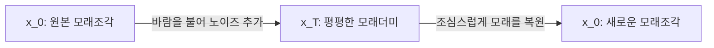
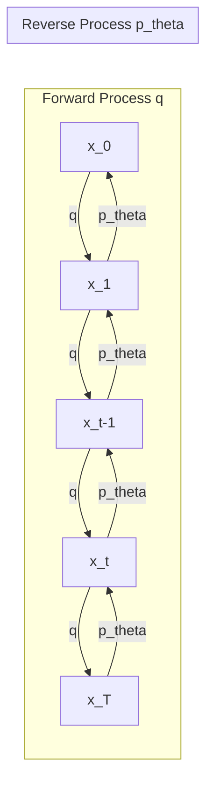

* **Paper Title**: [Denoising Diffusion Probabilistic Models](https://arxiv.org/abs/2006.11239)
* **Authors**: Jonathan Ho, Ajay Jain, and Pieter Abbeel
* **Journal/Conference**: NeurIPS 2020
* **arXiv ID**: [arXiv:2006.11239](https://arxiv.org/abs/2006.11239)

---

## 1. 서론 (Introduction)

Generative Adversarial Networks (GANs)와 Variational Autoencoders (VAEs)는 오랜 시간 생성 모델(Generative Models)의 양대 산맥으로 군림해 왔습니다. 하지만 GAN은 학습이 극도로 불안정하고 모드 붕괴(Mode Collapse) 현상에 취약하며, VAE는 다루기 쉬운 가우시안 가정 때문에 생성된 이미지가 다소 블러(Blur)되는 한계를 지니고 있었습니다.

본 논문에서 제안하는 **DDPM(Denoising Diffusion Probabilistic Models)은** 통계물리학의 확산 이론에서 영감을 얻은 생성 모델로, 가우시안 노이즈를 데이터에 점진적으로 추가하는 **순방향 과정(Forward Process)과** 이를 신경망으로 예측하여 한 단계씩 제거하는 **역방향 과정(Reverse Process)을** 마르코프 체인(Markov Chain)으로 학습합니다. DDPM은 GAN에 필적하는 고품질의 이미지 생성 성능을 달성함과 동시에 고정된 우도 목적 함수를 최적화하여 안정적인 학습이 가능함을 보여주며, 디퓨전 생성 AI 시대의 서막을 열었습니다.

---

## 2. 직관적 이해: 모래조각의 아날로지
수학적 수식 유도로 들어가기 전에 디퓨전 모델이 작동하는 직관적인 원리를 이해해 봅시다.

*Figure 2: 논문에 제시된 순방향 과정(q)과 역방향 과정(p_theta)을 나타내는 유향 그래픽 모델(Directed Graphical Model).*

* **순방향 과정 (Forward Process)**: 여러분 앞에 정밀하게 빚어진 **아름다운 모래조각($x_0$)이** 있습니다. 여기에 매 시간 아주 미세한 바람을 불어 모래알을 흩뿌립니다. 이 과정을 수천 번 반복하면 결국 형태를 알아볼 수 없는 평평한 **모래더미($x_T$)가** 됩니다.
* **역방향 과정 (Reverse Process)**: 완전히 형태를 잃은 모래더미($x_T$)에서 시작하여 바람이 불었던 궤적을 거꾸로 되돌려 다시 원래의 모래조각($x_0$)으로 복원하는 과정입니다. 역방향은 매 단계가 확률적이며 매우 정교하게 움직여야 합니다. 모델(U-Net)은 **"현재 모래 상태($x_t$)에서 이전 상태($x_{t-1}$)로 가기 위해 불었던 노이즈(바람)가 무엇이었는지"를** 예측하여 역으로 모래를 쓸어 담습니다.

---

## 3. 방법론 (Methodology)

DDPM의 방법론은 데이터를 점진적으로 망가뜨리는 순방향 과정과 이를 학습하여 복원하는 역방향 과정의 대칭 구조로 설계되어 있습니다.

### 3.1. 순방향 과정 (Forward Process)
순방향 과정 $q$는 원래 데이터 $x_0$에 사전에 정의된 스케줄러 $\beta_1, \beta_2, \dots, \beta_T$에 따라 가우시안 노이즈를 단계적으로 주입하는 과정입니다. 이 과정은 별도의 학습이 필요 없는 **고정된 확률 과정(Fixed stochastic process)입니다.**

$$q(x_{1:T} | x_0) = \prod_{t=1}^T q(x_t | x_{t-1})$$

$$q(x_t | x_{t-1}) = \mathcal{N}(x_t; \sqrt{1 - \beta_t} x_{t-1}, \beta_t \mathbf{I})$$

여기서 $\beta_t$는 노이즈의 세기를 나타내며, $t$가 증가함에 따라 $0.0001$에서 $0.02$로 서서히 선형 증가(Linear Schedule)하게 설계됩니다. 

#### 임의의 시점 $t$에서의 서열 스캔 (Closed-form sampling)
마르코프 체인의 정의에 따르면 $x_t$를 얻기 위해 $t$번의 연산을 순차적으로 거쳐야 하지만, 수학적 전개를 통해 **$x_0$로부터 임의의 단계 $x_t$를 즉각 샘플링할 수 있는 공식**을 유도할 수 있습니다.

이를 위해 $\alpha_t = 1 - \beta_t$ 및 $\bar{\alpha}_t = \prod_{i=1}^t \alpha_i$로 정의하겠습니다.

$$x_t = \sqrt{\alpha_t} x_{t-1} + \sqrt{1 - \alpha_t} \epsilon_{t-1} \quad (\text{where } \epsilon_{t-1} \sim \mathcal{N}(0, \mathbf{I}))$$

위 수식을 재귀적으로 대입하면 다음과 같습니다:

$$\begin{aligned}
x_t &= \sqrt{\alpha_t} \left( \sqrt{\alpha_{t-1}} x_{t-2} + \sqrt{1 - \alpha_{t-1}} \epsilon_{t-2} \right) + \sqrt{1 - \alpha_t} \epsilon_{t-1} \\
&= \sqrt{\alpha_t \alpha_{t-1}} x_{t-2} + \sqrt{\alpha_t(1 - \alpha_{t-1})} \epsilon_{t-2} + \sqrt{1 - \alpha_t} \epsilon_{t-1}
\end{aligned}$$

독립적인 두 가우시안 분포의 합 법칙($\mathcal{N}(0, \sigma_1^2 \mathbf{I}) + \mathcal{N}(0, \sigma_2^2 \mathbf{I}) = \mathcal{N}(0, (\sigma_1^2 + \sigma_2^2)\mathbf{I})$)에 의해 두 노이즈 항을 하나로 묶을 수 있습니다. 분산의 합은 다음과 같습니다:

$$\alpha_t(1 - \alpha_{t-1}) + (1 - \alpha_t) = \alpha_t - \alpha_t \alpha_{t-1} + 1 - \alpha_t = 1 - \alpha_t \alpha_{t-1}$$

이 과정을 $x_0$까지 반복하면 다음 수식을 얻습니다:

$$q(x_t | x_0) = \mathcal{N}(x_t; \sqrt{\bar{\alpha}_t} x_0, (1 - \bar{\alpha}_t) \mathbf{I})$$

$$x_t = \sqrt{\bar{\alpha}_t} x_0 + \sqrt{1 - \bar{\alpha}_t} \epsilon \quad (\text{where } \epsilon \sim \mathcal{N}(0, \mathbf{I}))$$

이 공식 덕분에 학습 시 중간 단계를 일일이 계산할 필요 없이, 단 한 번의 연산으로 임의의 $t$ 시점의 손상된 이미지를 직접 만들어 학습 데이터를 공급할 수 있습니다.

---

### 3.2. 역방향 과정 (Reverse Process)
역방향 과정 $p_\theta$는 순방향의 반대 방향으로 가우시안 노이즈로부터 원래의 이미지를 한 단계씩 복원해 나가는 생성 과정입니다. 실제 조건부 분포 $q(x_{t-1} | x_t)$는 전체 데이터 분포를 알아야 하므로 계산이 불가능하여, 학습 가능한 파라미터 $\theta$를 가진 인공신경망으로 이 확률 분포를 근사합니다.

$$p_\theta(x_{0:T}) = p(x_T) \prod_{t=1}^T p_\theta(x_{t-1} | x_t) \quad (\text{where } p(x_T) = \mathcal{N}(x_T; 0, \mathbf{I}))$$

$$p_\theta(x_{t-1} | x_t) = \mathcal{N}(x_{t-1}; \mu_\theta(x_t, t), \Sigma_\theta(x_t, t))$$

이때 노이즈 스케일 $\beta_t$가 매우 작다면 역방향의 천이 확률 역시 가우시안 분포로 근사할 수 있음이 수학적으로 입증되어 있습니다. DDPM은 평균 $\mu_\theta(x_t, t)$를 신경망으로 학습하고, 분산 $\Sigma_\theta(x_t, t)$는 학습하지 않는 상수 $\sigma_t^2 \mathbf{I}$로 고정하여 사용합니다. (여기서 $\sigma_t^2 = \beta_t$ 또는 $\sigma_t^2 = \tilde{\beta}_t = \frac{1 - \bar{\alpha}_{t-1}}{1 - \bar{\alpha}_t} \beta_t$로 설정)

---

## 4. 손실 함수 유도와 노이즈 예측 (Loss Function & Noise Prediction)

### 4.1. Variational Lower Bound (VLB)
모델의 네거티브 로그 우도(Negative Log-Likelihood)를 최소화하기 위해 변분 하한(Variational Lower Bound)을 목적 함수로 유도합니다:

$$\mathbb{E}[-\log p_\theta(x_0)] \le \mathbb{E}_q \left[ -\log \frac{p_\theta(x_{0:T})}{q(x_{1:T} | x_0)} \right] = L_{\text{VLB}}$$

수학적 전개를 거치면 $L_{\text{VLB}}$는 3가지 성분으로 분해됩니다:

$$L_{\text{VLB}} = \mathbb{E}_q \underbrace{\left[ D_{\text{KL}}(q(x_T | x_0) \parallel p(x_T)) \right]}_{L_T} + \sum_{t=2}^T \mathbb{E}_q \underbrace{\left[ D_{\text{KL}}(q(x_{t-1} | x_t, x_0) \parallel p_\theta(x_{t-1} | x_t)) \right]}_{L_{t-1}} - \underbrace{\mathbb{E}_q \left[ \log p_\theta(x_0 | x_1) \right]}_{L_0}$$

*   **$L_T$**: 마지막 시점 $x_T$의 노이즈 분포와 표준 가우시안 분포 사이의 쿨백-라이블러 발산(KL Divergence)입니다. $\beta_t$가 고정되어 있어 상수로 취급되므로 최적화 대상에서 제외됩니다.
*   **$L_0$**: 최종 생성된 이미지의 우도로 디코딩을 담당하는 재구성 손실(Reconstruction Loss)입니다.
*   **$L_{t-1}$**: 핵심 학습 성분으로, 베이즈 정리를 통해 계산된 실제 역방향 분포 $q(x_{t-1} | x_t, x_0)$와 모델이 예측한 $p_\theta(x_{t-1} | x_t)$ 사이의 차이를 최소화합니다.
    

수학적으로 조건부 실제 역방향 분포의 평균 $\tilde{\mu}_t(x_t, x_0)$는 다음과 같이 유도됩니다:

$$q(x_{t-1}|x_t, x_0) = \mathcal{N}(x_{t-1}; \tilde{\mu}_t(x_t, x_0), \tilde{\beta}_t \mathbf{I})$$

$$\tilde{\mu}_t(x_t, x_0) = \frac{\sqrt{\bar{\alpha}_{t-1}} \beta_t}{1 - \bar{\alpha}_t} x_0 + \frac{\sqrt{\alpha_t} (1 - \bar{\alpha}_{t-1})}{1 - \bar{\alpha}_t} x_t$$

여기서 앞서 유도한 $x_t = \sqrt{\bar{\alpha}_t} x_0 + \sqrt{1 - \bar{\alpha}_t} \epsilon$ 식을 $x_0$에 관해 정리하여 대입하면, $x_0 = \frac{1}{\sqrt{\bar{\alpha}_t}} (x_t - \sqrt{1 - \bar{\alpha}_t} \epsilon)$이 됩니다. 이를 위 식에 정리하면 다음과 같습니다:

$$\tilde{\mu}_t(x_t, x_0) = \frac{1}{\sqrt{\alpha_t}} \left( x_t - \frac{\beta_t}{\sqrt{1 - \bar{\alpha}_t}} \epsilon \right)$$

---

### 4.2. 노이즈 예측을 향한 정형화: Simple Loss
따라서 모델이 학습해야 할 평균 $\mu_\theta$ 역시 동일한 형태로 매개변수화(Parameterization)하는 것이 자연스럽습니다:

$$\mu_\theta(x_t, t) = \frac{1}{\sqrt{\alpha_t}} \left( x_t - \frac{\beta_t}{\sqrt{1 - \bar{\alpha}_t}} \epsilon_\theta(x_t, t) \right)$$

여기서 $\epsilon_\theta(x_t, t)$는 신경망 모델이 예측해야 하는 **"주입된 노이즈"**입니다. 이 식을 KL Divergence 식에 대입하여 정리하면 다음과 같은 평균 제곱 오차(MSE) 형태의 단순 손실 함수 $L_{\text{simple}}$로 변환됩니다:

$$L_{\text{simple}}(\theta) = \mathbb{E}_{t, x_0, \epsilon} \left[ \| \epsilon - \epsilon_\theta(x_t, t) \|^2 \right] = \mathbb{E}_{t, x_0, \epsilon} \left[ \| \epsilon - \epsilon_\theta(\sqrt{\bar{\alpha}_t} x_0 + \sqrt{1 - \bar{\alpha}_t} \epsilon, t) \|^2 \right]$$

DDPM 논문은 복잡한 가중치 계수가 생략된 이 **$L_{\text{simple}}$을 목적 함수로 사용할 때 이미지의 생성 품질(FID)이 극적으로 향상됨을** 실험적으로 보여주었습니다.

---

## 5. 알고리즘 테이블 (Algorithms)

DDPM의 학습과 샘플링은 다음과 같은 명확한 절차로 수행됩니다.

| 알고리즘 1: 학습 (Training) | 알고리즘 2: 샘플링 (Sampling) |
| :--- | :--- |
| **반복**: 수렴할 때까지 아래 과정을 반복 | **입력**: 랜덤 노이즈 $x_T \sim \mathcal{N}(0, \mathbf{I})$ |
| 1. 데이터 분포에서 원본 데이터 선택: $x_0 \sim q(x_0)$ | 1. $t = T, T-1, \dots, 1$에 대해 다음을 반복: |
| 2. 임의의 타임스텝 샘플링: $t \sim \text{Uniform}(\{1, \dots, T\})$ | 2. 임의의 노이즈 샘플링: $z \sim \mathcal{N}(0, \mathbf{I})$ (단, $t=1$인 경우 $z=0$) |
| 3. 표준 가우시안 노이즈 생성: $\epsilon \sim \mathcal{N}(0, \mathbf{I})$ | 3. 노이즈 제거된 이전 시점 계산:  $x_{t-1} = \frac{1}{\sqrt{\alpha_t}} \left( x_t - \frac{\beta_t}{\sqrt{1 - \bar{\alpha}_t}} \epsilon_\theta(x_t, t) \right) + \sigma_t z$ |
| 4. 손실 함수 기반 경사하강법 적용:  $\nabla_\theta \| \epsilon - \epsilon_\theta(\sqrt{\bar{\alpha}_t} x_0 + \sqrt{1 - \bar{\alpha}_t} \epsilon, t) \|^2$ | 4. 최종 복원된 데이터 **$x_0$** 반환 |

*Figure 3: 논문 원본에 수록된 학습(Algorithm 1) 및 샘플링(Algorithm 2) 알고리즘.*

---

## 6. 실험 결과 및 FID 평가지표 분석 (Experimental Results & FID)

### 6.1. FID (Fréchet Inception Distance) 평가지표의 중요성
생성 모델을 공정하게 평가하기 위해 컴퓨터 비전 도메인에서는 단순 오차나 우도(Likelihood) 분석 대신 **FID(Fréchet Inception Distance)**를 핵심 지표로 사용합니다.

#### 수학적 정의
FID는 이미지넷(ImageNet)으로 사전 학습된 Inception-v3 네트워크의 특징 추출 레이어 공간 상에서 실제 이미지의 특징 분포 $\mathcal{N}(\mu_r, \Sigma_r)$와 생성 이미지의 특징 분포 $\mathcal{N}(\mu_g, \Sigma_g)$를 다변량 가우시안으로 근사한 뒤, 두 분포 간의 Fréchet Distance(Wasserstein-2 Distance)를 계산합니다:

$$d^2((\mu_r, \Sigma_r), (\mu_g, \Sigma_g)) = \|\mu_r - \mu_g\|^2_2 + \text{Tr}(\Sigma_r + \Sigma_g - 2(\Sigma_r \Sigma_g)^{1/2})$$

*   **해석**: FID 점수가 낮을수록 생성 모델이 만든 이미지 집합의 분포가 실제 데이터 분포와 형태학적(화질, 텍스처 등) 및 다양성(Mode coverage) 측면에서 매우 유사함을 나타냅니다.
*   **중요성**: 기존의 Inception Score (IS)는 생성된 각 이미지가 뚜렷한 클래스로 분류되는지(주변 분포의 엔트로피)만 중점적으로 평가하기 때문에, 클래스 다양성을 결여하고 특정 선명 이미지만 대량 생성하는 모델(Mode collapse)에 취약하며 쉽게 기만당할 수 있었습니다. 반면 FID는 실제 데이터셋 분포와의 누적 유사도를 보장하므로 정밀한 평가가 가능합니다.

---

### 6.2. NLL(우도)과 FID(생성 화질)의 모순 관계 (Trade-off)
DDPM 논문은 통계적 Likelihood 최적화(NLL 최소화)와 인간이 보기에 우수한 고품질 이미지 생성(FID 최소화) 사이에 흥미로운 반비례 성향이 존재함을 밝혀냈습니다.

*Figure 4 (Table 1): CIFAR-10 데이터셋에서의 양적 성능 지표 비교. $L_{\text{simple}}$ 목적함수를 적용한 모델이 최적의 FID 3.17을 기록함을 볼 수 있습니다.*

*Figure 5 (Table 2): 분산 매개변수 $\sigma_t$ 및 학습 손실함수($L_{\text{VLB}}$ vs $L_{\text{simple}}$) 설정에 따른 FID 및 NLL 성능 비교 테이블.*

*   **실험 결과 분석**:
    *   완전한 확률 변분 경계 손실함수인 **$L_{\text{VLB}}$만을 고집하여** 모델을 훈련시킬 경우, 최적의 Negative Log-Likelihood (NLL) 스코어인 **3.70 bits/dim**을 획득합니다. 하지만 이때의 생성 이미지 품질(FID)은 **13.51**로 눈에 띄게 나쁩니다.
    *   반면 가중치 계수를 생략한 단순한 목적함수인 **$L_{\text{simple}}$로** 모델을 훈련시킬 경우, NLL 성능은 **3.75 bits/dim**으로 조금 나빠지지만, FID 성능은 당대 최고 성능인 **3.17**로 비약적인 개선을 이루게 됩니다.
*   **모순이 발생하는 이유**:
    데이터의 로그 우도(NLL)를 극대화하는 학습 목표는 이미지 내부의 모든 픽셀의 확률 분포를 균일하게 맞추려고 시도합니다. 이는 인간의 시각 시스템이 인지하기 힘든 배경의 미세한 고주파 노이즈(High-frequency background noise)나 잡음 분포를 정확하게 복사하는 데 모델의 한정된 용량(Capacity)을 과도하게 소모하도록 만듭니다.
    반대로, 단순 손실 함수인 $L_{\text{simple}}$은 가우시안 노이즈 예측 가중치를 조절하여 이미지의 구조적 뼈대를 형성하는 저주파수(Low-frequency) 노이즈 복원에 모델 용량을 더 집중시킵니다. 그 결과 이미지의 픽셀 당 우도(Likelihood)는 미세하게 저해되더라도, 인간이 느끼기에 형태학적으로 매끄럽고 구조적으로 이상적인 고화질의 이미지가 생성될 수 있습니다.

---

### 6.3. 점진적 복원 시각화
DDPM이 가우시안 노이즈 $x_T$에서 시작해 $x_0$로 가는 역방향 과정 동안 노이즈가 어떻게 점진적으로 제거되어 가는지 논문의 시각화 결과들을 통해 확인할 수 있습니다.

*Figure 6: CIFAR-10 Unconditional generation 과정 상의 점진적 노이즈 제거 및 이미지 재구성 시각화.*

*Figure 7: CelebA 데이터셋을 활용해 DDPM이 무조건부(Unconditional)로 생성해 낸 고해상도 인물 샘플 결과물.*

---

## 7. 장점과 한계 (Strengths & Limitations)

### 7.1. 장점
*   **압도적인 이미지 품질**: 가우시안 노이즈 예측이라는 단순한 목적 함수를 사용함에도 불구하고 당시 최첨단 GAN 모델에 필적하는 고해상도 고화질 생성이 가능합니다.
*   **안정적인 학습**: GAN의 적대적 학습(Adversarial training)과 달리 단순한 MSE Loss 기반의 우도 극대화 기법으로 학습하므로 훈련이 매우 안정적입니다.
*   **유연한 스케일링**: 데이터의 차원이나 복잡도에 유연하게 대응하며 구조적인 모드 붕괴가 일어나지 않습니다.

### 7.2. 한계
*   **극악의 생성 속도 (Sampling Bottleneck)**: 고품질 이미지를 생성하기 위해 마르코프 체인의 전 단계를 하나씩 밟아야 합니다. 일반적으로 $T=1000$의 역방향 단계를 거쳐야 하므로 이미지 한 장을 생성하는 데 모델(U-Net)을 1000번 호출해야 해 실시간 응용이 불가능합니다.
*   **확률적 제어의 부재**: 무작위 가우시안 노이즈에서 출발하기 때문에 매번 생성되는 이미지가 완전히 달라지며, 특정 초기 노이즈로부터 항상 동일한 결과를 얻는 일대일 매핑 제어가 불가능합니다.

---

## 8. 결론 및 인사이트

DDPM은 단순히 노이즈를 더하고 지우는 물리 현상을 모방하는 것을 넘어, 최적화가 용이한 단순 손실 함수 $L_{\text{simple}}$을 통해 딥러닝 기반 이미지 생성의 판도를 바꾸었습니다. 

하지만 디퓨전 모델의 상용화를 막는 최대 걸림돌은 역시 **"느린 샘플링 속도"였습니다.** 이 한계를 깨부수기 위해 마르코프 체인 가정을 타파하고 결정론적(Deterministic) 경로를 설계하여 단 수십 걸음 만에 이미지를 뽑아내도록 개선된 후속 논문이 바로 **DDIM(Denoising Diffusion Implicit Models)입니다.** 이에 대해서는 다음 포스팅에서 자세히 다루어 보겠습니다.

---

### 참고 문헌 및 자료 출처
1.  **DDPM**: Ho, J., Jain, A., & Abbeel, P. (2020). Denoising diffusion probabilistic models. *Advances in Neural Information Processing Systems*, 33, 6840-6851. [https://doi.org/10.48550/arXiv.2006.11239](https://doi.org/10.48550/arXiv.2006.11239)
2.  **Inception Score (IS)**: Salimans, T., Goodfellow, I., Zaremba, W., Cheung, V., Radford, A., & Chen, X. (2016). Improved techniques for training GANs. *Advances in Neural Information Processing Systems*, 29.
3.  **Fréchet Inception Distance (FID)**: Heusel, M., Ramsauer, H., Unterthiner, T., Nessler, B., & Hochreiter, S. (2017). GANs trained by a two time-scale update rule converge to a local Nash equilibrium. *Advances in Neural Information Processing Systems*, 30.

---
긴 글 읽어주셔서 감사합니다! 

**Contact & Inquiries**
- LinkedIn : [Sehoon Park](https://www.linkedin.com/in/sehoon-park)
- GitHub : [https://github.com/sehooni](https://github.com/sehooni)
- Email : 74sehoon@gmail.com
- 궁금한 점이나 의견은 댓글 혹은 메일을 통해 언제든 환영합니다! :)
