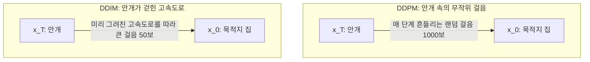
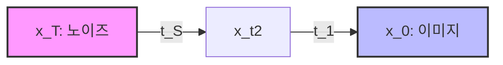

* **Paper Title**: [Denoising Diffusion Implicit Models](https://arxiv.org/abs/2010.02502)
* **Authors**: Jiaming Song, Chenlin Meng, and Stefano Ermon
* **Journal/Conference**: ICLR 2021
* **arXiv ID**: [arXiv:2010.02502](https://arxiv.org/abs/2010.02502)

---

## 1. 서론 (Introduction)

앞선 포스팅에서 다루었던 DDPM(Denoising Diffusion Probabilistic Models)은 뛰어난 생성 품질과 안정적인 학습 과정으로 큰 주목을 받았습니다. 하지만 실용화 관점에서 치명적인 단점이 존재했는데, 바로 **"느린 샘플링 속도"**였습니다. 

DDPM은 역방향 생성 과정이 바로 직전 단계의 정보에만 의존하는 마르코프 체인(Markov Chain)으로 정의되어 있어, 고품질 이미지를 한 장 뽑기 위해 $T=1000$단계의 역방향 연산을 차례로 모두 거쳐야 했습니다. 이는 인공신경망(U-Net)을 1000번 호출해야 함을 의미하며, 실시간 서비스는 물론 대규모 이미지 생성을 불가능하게 만드는 병목이었습니다.

본 논문인 **DDIM(Denoising Diffusion Implicit Models)은** 이러한 한계를 혁신적으로 극복한 연구입니다. 저자들은 순방향 과정을 비마르코프 체인(Non-Markovian Process)으로 새롭게 정의하여, **"이미 학습된 DDPM 모델을 전혀 새로 훈련하지 않고도"** 역방향 단계 중 일부만 선택(Sub-sequence sampling)하여 건너뛰는 방식으로 샘플링 속도를 **$10\sim50$배 이상 단축시켰습니다.** 또한 샘플링을 완전히 결정론적(Deterministic)으로 바꾸어 이미지 편집 및 인버전(Inversion) 기술의 토대를 마련했습니다.

---

## 2. 직관적 이해: 고속도로와 큰 걸음의 아날로지
DDPM과 DDIM의 가장 큰 차이를 비유를 들어 이해해 봅시다.

*Figure 1: 마르코프 체인으로 단계별 확률 연산을 거쳐야 하는 DDPM(왼쪽)과, 동일한 주변분포(Marginals)를 공유하되 비마르코프 형태로 중간 단계를 점프할 수 있는 DDIM(오른쪽)의 개념적 차이.*

* **DDPM (확률적 안개 속 걷기)**: 짙은 안개 속에서 목적지(집)를 찾아가기 위해 매 걸음마다 약간의 무작위 진동(확률적 노이즈)을 느끼며 아주 조밀하게 1000보를 걸어야 합니다. 만약 큰 보폭으로 몇 단계만 건너뛰어 걸으려 하면, 진동 확률 때문에 금세 경로를 이탈해 미아가 됩니다.
* **DDIM (결정론적 고속도로 주행)**: 안개가 완전히 걷히고 목적지까지 연결된 탄탄한 고속도로(결정론적 경로)가 깔려 있습니다. 경로가 흔들리지 않고 확실하기 때문에 1000보를 다 밟을 필요 없이, **보폭을 크게 키워 단 50보 만에 성큼성큼 걸어가도** 목적지에 안전하게 도달할 수 있습니다. 또한 같은 위치에서 출발하면 언제나 똑같은 목적지에 도착하게 됩니다.

---

## 3. 핵심 아이디어: Non-Markovian Forward Process

DDPM의 학습은 임의의 시점 $t$에서의 주변 분포(Marginal Distribution) $q(x_t|x_0)$ 정보만을 사용하여 단순 손실 함수 $L_{\text{simple}}$을 최적화합니다:

$$q(x_t | x_0) = \mathcal{N}(x_t; \sqrt{\bar{\alpha}_t} x_0, (1 - \bar{\alpha}_t) \mathbf{I})$$

DDIM 연구진은 매우 영리한 통찰을 제시했습니다. **"우리가 모델을 학습할 때 쓴 유일한 조건은 각 $t$단계의 주변 분포 $q(x_t|x_0)$가 가우시안이라는 점뿐이다. 그렇다면 순방향 결합 분포 $q(x_{1:T}|x_0)$가 반드시 마르코프 체인($q(x_t|x_{t-1})$)으로 연결될 필요는 없지 않은가?"**

즉, 모든 단일 $t$에서의 분포 $q(x_t|x_0)$는 DDPM과 완벽하게 동일하게 유지하되, 이들을 이어주는 중간 결합 구조를 **비마르코프 체인(Non-Markovian Process)**으로 새롭게 다시 정의하는 것입니다.

이 설계 하에서, $x_t$와 $x_0$가 주어졌을 때 이전 시점 $x_{t-1}$의 실제 조건부 확률 분포는 다음과 같이 설계됩니다:

$$q_\sigma(x_{t-1} | x_t, x_0) = \mathcal{N} \left( x_{t-1}; \mathbf{m}_t(x_t, x_0), \sigma_t^2 \mathbf{I} \right)$$

*Figure 2: 논문에 공식 정의된 비마르코프 순방향 전이 $q_\sigma(x_{t-1}|x_t, x_0)$ 공식.*

여기서 분산을 나타내는 계수 $\sigma_t$는 임의로 설정할 수 있는 자유 파라미터(Free parameter)이며, 평균에 해당하는 벡터 $\mathbf{m}_t(x_t, x_0)$는 다음과 같이 정리됩니다:

$$\mathbf{m}_t(x_t, x_0) = \sqrt{\bar{\alpha}_{t-1}} x_0 + \sqrt{1 - \bar{\alpha}_{t-1} - \sigma_t^2} \frac{x_t - \sqrt{\bar{\alpha}_t} x_0}{\sqrt{1 - \bar{\alpha}_t}}$$

이 확률 식은 베이즈 정리를 통과하더라도 모든 $t$에 대해 marginal 분포 $q_\sigma(x_t|x_0) = \mathcal{N}(x_t; \sqrt{\bar{\alpha}_t} x_0, (1 - \bar{\alpha}_t) \mathbf{I})$를 온전히 유지하도록 수학적으로 유도된 형태입니다.

---

## 4. 확률적 성질의 제어와 DDIM의 공식화 (Stochasticity Control)

자유 파라미터인 분산 계수 $\sigma_t$를 어떻게 조절하느냐에 따라 생성 과정의 성격이 극적으로 변합니다. 논문은 $\sigma_t$를 다음과 같이 매개변수화했습니다:

$$\sigma_t^2 = \eta \cdot \tilde{\beta}_t = \eta \cdot \left( \frac{1 - \bar{\alpha}_{t-1}}{1 - \bar{\alpha}_t} \left(1 - \frac{\bar{\alpha}_t}{\bar{\alpha}_{t-1}}\right) \right)$$

여기서 $\eta \ge 0$는 생성 과정의 stochasticity(확률적 흔들림)를 제어하는 상수 하이퍼파라미터입니다.

### 4.1. $\eta = 1$ 인 경우: DDPM으로의 회귀
$\eta = 1$로 두면 $\sigma_t = \tilde{\beta}_t$가 되며, 이 비마르코프 역과정은 기존의 **DDPM 마르코프 체인 역과정과 수학적으로 완벽히 일치하게** 됩니다. 즉, DDPM은 DDIM 수식 체계의 특수한 한 사례(Stochastic limit)에 불과합니다.

### 4.2. $\eta = 0$ 인 경우: 결정론적 DDIM (Deterministic Model)
$\eta = 0$으로 설정하면 분산 항 $\sigma_t^2$이 완전히 사라져 $0$이 됩니다. 즉, $x_t$와 $x_0$가 주어지면 $x_{t-1}$의 값이 단 하나의 값으로 완벽히 고정되는 **결정론적 역과정(Deterministic Process)이** 설계됩니다. 

이 모드가 바로 본 논문의 핵심인 **DDIM(Denoising Diffusion Implicit Models)입니다.** 역과정 단계마다 추가적인 랜덤 가우시안 노이즈가 유입되지 않으므로, 생성 과정이 상미분방정식(ODE, Ordinary Differential Equation)과 대응되는 궤적으로 흐르게 됩니다.

---

## 5. 결정론적 샘플링과 가속화 (Deterministic Sampling & Acceleration)

$\eta=0$일 때, 이미 사전 학습된 디퓨전 네트워크 $\epsilon_\theta$가 예측한 노이즈를 바탕으로 역과정을 계산하는 샘플링 공식은 다음과 같습니다:

$$x_{t-1} = \sqrt{\bar{\alpha}_{t-1}} \underbrace{\left( \frac{x_t - \sqrt{1 - \bar{\alpha}_t} \epsilon_\theta(x_t, t)}{\sqrt{\bar{\alpha}_t}} \right)}_{\text{"predicted } x_0\text{"}} + \underbrace{\sqrt{1 - \bar{\alpha}_{t-1}} \epsilon_\theta(x_t, t)}_{\text{"direction pointing to } x_t\text{"}}$$

*Figure 3: 논문에 정의된 DDIM의 결정론적 역방향 생성 공식.*

이 식에는 무작위 노이즈 $z \sim \mathcal{N}(0, \mathbf{I})$를 더하는 항이 존재하지 않습니다. 따라서 다음과 같은 거대한 이점이 파생됩니다:

*   **Sub-sequence Sampling을 통한 가속화**: 
    DDPM은 가우시안 분포 전이 조건 때문에 $t$에서 바로 $t-1$로만 가야 했습니다. 하지만 DDIM은 매 단계가 결정론적 흐름을 따르므로 임의의 타임스텝 서브셋(예: $\tau = [\tau_1, \tau_2, \dots, \tau_S]$ where $S=50, T=1000$)을 지정하고, $x_{\tau_i}$에서 $x_{\tau_{i-1}}$로 **중간 단계들을 성큼성큼 건너뛰어 다이렉트로 예측하는 도약이 가능합니다.** 
    이 방법을 통해 생성 이미지의 미세 구조 디테일을 거의 훼손하지 않으면서도 **U-Net 호출 횟수를 1000번에서 20~50번으로 급감시켜** $10\sim50$배의 실질적 속도 개선을 이뤄냈습니다.

---

## 6. DDIM Inversion의 문을 열다 (Image Inversion & Consistency)

기존 DDPM은 확률 과정이기 때문에 원본 이미지 $x_0$를 노이즈로 바꿨다가(Forward) 다시 복원하면(Reverse) 항상 다른 이미지가 생성되어 일관된 편집이 불가능했습니다. 

반면 DDIM은 역방향 과정이 결정론적 미분방정식(ODE) 흐름을 타기 때문에 **역연산(Inversion)이 완벽히 가능합니다.**

$$x_t \xrightarrow{\text{Forward (Deterministic ODE)}} x_{t+1}$$

$$x_{t+1} \xrightarrow{\text{Reverse (Deterministic ODE)}} x_t$$

이 성질 덕분에 실제 사진 $x_0$를 거꾸로 추적하여 이에 매핑되는 고유한 화이트 노이즈 $x_T$를 찾아내는 **DDIM Inversion** 기술이 탄생했습니다. 이 고유 노이즈 $x_T$에 텍스트 프롬프트를 약간 변형하여 다시 역방향으로 이미지를 흘려보내면, 사진 속 강아지의 종류만 웰시코기에서 푸들로 바꾸는 등 원본 구도를 온전히 유지한 채 원하는 스타일로 정밀하게 이미지를 수정하는 **텍스트 기반 이미지 편집(Text-guided Image Editing) 분야의 기틀이** 되었습니다.

---

## 7. DDPM vs DDIM 핵심 비교

| 비교 지표 | DDPM (확률적 모델) | DDIM (결정론적 모델) |
| :--- | :--- | :--- |
| **순방향 속성** | 마르코프 체인 (Markovian) | 비마르코프 체인 (Non-Markovian) |
| **역방향 속성** | 확률적 (Stochastic, $\eta=1$) | 결정론적 (Deterministic, $\eta=0$) |
| **수학적 전이 모델** | stochastic SDE | probability flow ODE |
| **표준 샘플링 단계** | $1000$ 단계 고정 (매우 느림) | $20 \sim 50$ 단계 수준으로 가속 가능 |
| **랜덤 노이즈 영향** | 매 샘플링 단계마다 가우시안 노이즈 주입 | 초기 노이즈 $x_T$ 주입 후 추가 노이즈 유입 없음 |
| **양방향 역원성** | 불가능 (무작위성에 의해 경로 이탈) | **가능** (일대일 매핑 및 Exact Reconstruction) |

---

## 8. 결론 및 인사이트

DDIM은 단순히 샘플링 연산의 속도를 개선한 실용적 도구를 넘어, 디퓨전 모델이 수학적으로 **연속 시간 상미분방정식(Continuous-time ODE)과 확률 유동 ODE(Probability Flow ODE)**로 귀결될 수 있음을 증명한 이론적 이정표입니다.

이 발견은 컴퓨터 비전 생태계에 큰 충격을 주었으며, 훗날 매우 빠른 고속 솔버(Solver)인 **DPM-Solver**, **PLMS**, 그리고 현대 디퓨전 모델의 근간이 되는 **Score-based Generative Models (SGM)** 및 **Flow Matching** 기법들의 개발을 촉진하는 결정적인 연결 고리가 되었습니다.

---

### 참고 문헌 및 자료 출처
1.  **DDIM**: Song, J., Meng, C., & Ermon, S. (2020). Denoising diffusion implicit models. *arXiv preprint arXiv:2010.02502*. [https://doi.org/10.48550/arXiv.2010.02502](https://doi.org/10.48550/arXiv.2010.02502)
2.  **DDPM**: Ho, J., Jain, A., & Abbeel, P. (2020). Denoising diffusion probabilistic models. *Advances in Neural Information Processing Systems*, 33, 6840-6851.

---
긴 글 읽어주셔서 감사합니다! 

**Contact & Inquiries**
- LinkedIn : [Sehoon Park](https://www.linkedin.com/in/sehoon-park)
- GitHub : [https://github.com/sehooni](https://github.com/sehooni)
- Email : 74sehoon@gmail.com
- 궁금한 점이나 의견은 댓글 혹은 메일을 통해 언제든 환영합니다! :)
