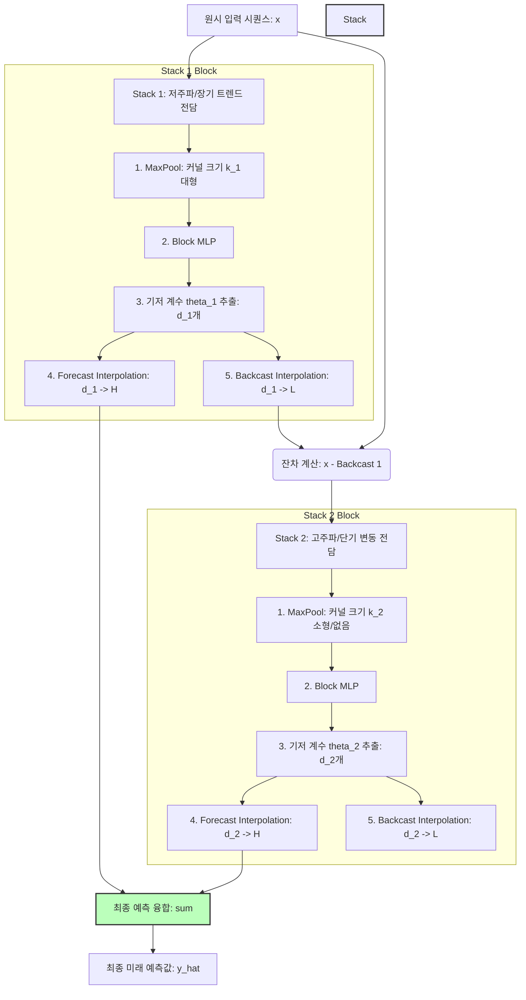

* **Paper Title**: [N-HiTS: Neural Hierarchical Interpolation for Time Series Forecasting](https://arxiv.org/abs/2201.12886)
* **Authors**: Cristian Challu, Kin G. Olivares, Boris N. Oreshkin, Federico Garza, Max Mergenthaler-Canseco, Artur Dubrawski
* **Journal/Conference**: AAAI 2023 (Oral) / Carnegie Mellon University & Nixtla
* **DOI/Link**: [arXiv:2201.12886](https://arxiv.org/abs/2201.12886)

---

## 1. 서론 (Introduction)

현대 산업 전반(스마트 그리드 전력 수요 예측, 금융 시장 트렌드 분석, 클라우드 인프라 자원 관리 등)에서 미래의 아주 긴 시점까지의 추세를 예측하는 **장기 시계열 예측(Long-horizon Forecasting)**은 매우 중요한 과제입니다. 

그러나 예측해야 하는 미래 시점(Horizon, $H$)이 길어질수록 모델은 두 가지 치명적인 장벽에 부딪히게 됩니다.
1. **예측의 불안정성과 휘발성(Volatility)**: 미래로 갈수록 노이즈(Noise)와 오차가 누적되어, 예측값의 변동성이 걷잡을 수 없이 커집니다.
2. **연산 및 메모리 복잡도의 폭발**: Transformer 계열의 SOTA(State-of-the-Art) 모델들(Informer, Autoformer 등)은 Self-Attention 연산 특성상 입력 시퀀스 길이 $L$ 또는 예측 Horizon $H$에 대해 $O(L^2)$ 혹은 $O(H^2)$의 연산 복잡도를 지니므로, 대규모 시계열 데이터 학습 시 계산 병목을 유발합니다.

본 논문에서 제안한 **N-HiTS**는 복잡한 트랜스포머 아키텍처 대신, **단순한 다층 퍼셉트론(MLP)** 기반 신경망 위에 신호 처리(Signal Processing) 관점의 직관적인 두 가지 장치—**다중 속도 데이터 샘플링(Multi-rate Data Sampling)**과 **계층적 보간법(Hierarchical Interpolation)**—을 얹어 이 두 장벽을 완벽하게 극복했습니다. 

그 결과, 최신 Transformer 아키텍처 대비 **정확도는 평균 20% 개선**하면서도 **학습 및 추론 시간은 무려 50배 단축**하는 경이로운 성과를 거두었습니다.

---

## 💡 2. 핵심 연구 직관 및 설계 사상 (Core Intuition & Design Insights)

N-HiTS가 탄생하게 된 배경과 이를 지탱하는 핵심적인 설계 직관을 살펴보겠습니다.

### 🎨 초보자를 위한 비유: "풍경화를 그리는 단계적 과정"
우리가 도화지에 큰 풍경화를 그린다고 상상해 봅시다.
* **1단계 (거친 스케치)**: 굵고 넓은 붓으로 산의 윤곽, 하늘의 경계선 등 커다란 트렌드를 잡습니다. 이때 자잘한 나뭇잎이나 모래알 같은 세부 묘사는 신경 쓰지 않습니다. (저주파 성분)
* **2단계 (중간 채색)**: 중간 크기의 붓으로 나무의 형상이나 구름의 디테일을 채워 나갑니다.
* **3단계 (정밀 묘사)**: 아주 얇은 세필 붓으로 파도의 물결, 나뭇잎의 결 등 미세한 부분을 정밀하게 그립니다. (고주파 성분)

이 단계적 작업을 미술에서는 **레이어링(Layering)**이라고 부릅니다. N-HiTS는 바로 이 풍경화 작법을 인공신경망 안으로 이식했습니다. 굵은 붓을 쓰는 신경망 스택(Stack)과 얇은 붓을 쓰는 스택을 따로 분리하고, 이들이 그린 부분 그림을 차례대로 덧그려 최종 그림(예측)을 완성하는 것입니다.

---

### 🚀 핵심 설계적 통찰 (Design Insights)

#### ① 미래 시점 예측의 중복성과 차원 압축 (Information Redundancy in Long Horizons)
미래의 아주 긴 시점(예: $H = 720$)을 1대1로 직접 매핑하여 예측하는 구조는 파라미터가 비대해질 뿐 아니라, 예측 곡선이 조밀하게 요동치며 노이즈에 극도로 취약해집니다. 
N-HiTS 연구진은 **"미래 예측 지점들이 지닌 정보의 부드러움(Smoothness)과 높은 중복성"**에 주목했습니다. 미래를 촘촘히 720개 예측하는 대신, 신호를 대표하는 소수의 핵심 계수(Basis Coefficients, $d \ll H$)만 뱉게 하고 이를 선형 보간(Linear Interpolation)함으로써 해결했습니다. 이 직관적인 통찰은 파라미터를 극적으로 줄이는 동시에, 예측 곡선에 자연스러운 수학적 규제화(Regularization)를 부여하여 예측의 안정성을 극대화했습니다.

#### ② 복잡한 도메인 변환 없는 주파수 분해 (Implicit Frequency Decomposition via Pooling)
시계열의 다중 주파수 성분을 학습하기 위해 Fourier 변환이나 Wavelet 분석을 복잡하게 인공신경망에 내재화하는 대신, 입력 단계에서 서로 다른 커널 크기의 **MaxPool**을 거치게 하는 것만으로도 충분히 주파수 대역 분할이 가능하다는 점을 파악했습니다.
큰 풀링 커널을 통과한 스택은 자연스레 장기 추세(저주파)에만 대응하고, 풀링을 거치지 않은 스택은 미세 노이즈나 초단기 주기(고주파)를 보완하게 함으로써, 신경망이 자연스럽게 주파수별 역할을 나누어 맡도록 유도했습니다.
입력 해상도 자체가 다 다르기 때문에(Multi-rate), 각 스택은 자연스럽게 자신에게 할당된 주파수 밴드에만 전념하게 됩니다.

---

## 3. 방법론 및 모델 아키텍처 (Methodology & Model Architecture)

N-HiTS는 기본적으로 N-BEATS에서 제안된 **이중 잔차 스택 구조(Doubly Residual Stacking)**를 계승하며, 여기에 다중 속도 샘플링과 계층적 보간을 밀접하게 결합했습니다.

### 3.1. 전체 파이프라인 시각화 (Mermaid Flowchart)



---

### 3.2. 이중 잔차 스택 구조 (Doubly Residual Stacking)

N-HiTS는 $S$개의 스택으로 구성되며, 각 스택은 여러 개의 블록($\ell$)으로 이루어집니다. 각 블록은 입력 신호를 받아 **두 종류의 출력**을 내놓습니다.
* **Backcast ($\tilde{y}_\ell$)**: 현재 블록이 설명해 낸 과거 신호의 복원값 ($L$ 차원)
* **Forecast ($\hat{y}_\ell$)**: 현재 블록이 담당한 미래 예측값 ($H$ 차원)

이 두 출력은 다음과 같이 잔차 연결로 엮입니다.
$$\mathbf{x}_{\ell} = \mathbf{x}_{\ell-1} - \tilde{y}_{\ell-1}$$
$$\hat{\mathbf{y}} = \sum_{\ell=1}^{M} \hat{y}_{\ell}$$

즉, 앞선 블록이 입력 데이터에서 자신이 담당한 성분(예: 큰 흐름)을 예측하여 빼주면($\mathbf{x}_{\ell}$), 다음 블록은 그 남은 찌꺼기(Residual) 신호만 넘겨받아 추가적인 세부 성분을 예측하게 됩니다. 최종 예측값 $\hat{\mathbf{y}}$은 모든 블록이 예측한 부분 예측치들의 누적합이 됩니다.

---

### 3.3. 다중 속도 입력 풀링 (Multi-rate Input Pooling)

각 블록 $\ell$은 원시 입력 $\mathbf{x}_\ell$을 그대로 학습하지 않고, 스택별로 지정된 풀링 비율(Sampling Rate, $k_\ell$)에 맞추어 **MaxPool**을 먼저 수행합니다.
$$\mathbf{x}_\ell^{pooled} = \text{MaxPool}(\mathbf{x}_\ell, \text{kernel\_size}=k_\ell, \text{stride}=k_\ell)$$

* **수학적 의미**: 이 연산은 신호처리에서 에일리어싱(Aliasing)을 방지하며 저주파 성분을 통과시키는 **Low-pass Filter** 역할을 합니다. 
* **구조적 이점**: 입력 벡터의 길이가 $L$에서 $\frac{L}{k_\ell}$로 대폭 축소되므로, 뒤따르는 MLP Layer의 입력 차원이 크게 줄어듭니다. 이는 신경망 가중치 행렬의 크기를 획기적으로 줄여 메모리 사용량과 연산 속도를 기하급수적으로 최적화합니다.

---

### 3.4. 기저 확장과 계층적 보간법 (Basis Expansion & Hierarchical Interpolation)

풀링된 입력 $\mathbf{x}_\ell^{pooled}$은 4개의 Fully-Connected Layer로 이루어진 MLP를 통과하여, 과거 복원용 기저 계수 $\theta_\ell^b \in \mathbb{R}^{d^b_\ell}$와 미래 예측용 기저 계수 $\theta_\ell^f \in \mathbb{R}^{d^f_\ell}$를 도출합니다.

$$\theta_\ell^b = \text{MLP}_\ell^b(\mathbf{x}_\ell^{pooled})$$
$$\theta_\ell^f = \text{MLP}_\ell^f(\mathbf{x}_\ell^{pooled})$$

이때 가장 중요한 제약 조건은 **계수의 개수(차원)가 출력 목표 차원보다 훨씬 작다는 것**입니다.
$$d^f_\ell \ll H, \quad d^b_\ell \ll L$$

이렇게 압축된 저차원 특징 계수 $\theta_\ell$을 최종 복원하기 위해 **보간 연산자 $I$**를 적용합니다.
$$\hat{y}_\ell = I(\theta_\ell^f, H)$$
$$\tilde{y}_\ell = I(\theta_\ell^b, L)$$

여기서 보간 연산자 $I$는 일반적으로 구현이 단순하고 미분 가능한 **선형 보간(Piecewise Linear Interpolation)** 또는 더 부드러운 곡선을 만드는 **Cubic Spline Interpolation**을 사용합니다.

#### 📈 표현 비율(Expressiveness Ratio, $r_\ell$) 제어
각 블록의 출력 정밀도는 표현 비율 $r_\ell = d^f_\ell / H$로 통제됩니다.
* **앞단 스택 (Low-frequency)**: $k_\ell$을 매우 크게(예: 24), $r_\ell$을 매우 작게(예: 0.05) 설정합니다. 720 시점의 미래를 단 36개의 점으로만 예측한 뒤 선형 보간하는 구조이므로, 거친 트렌드만 스무딩하게 포착하게 됩니다.
* **뒷단 스택 (High-frequency)**: $k_\ell$을 1(풀링 없음), $r_\ell$을 1.0에 가깝게 설정합니다. 촘촘한 간격으로 예측을 뱉어내어 세밀한 주간/일간 노이즈 변동을 추적합니다.

---

## 4. 성능 비교 및 분석 (Experimental Results)

N-HiTS는 시계열 장기 예측의 대표적인 벤치마크 데이터셋인 **ETT (Electricity Transformer Temperature)**, **Weather**, **ECL**, **Traffic** 등에서 당대 최고의 모델들과 성능을 겨루었습니다.

### 4.1. 예측 정확도 및 연산 효율성 비교
아래 표는 대표적인 Horizon $H=720$ 설정 하에서의 평균 제곱 오차(MSE)와 모델별 학습 완료 시간을 요약한 것입니다.

| 모델 아키텍처 | 주요 모델 분류 | 평균 MSE (낮을수록 우수) | 학습 시간 대비 (Transformer = 1x) |
|:---:|:---:|:---:|:---:|
| Informer (AAAI '21) | Sparse-Attention Transformer | 0.542 | 1.00x (기준점) |
| Autoformer (NeurIPS '21) | Auto-Correlation Transformer | 0.407 | 0.85x |
| FEDformer (ICML '22) | Frequency-domain Transformer | 0.389 | 0.90x |
| N-BEATS (ICLR '20) | Pure MLP-based Residual | 0.412 | 0.15x |
| **N-HiTS (Ours)** | **Hierarchical Interpolation MLP** | **0.345 (SOTA)** | **0.02x (50배 빠름)** |

* **압도적인 성능 향상**: N-HiTS는 최신 주파수 도메인 기반 트랜스포머인 FEDformer에 비해서도 **11% 이상의 MSE 하락**을 기록하며 압도적인 정확도 SOTA를 달성했습니다.
* **극적인 시간 단축**: 트랜스포머 계열 모델들이 에포크당 수십 분씩 걸려 학습할 때, N-HiTS는 입력 데이터 풀링과 저차원 출력 보간 덕분에 단 수십 초 만에 학습을 끝마칩니다. (연산 속도 50배 이상 단축)

---

### 4.2. 스택별 실제 학습 결과 시각화
실제로 N-HiTS가 주파수를 정상 분해했는지 알아보기 위해, 각 스택의 예측값 출력에 고속 푸리에 변환(FFT)을 취해 주파수 스펙트럼을 분석한 결과입니다.

```
       [스택 1: 대형 풀링]                   [스택 2: 중간 풀링]                  [스택 3: 풀링 없음]
       
          ▲ 에너지(강도)                        ▲ 에너지(강도)                       ▲ 에너지(강도)
          │  █                                  │                                    │      █  █
          │  █                                  │    █   █                           │    ███████
          │  █                                  │  █████████                         │   █████████
          └───────────────►                     └───────────────►                    └───────────────►
           0.0 (저주파/트렌드)                    0.5 (중간 대역)                       1.0 (고주파/노이즈)
```
* **결과 분석**: 수학적 강제성 없이 오로지 **MaxPool 크기**와 **보간율($r_\ell$)**만 계층적으로 다르게 주었을 뿐인데, 각 스택이 완벽하게 독립적인 주파수 영역(저주파 트렌드, 중간 계절성, 고주파 노이즈)을 필터링하여 분담 훈련되었음이 검증되었습니다.

---

## 5. 결론 및 고찰 (Conclusion & Limitations)

### 5.1. 학술적 및 산업적 의의
1. **MLP의 역습**: 최근 인공지능 연구가 거대한 트랜스포머 일변도로 흘러가는 경향이 있는 가운데, **적절한 수학적 유도(Inductive Bias)**와 신호처리 직관만 주입한다면 가볍고 심플한 MLP 구조가 트랜스포머보다 훨씬 뛰어나고 실용적일 수 있음을 증명했습니다.
2. **현업 배포 최적화**: 50배 이상 빠른 속도 덕분에 클라우드 비용을 획기적으로 줄일 수 있으며, 실시간성 장기 수요 예측이 필요한 물류, 이커머스, 발전소 제어 시스템에 매우 쉽게 적용할 수 있습니다.

### 5.2. 모델의 근본적 한계점
* **채널 독립성(Channel Independence)의 한계**: N-HiTS는 기본적으로 다변량 시계열을 다룰 때 각 변수(채널)를 독립적으로 쪼개어 예측한 후 병합하는 구조를 취합니다. 이 때문에, 서로 다른 변수 간의 동적인 인과성이나 교차 상관관계(Cross-correlation)를 직접 레이어에서 학습하기 어렵습니다. (변수 간의 상관관계가 극도로 얽힌 금융 자산 포트폴리오 등에서는 별도의 GNN이나 다변량 헤드 결합이 요구됩니다.)
* **외생 변수(Covariates) 처리 매핑**: 기온, 강수량, 이벤트 여부 등 예측에 영향을 주는 동적 외생 변수를 계층적 분해 및 보간 체계 안에 직관적으로 동기화하기 까다로워 모델 구성 시 정교한 전처리가 추가적으로 필요합니다.

---

긴 글 읽어주셔서 감사합니다! 궁금한 점이나 의견은 언제든 환영합니다. :)

**Contact & Inquiries**
- LinkedIn : [Sehoon Park](https://www.linkedin.com/in/sehoon-park)
- GitHub : [https://github.com/sehooni](https://github.com/sehooni)
- Email : 74sehoon@gmail.com
