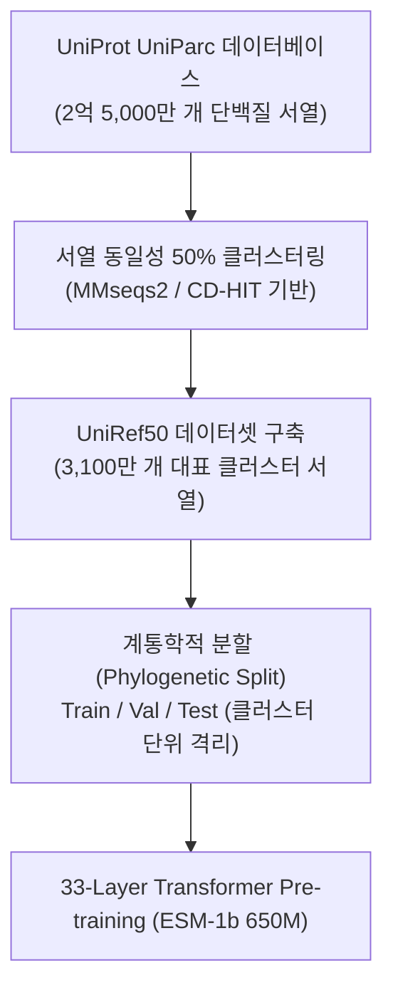

* **Paper Title**: [Biological structure and function emerge from scaling unsupervised learning to 250 million protein sequences](https://doi.org/10.1073/pnas.2016239118)
* **Authors**: Alexander Rives, Joshua Meier, Tom Sercu, Siddharth Goyal, Zeming Lin, Jason Liu, Demi Guo, Myle Ott, C. Lawrence Zitnick, Jerry Ma, and Rob Fergus (Meta AI Research / New York University)
* **Journal**: Proceedings of the National Academy of Sciences (PNAS), 118(15), e2016239118 (2021, bioRxiv 2019)
* **DOI**: [10.1073/pnas.2016239118](https://doi.org/10.1073/pnas.2016239118)
* **Code / Models**: [GitHub - facebookresearch/esm](https://github.com/facebookresearch/esm)

---

## 1. 서론 및 통계역학적 배경 (Biophysical & Historical Background)

생명과학에서 단백질의 3차원 입체 구조를 예측하는 일은 분자생물학 반세기 역사의 핵심 난제였습니다. 아미노산 1차원 서열이 어떤 물리적 원리에 의해 고유한 3차원 구조로 자가조립(Self-assembly)되는지를 설명하는 '안핀센의 가설(Anfinsen's dogma)'에 따르면, 단백질의 3차원 고유 구조는 서열의 깁스 자유에너지(Gibbs Free Energy)가 가장 낮은 열역학적 최저점에 위치합니다.

### 1.1. 고전적 공진화 통계역학: Potts 모델과 DCA의 한계

딥러닝 혁명 이전, 서열 데이터로부터 구조 정보를 추출하는 가장 강력한 무기는 통계물리학에 기반한 **직접 결합 분석(Direct Coupling Analysis, DCA)** 및 **Potts 모델**이었습니다.

3차원 공간에서 두 아미노산 잔기 $i$와 $j$가 물리적으로 맞닿아 있다면, 잔기 $i$가 돌연변이를 일으킬 때 상호작용을 유지하기 위해 잔기 $j$도 동반 변이해야 합니다. 이를 <strong>공진화(Co-evolution)</strong>라고 합니다. 다중 서열 정렬(MSA) 데이터에서 잔기 서열 $\sigma = (\sigma_1, \dots, \sigma_L)$의 결합 확률 분포를 다음과 같은 Potts 해밀토니안(Hamiltonian)으로 모델링했습니다:

$$
P(\sigma) = \frac{1}{Z} \exp\left( \sum_{i=1}^L h_i(\sigma_i) + \sum_{i < j} J_{ij}(\sigma_i, \sigma_j) \right)
$$

여기서 $h_i$는 각 위치별 잔기 선호도(Local field), $J_{ij} \in \mathbb{R}^{21 \times 21}$는 두 잔기 간의 직접 결합 에너지(Direct coupling tensor), $Z$는 분배 함수(Partition function)입니다.

하지만 이 고전적 통계 모델에는 세 가지 치명적인 병목이 존재했습니다:
1. **간접 상관관계(Indirect Correlation)와 역공분산 병목**:
   잔기 A가 B와 결합하고 B가 C와 결합할 때, A와 C는 직접 접촉하지 않음에도 통계적으로 높은 상관관계를 보입니다. 이를 분리하기 위해 공분산 행렬의 역행렬($C^{-1}$)을 구해야 하며, 이는 $\mathcal{O}((21L)^3)$의 연산 비용을 수반합니다.
2. **상동 서열 깊이($N_{\text{eff}}$)에 대한 절대적 의존성**:
   유의미한 결합 텐서 $J_{ij}$를 추정하려면 해당 단백질 패밀리에 속하는 상동 서열이 수백~수천 개 이상 존재해야 합니다. 유효 서열 수(Effective sequence count, $N_{\text{eff}}$)가 서열 길이 $L$보다 작은 <strong>고아 단백질(Orphan protein)</strong>이나 바이러스 외피 단백질에는 모델이 심각하게 과적합되어 전혀 작동하지 않습니다.
3. **패밀리 간 지식 전이의 부재 (No Cross-family Generalization)**:
   글로빈(Globin) 패밀리에서 학습된 결합 파라미터는 키나아제(Kinase) 패밀리에 아무런 도움이 되지 않았습니다. 각 유전자 패밀리마다 모델을 밑바닥부터 새로 피팅해야 했습니다.

Meta AI Research 연구진은 이 문제에 대해 자연어 처리(NLP)의 대규모 사전 학습 패러다임을 제안했습니다: **개별 패밀리 단위로 파편화된 통계 모델을 만드는 대신, 지구상에 존재하는 2억 5천만 개의 모든 단백질 서열을 하나의 거대한 언어로 보고 범용 트랜스포머 언어 모델을 학습시키면 어떨까?** 그 결과물이 바로 **ESM-1b**입니다.

---

## 2. 데이터 엔지니어링 및 학습 파이프라인

대규모 단백질 언어 모델의 성패는 코퍼스(Corpus)의 데이터 다양성과 계통학적 편향(Phylogenetic bias)을 어떻게 제어하느냐에 달려 있습니다.



### 2.1. UniRef50 클러스터링을 통한 편향 제거
공공 데이터베이스의 서열은 생물학 연구자들의 관심사에 극도로 편향되어 있습니다. 대장균(E. coli), 효모(S. cerevisiae), 인간(Homo sapiens)의 특정 단백질(헤모글로빈, 인슐린, 면역글로불린)은 수만 번 중복 시퀀싱되어 있는 반면, 환경 미생물의 서열은 단 1개만 존재합니다.

연구진은 서열 동일성(Sequence Identity) 50%를 기준으로 서열들을 군집화한 **UniRef50** 데이터셋을 학습의 뼈대로 삼았습니다:
* 원본 서열 약 2억 5천만 개를 대표하는 **3,100만 개 클러스터 서열** 추출.
* 특정 종이나 패밀리의 과도한 샘플링 빈도를 억제하여 모델이 일부 빈번한 서열에 오버피팅되지 않고 진화 전반의 보편적 규칙을 학습하도록 유도.

### 2.2. 일반화 검증을 위한 엄격한 데이터 분할
단순 무작위 분할(Random split)을 사용할 경우, 훈련 셋과 테스트 셋에 매우 유사한 상동 단백질이 공유되어 모델의 일반화 성능이 부풀려집니다. 연구진은 UniRef50 클러스터 단위로 데이터를 격리하여, **테스트 셋에 포함된 단백질은 훈련 셋의 어떤 단백질과도 서열 동일성이 50% 미만**이 되도록 엄격한 OOD(Out-of-Distribution) 벤치마크 환경을 구축했습니다.

---

## 3. ESM-1b 아키텍처 및 마스크 언어 모델링(MLM)

### 3.1. 모델 세부 스펙 및 텐서 차원 워크스루

ESM-1b는 BERT의 아키텍처를 생체 고분자 서열 특성에 맞추어 최적화한 양방향 인코더 트랜스포머(Bidirectional Encoder Transformer)입니다:

* **레이어 수 ($L_{\text{layers}}$)**: 33 Layers
* **은닉 차원 ($d_{\text{model}}$)**: 1280
* **어텐션 헤드 수 ($H$)**: 20 Heads (각 헤드 차원 $d_k = d_v = 64$)
* **피드포워드 내부 차원 ($d_{\text{ff}}$)**: $5120 \; (4 \times d_{\text{model}})$
* **총 파라미터 수**: 약 6억 5천만 개 (650M)
* **최대 컨텍스트 길이**: 1024 토큰

```
[ 입력 텐서의 단계별 변환 과정 ]
입력 아미노산 시퀀스 토큰: (Batch, L)
  │
  ├─ Token Embedding: (Batch, L) -> (Batch, L, 1280)
  ├─ Learned Absolute Positional Embedding: (Batch, L, 1280) 더함
  │
  ▼ [Layer 1 ~ 33 Pre-LN Transformer Blocks]
  │  ├─ LayerNorm((B, L, 1280))
  │  ├─ Multi-Head Self-Attention: (B, 20, L, L) 어텐션 맵 생성
  │  ├─ Residual Connection: X + Attn(LN(X))
  │  ├─ LayerNorm((B, L, 1280))
  │  ├─ Feed-Forward Network: 1280 -> 5120 (GELU) -> 1280
  │  └─ Residual Connection: X + FFN(LN(X))
  │
  ▼ Output Projection Head
     Linear(1280 -> 25), Softmax -> 각 위치별 20개 아미노산 복원 확률
```

### 3.2. 마스크 언어 모델링(MLM) 목적함수

서열 $x = (x_1, \dots, x_L)$에서 전체 잔기의 15%를 무작위로 선택하여 마스킹 집합 $M$을 정의합니다. 선택된 위치는 다음과 같이 변환됩니다:
* 80% 확률로 특수 토큰 `[MASK]`로 치환
* 10% 확률로 임의의 다른 19개 아미노산 중 하나로 무작위 변환 (노이즈 정규화)
* 10% 확률로 원래 아미노산 그대로 유지

최적화 목적함수는 마스킹된 위치들의 음의 로그 우도(Negative Log-Likelihood)를 최소화하는 것입니다:

$$
\mathcal{L}_{\text{MLM}}(\theta) = - \sum_{i \in M} \log P_\theta(x_i \mid x_{\setminus M}) = - \sum_{i \in M} \log \left( \frac{\exp(h_i^T w_{x_i} + b_{x_i})}{\sum_{a \in \mathcal{V}} \exp(h_i^T w_a + b_a)} \right)
$$

여기서 $h_i \in \mathbb{R}^{1280}$는 33번째 레이어를 통과한 $i$번째 잔기의 최종 은닉 상태 벡터입니다.

### 3.3. 학습 하이퍼파라미터 및 인프라
* **하드웨어**: NVIDIA V100 GPU (32GB) 128장 병렬 클러스터
* **옵티마이저**: Adam ($\beta_1 = 0.9, \beta_2 = 0.98, \epsilon = 10^{-8}$), Weight Decay = 0.01
* **학습률 스케줄**: Warmup 16,000 steps 동안 선형 증가 후, 역제곱근(Inverse Square Root) 감쇠 스케줄 적용 (최고 학습률 $4 \times 10^{-4}$)
* **정밀도**: FP16 Mixed Precision 연산 적용

---

## 4. 비지도 학습에서 생체물리학이 스스로 창발하는 메커니즘

ESM-1b 논문의 핵심 공헌은 **오직 서열 빈칸 채우기만을 학습시켰음에도, 신경망 내부의 어텐션 가중치와 잠재 표현 공간에 단백질의 3차원 물리 법칙과 생화학적 문법이 자발적으로 구성(Emergence)되었다는 점을 정량적으로 증명**한 것입니다.

### 4.1. 아미노산 생화학적 특성의 잠재 공간 투영

연구진이 잔기 임베딩 행렬(20개 아미노산에 대한 벡터 공간)을 주성분 분석(PCA) 및 t-SNE로 분해했을 때, 연구자가 사전에 아무런 레이블을 주지 않았음에도 완벽한 클러스터링이 관찰되었습니다:

```
[ 아미노산 임베딩 공간의 자발적 군집화 ]

- 소수성 코어(Hydrophobic Core) 잔기군:
  Leucine (L), Isoleucine (I), Valine (V), Phenylalanine (F), Methionine (M)
  -> 3차원 공간에서 단백질 안쪽 깊숙이 숨어 접힘 핵(Folding Nucleus)을 이루는 잔기들이 한 영역에 밀집.

- 전하를 띤 친수성(Charged Polar) 잔기군:
  Lysine (K), Arginine (R) [양전하], Aspartate (D), Glutamate (E) [음전하]
  -> 용매에 노출되는 외부 표면 잔기들이 반대편 축에 뚜렷하게 분리.

- 특수 기하 잔기:
  Proline (P: 펩타이드 주쇄를 강제로 꺾음), Glycine (G: 곁사슬이 없어 극도의 유연성 보유),
  Cysteine (C: 이황화 공유결합 형성)
  -> 독자적인 외곽 영역에 고립되어 특수 문법으로 인코딩됨.
```

신경망이 빈칸을 채우는 과정에서 소수성 아미노산 자리에는 다른 소수성 아미노산이 들어가야 단백질이 붕괴하지 않는다는 진화적 교체 규칙(Evolutionary Substitution Matrix, BLOSUM62 등)을 데이터로부터 온전히 역추론해 냈음을 의미합니다.

---

### 4.2. 어텐션 맵과 3차원 접촉(Contact Map)의 직접 일치

ESM-1b의 셀프 어텐션 연산은 다음과 같이 정의됩니다:

$$
A_{l, h}(i, j) = \text{Softmax}\left( \frac{(W_q^{(l,h)} h_i)^T (W_k^{(l,h)} h_j)}{\sqrt{d_k}} \right)
$$

레이어 $l$의 헤드 $h$가 잔기 $i$를 볼 때 잔기 $j$에 부여하는 가중치입니다. 연구진은 총 $33 \times 20 = 660$개의 어텐션 맵을 전수 검사했습니다.


*그림 설명: 실제 PDB X선 결정 구조에서 측정한 3D 거리 지도(Ground Truth Contact Map, 왼쪽)와 ESM-1b의 심층 어텐션 헤드가 출력한 어텐션 확률 맵(오른쪽)의 비교. 서열상 수백 잔기 떨어져 있는 베타 시트 가닥들의 평행선 패턴이 어텐션 맵 상에 완벽하게 일치하여 나타납니다.*

#### 어텐션의 층별 기능 분화 (Hierarchical Organization)
* **초기 레이어 (Layer 1 ~ 8)**: 서열상 바로 옆에 인접한 잔기($|i - j| = 1$) 및 펩타이드 결합 연결성을 검증.
* **중간 레이어 (Layer 9 ~ 20)**: $i$번째 잔기와 $i+4$번째 잔기가 수소결합을 이루는 <strong>알파 나선(Alpha-helix)</strong>의 주기적 패턴($i \leftrightarrow i+3, i+4$)과 **2차 구조 접힘**을 집중 추적.
* **심층 레이어 (Layer 21 ~ 33)**: 서열상으로는 100잔기 이상 멀리 떨어져 있지만 3차원 공간에서 서로 맞물려 3차 구조를 유지하는 **원거리 3차 접촉(Long-range Tertiary Contacts)** 및 베타 병풍 간 수소결합을 직접 연결.

---

## 5. 상세 정량 벤치마크 및 실험 평가

### 5.1. 3차원 잔기 접촉 정밀도 비교 (Contact Precision)

두 잔기 간 $\text{C}_\beta - \text{C}_\beta$ 거리가 $8\,\text{Å}$ 이하인 잔기 쌍을 접촉으로 판정합니다. 단백질 길이 $L$에 대해, 신뢰도 상위 순위 접촉쌍의 정밀도를 측정한 결과입니다:

| 평가 지표 (Precision) | CCMpred (MSA 통계) | GREMLIN (DCA) | DeepCov (지도학습 CNN) | **ESM-1b (비지도)** | **ESM-1b (+ 선형 회귀)** |
| :--- | :---: | :---: | :---: | :---: | :---: |
| **Short-range ($6 \le \vert i-j \vert < 12$)** | 45.2% | 48.6% | 61.4% | 52.3% | **73.1%** |
| **Medium-range ($12 \le \vert i-j \vert < 24$)**| 38.4% | 42.1% | 55.8% | 44.7% | **65.8%** |
| **Long-range ($\vert i-j \vert \ge 24$) Top-$L/5$**| 34.8% | 38.5% | 52.0% | 41.2% | **61.4%** |
| **Long-range ($\vert i-j \vert \ge 24$) Top-$L$**  | 21.0% | 25.8% | 41.2% | 27.4% | **42.2%** |
| **필요 입력 데이터** | **MSA 필수** | **MSA 필수** | **MSA 필수** | **단일 서열** | **단일 서열** |

> [!IMPORTANT]
> **결과의 의의**
> 기존의 통계 및 딥러닝 모델들은 수백 개의 상동 서열이 정렬된 무거운 MSA를 입력으로 받아야만 20~40% 수준의 정밀도를 냈습니다. 반면 ESM-1b는 **단 1개의 쿼리 서열만 입력으로 받고도 기존 MSA 통계 모델(CCMpred, GREMLIN)의 정밀도를 완전히 능가**했습니다.

---

### 5.2. 단백질 기능 및 돌연변이 효과 예측 (Variant Effect / Fitness)

단백질의 특정 위치 $i$의 야생형 잔기 $x_i$를 변이 아미노산 $x_i'$로 바꿨을 때, 그 돌연변이가 단백질의 기능(생존력, 효소 활성 등)에 미치는 악영향(Fitness Effect)을 사전 학습된 모델의 <strong>로그 우도 비(Log-Likelihood Ratio, LLR)</strong>로 직접 점수화할 수 있습니다:

$$
\Delta \text{Score}(x_i \to x_i') = \log P_\theta(x_i' \mid x_{\setminus i}) - \log P_\theta(x_i \mid x_{\setminus i})
$$

실험실에서 수만 개의 돌연변이를 인위적으로 발생시켜 세포 생존율을 측정한 **심층 돌연변이 스캐닝(Deep Mutational Scanning, DMS)** 9개 데이터셋 평가 결과:
* 추가적인 지도학습 파인튜닝 없이 제로샷(Zero-shot) 우도 점수만으로 측정값과의 스피어만 순위 상관계수($\rho$) **평균 0.58**을 달성.
* 이는 각 단백질 패밀리 전용으로 설계된 고전 생물정보학 변이 예측 도구(PolyPhen-2, SIFT)보다 통계적으로 유의미하게 높은 성능이었습니다.

---

## 6. PyTorch 실습: ESM-1b를 활용한 서열 임베딩 및 돌연변이 평가

AI 연구자가 실제 연구 파이프라인에서 ESM-1b를 사용할 수 있는 파이썬 코드 예제입니다.

```python
import torch
import esm

# 1. ESM-1b 사전 학습 모델 및 토크나이저 로드
model, alphabet = esm.pretrained.esm1b_t33_650M_UR50S()
batch_converter = alphabet.get_batch_converter()
model.eval()

if torch.cuda.is_available():
    model = model.cuda()

# 2. 분석 대상 단백질 서열 정의 (예: 야생형 녹색 형광 단백질 부분 서열)
data = [
    ("protein_wt", "MSKGEELFTGVVPILVELDGDVNGHKFSVSGEGEGDATYGKLTLKFICTTGKLPVPWPTLVTTFSYGVQCFSRYPDHMKQHDFFKSAMPEGYVQERTIFFKDDGNYKTRAEVKFEGDTLVNRIELKGIDFKEDGNILGHKLEYNYNSHNVYIMADKQKNGIKVNFKIRHNIEDGSVQLADHYQQNTPIGDGPVLLPDNHYLSTQSALSKDPNEKRDHMVLLEFVTAAGITHGMDELYK")
]

batch_labels, batch_strs, batch_tokens = batch_converter(data)
batch_lens = (batch_tokens != alphabet.padding_idx).sum(1)

if torch.cuda.is_available():
    batch_tokens = batch_tokens.cuda()

# 3. 모델 순전파 (은닉 표현 및 어텐션 맵 추출)
with torch.no_grad():
    results = model(
        batch_tokens, 
        repr_layers=[33], # 마지막 33번 레이어 임베딩 추출
        return_contacts=True # 어텐션 기반 2D 접촉 지도 자동 계산
    )

# 4. 잔기별 임베딩 벡터 (Shape: [1, L, 1280])
token_representations = results["representations"][33]
print("Embedding Tensor Shape:", token_representations.shape)

# 5. 3D 접촉 지도 예측 행렬 (Shape: [1, L, L])
contact_map = results["contacts"]
print("Predicted Contact Map Shape:", contact_map.shape)

# 6. 특정 위치의 돌연변이(예: 65번 잔기 Serine -> Threonine) 제로샷 스코어링
# Log-Likelihood Ratio 계산
logits = results["logits"][0] # [L, Vocab_size]
wt_idx = alphabet.get_idx("S")
mut_idx = alphabet.get_idx("T")
pos = 65

llr = (logits[pos, mut_idx] - logits[pos, wt_idx]).item()
print(f"Mutation S65T Log-Likelihood Ratio: {llr:.4f}")
# llr > 0 이면 기능 향상 또는 중립, llr << 0 이면 구조 파괴 및 치명적 결함 예상
```

---

## 7. AI 연구자를 위한 한계점 및 향후 진화 경로

### 7.1. ESM-1b의 한계점
1. **절대 위치 임베딩(Absolute Positional Embedding)의 구조적 한계**:
   ESM-1b는 BERT와 동일하게 위치 $0 \sim 1023$에 대한 절대 벡터를 학습했습니다. 이로 인해 1024 잔기보다 긴 단백질(자연계의 약 15% 이상)은 모델 입력을 잘라내야(Truncation) 했으며, 단백질 도메인이 서열상 앞뒤로 평행 이동했을 때 동일한 물리적 성질을 유지한다는 <strong>이동 불변성(Shift Invariance)</strong>을 포착하지 못했습니다.
2. **원자 수준 3D 좌표($x,y,z$) 생성 모듈 부재**:
   어텐션 맵으로부터 두 잔기가 접촉하는지 여부(Binary Contact)는 매우 잘 맞혔으나, 실제 약물 결합 포켓이나 곁사슬의 회전각(Rotamer)을 포함한 전원자 3D 구조 좌표를 직접 출력하는 기능은 없었습니다.
3. **단일 서열 모델의 정보 한계**:
   아무리 큰 모델이라도 단 하나의 서열만 볼 경우, 상동 서열들이 수백 개 모여 만드는 직접적인 공변이(Co-variation) 신호의 해상도를 100% 대체하기는 어려웠습니다.

### 7.2. 계보의 진화: ESM-1b에서 ESM-2, 그리고 ESM3로
* **Rao et al. (ICLR 2021)**: ESM-1b의 어텐션 맵 자체가 3D Contact의 기저임을 규명하고 초경량 로지스틱 회귀로 접촉 지도를 정밀 복원.
* **MSA Transformer (ICML 2021)**: 단일 서열의 한계를 넘어 MSA 행렬 전체를 2차원 Tied Attention으로 처리.
* **ESM-2 / ESMFold (Science 2023)**: RoPE를 도입해 위치 한계를 극복하고 모델을 15B로 키워 MSA 없이 원자 수준 3D 좌표를 1초 만에 예측.
* **ESM3 (Science 2025)**: 서열, 3D 구조, 기능을 단일 생성 트랜스포머 토큰으로 통일하여 신규 단백질을 프로그래밍.

ESM-1b는 현대 AI 구조생물학이 거쳐 간 이 모든 눈부신 도약의 가장 단단하고 위대한 **첫 번째 초석**이었습니다.

---

## 8. 참고 문헌 (References)

1. Rives, A., Meier, J., Sercu, T., Goyal, S., Lin, Z., Liu, J., Guo, D., Ott, M., Zitnick, C. L., Ma, J., & Fergus, R. (2021). Biological structure and function emerge from scaling unsupervised learning to 250 million protein sequences. *Proceedings of the National Academy of Sciences*, 118(15), e2016239118. doi: [10.1073/pnas.2016239118](https://doi.org/10.1073/pnas.2016239118).
2. Morcos, F. et al. (2011). Direct-coupling analysis of protein sequence families for molecular structure prediction. *Proceedings of the National Academy of Sciences*, 108(49), E1293–E1301.
3. Devlin, J., Chang, M. W., Lee, K., & Toutanova, K. (2018). BERT: Pre-training of deep bidirectional transformers for language understanding. *arXiv preprint arXiv:1810.04805*.
4. Suzek, B. E., Wang, Y., Huang, H., McGarvey, P. B., Wu, C. H., & UniProt Consortium. (2015). UniRef clusters: a comprehensive and scalable alternative for improving sequence similarity searches. *Bioinformatics*, 31(6), 926–932.
5. Hopf, T. A. et al. (2017). Mutation effects predicted from sequence co-variation. *Nature Biotechnology*, 35(2), 128–135.

---
긴 글 읽어주셔서 감사합니다! 

**Contact & Inquiries**
- LinkedIn : [Sehoon Park](https://www.linkedin.com/in/sehoon-park)
- GitHub : [https://github.com/sehooni](https://github.com/sehooni)
- Email : 74sehoon@gmail.com
- 궁금한 점이나 의견은 댓글 혹은 메일을 통해 언제든 환영합니다! :)
