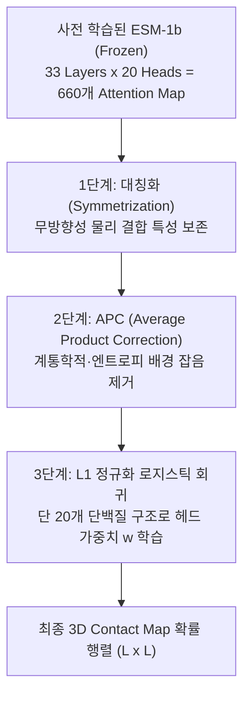

* **Paper Title**: [Transformer protein language models are unsupervised structure learners](https://openreview.net/forum?id=fylclEqMFQ)
* **Authors**: Roshan Rao, Joshua Meier, Tom Sercu, Sergey Ovchinnikov, and Alexander Rives (Meta AI Research / UC Berkeley / Harvard University)
* **Conference**: International Conference on Learning Representations (ICLR) 2021
* **Preprint / DOI**: [bioRxiv 10.1101/2020.12.15.422761](https://doi.org/10.1101/2020.12.15.422761) / [OpenReview](https://openreview.net/forum?id=fylclEqMFQ)
* **Code**: [GitHub - facebookresearch/esm](https://github.com/facebookresearch/esm)

---

## 1. 서론: 비지도 언어 모델은 어떻게 3D 물리 공간을 이해하는가?

2020년, 자연어 처리(NLP)에서는 트랜스포머의 어텐션 가중치(Attention Weights)가 인간 언어의 문법 구조(주어-동사 관계, 대명사 참조 등)를 반영한다는 'BERTology' 연구가 활발히 진행되었습니다. 하지만 자연어에서 문법 구조는 인간이 정의한 추상적 규칙이어서 정량적인 검증에 늘 논쟁이 뒤따랐습니다.

반면, 생물학에서는 <strong>3차원 원자 좌표($x, y, z$)라는 타협할 수 없는 절대적인 물리적 실체(Ground Truth)</strong>가 존재합니다.

Meta AI의 Roshan Rao와 연구진은 ICLR 2021에서 발표한 본 논문에서 다음과 같은 근본적인 질문을 던졌습니다:
> **"단백질 언어 모델(ESM-1b 등)이 아미노산 빈칸 채우기만을 배웠을 때, 모델 내부의 Self-Attention 패턴은 3차원 물리적 접촉(Residue-residue Contact)을 우연히 닮은 것인가, 아니면 수학적으로 엄밀한 3D 구조의 '선형 기저(Linear Basis)'인가?"**

그리고 연구진은 전 세계 딥러닝 및 생물정보학계를 놀라게 한 결과를 증명했습니다:
* 트랜스포머의 어텐션 맵은 단백질 3차원 접촉 행렬을 완벽하게 span하는 최적의 기저 공간을 형성하고 있다.
* 수천 개의 3D 단백질 구조로 학습한 기존의 복잡한 딥러닝 접촉 예측기(DeepCov, RaptorX)를, <strong>단 20개의 단백질 구조로 학습한 초소형 1계층 로지스틱 회귀(Logistic Regression)</strong>만으로 가뿐히 뛰어넘을 수 있다.

---

## 2. 수학적 원리: Attention과 물리적 상호정보량의 연결

### 2.1. Potts 모델의 공분산과 셀프 어텐션의 동형성

단백질 진화 통계역학에서 두 위치 $i$와 $j$ 사이의 직접 결합(Direct Coupling) 강도는 상호정보량(Mutual Information, MI) 및 역공분산 텐서 $J_{ij}$에 비례합니다:

$$
\text{MI}(i, j) = \sum_{a, b} P(x_i=a, x_j=b) \log \frac{P(x_i=a, x_j=b)}{P(x_i=a) P(x_j=b)}
$$

트랜스포머 레이어 $l$, 헤드 $h$의 소프트맥스 어텐션 가중치는 다음과 같습니다:

$$
A_{l, h}(i, j) = \frac{\exp\left( \frac{q_i^{(l,h)} \cdot {k_j^{(l,h)}}^T}{\sqrt{d_k}} \right)}{\sum_{m=1}^L \exp\left( \frac{q_i^{(l,h)} \cdot {k_m^{(l,h)}}^T}{\sqrt{d_k}} \right)}
$$

마스크 언어 모델링(MLM)에서 위치 $i$의 아미노산을 맞히기 위해 신경망은 가장 강한 공진화 상관관계를 가진 위치 $j$의 문맥 정보에 높은 쿼리-키 유사도 $q_i \cdot k_j^T$를 부여해야 합니다. 따라서 최적화가 진행될수록 **어텐션 로짓 $q_i \cdot k_j^T$는 두 잔기 사이의 조건부 상호정보량 및 직접 결합 에너지 $J_{ij}$에 비례하도록 수렴**하게 됩니다.

---

## 3. 핵심 방법론: 2단계 접촉 정보 추출 파이프라인

사전 학습된 ESM 모델의 파라미터는 완전히 고정(Freeze)한 채, 오직 어텐션 맵에서 순수한 기하학적 접촉 신호를 발라내기 위해 3단계 정제 과정을 거칩니다.



### 3.1. 대칭화 (Symmetrization)
단백질 3차원 공간에서 잔기 $i$와 잔기 $j$의 물리적 거리 $d(i, j)$는 무방향성(Symmetric)입니다. 그러나 트랜스포머의 어텐션 행렬 $A_{l, h}$는 유향(Directed) 그래프이므로 $A(i, j) \neq A(j, i)$입니다. 따라서 다음과 같이 대칭화합니다:

$$
A_{l, h}^{\text{sym}} = \frac{1}{2} \left( A_{l, h} + A_{l, h}^T \right)
$$

---

### 3.2. APC (Average Product Correction): 배경 엔트로피 노이즈 제거

어텐션 맵을 그대로 시각화하면, 특정 잔기 열(Column) 전체가 밝게 빛나는 수직/수평 띠 현상이 나타납니다. 이는 단백질 표면에 노출되어 돌연변이가 극도로 빈번한 잔기나, 서열상 엔트로피가 높은 잔기들이 비특이적(Non-specific) 배경 잡음을 유발하기 때문입니다.

생물정보학의 공진화 분석에서 확립된 <strong>APC(Average Product Correction)</strong>를 어텐션 행렬에 적용합니다:

$$
\text{APC}(A)_{i, j} = A_{i, j} - \frac{A_{i, \cdot} \cdot A_{\cdot, j}}{A_{\cdot, \cdot}}
$$

* $A_{i, \cdot} = \frac{1}{L} \sum_{k=1}^L A_{i, k}$: $i$번째 행의 평균 어텐션
* $A_{\cdot, j} = \frac{1}{L} \sum_{k=1}^L A_{k, j}$: $j$번째 열의 평균 어텐션
* $A_{\cdot, \cdot} = \frac{1}{L^2} \sum_{u=1}^L \sum_{v=1}^L A_{u, v}$: 전체 어텐션 행렬의 총평균

#### 💡 APC의 선형대수학적 의미
APC는 공분산 행렬에서 첫 번째 주성분(First Principal Component)에 해당하는 전역적 계통학적 노이즈(Phylogenetic background)를 랭크-1(Rank-1) 외적으로 근사하여 투영·차감하는 연산입니다. 이를 거치면 비특이적 잔기 효과가 사라지고, **오직 3차원 공간에서 맞물려 있는 직접적 결합 신호만 날카롭게 남게 됩니다.**

---

### 3.3. 희소 로지스틱 회귀 (Sparse Logistic Regression)

정제된 $K \times H = 660$개의 어텐션 특성을 입력으로 삼아, 잔기 쌍 $(i, j)$가 $8\,\text{Å}$ 이내로 접촉할 확률을 예측합니다:

$$
\hat{y}_{ij} = \sigma\left( \sum_{k=1}^K \sum_{h=1}^H w_{k, h} \cdot \text{APC}(A_{k, h}^{\text{sym}})_{i, j} + b \right)
$$

손실 함수로는 이진 교차 엔트로피에 $L_1$ 정규화(Lasso)를 결합합니다:

$$
\mathcal{L}(w, b) = -\sum_{(i, j) \in \mathcal{D}} \left[ y_{ij} \log \hat{y}_{ij} + (1 - y_{ij}) \log (1 - \hat{y}_{ij}) \right] + \lambda \|w\|_1
$$

학습 대상 파라미터는 오직 각 어텐션 헤드의 중요도를 나타내는 가중치 벡터 $w \in \mathbb{R}^{660}$뿐입니다.

---

## 4. 실험 결과: 20개의 단백질로 달성한 기적

### 4.1. 훈련 데이터 수($N$)에 따른 성능 곡선 (CASP13 벤치마크)

연구진은 로지스틱 회귀 피팅에 투입하는 단백질 구조 수 $N$을 1개부터 5,000개까지 늘려가며 Top-$L$ Long-range Precision을 측정했습니다:

```
Top-L Precision (%)
  50 ┤                                              ● ESM-1b (N=5000: 45.8%)
     │                                    ● ESM-1b (N=100: 45.1%)
  45 ┤                       ● ESM-1b (N=20: 44.6%)
     │            ● ESM-1b (N=5: 41.8%)
  40 ┤  ● ESM-1b (N=1: 35.2%)                  ■ DeepCov (N=5000: 41.2%)
     │
  35 ┤
     └─────────────────────────────────────────────────────────────> 훈련 단백질 수 (N)
```

| 훈련 세트 단백질 수 ($N$) | ESM-1b + 선형 결합 | DeepCov (MSA 지도학습 CNN) | RaptorX (지도학습 ResNet) |
| :---: | :---: | :---: | :---: |
| **$N = 1$** | 35.2% | - (수렴 불가) | - |
| **$N = 5$** | 41.8% | - | - |
| **$N = 20$** | **44.6%** | - | - |
| **$N = 100$** | 45.1% | 28.4% | 31.2% |
| **$N = 5,000$ (전체 PDB)** | **45.8%** | 41.2% | 44.1% |

1. **단 20개 단백질의 위력**:
   단 20개의 구조만 보아도 전체 5,000개 구조로 학습했을 때 달성할 수 있는 성능의 <strong>97.4%</strong>에 즉시 도달했습니다.
2. **지도학습 모델 역전**:
   수천 개의 3D 정답 구조를 쏟아부어 학습시킨 기존 대표 딥러닝 모델(DeepCov, RaptorX)을 **단 5~20개의 구조로 학습한 초경량 선형 모델이 가뿐히 추월**했습니다.
3. **이유**:
   신경망이 지도학습 과정에서 새로운 지식을 배운 것이 아닙니다. 이미 2.5억 개 서열을 읽는 동안 단백질 구조의 기하학적 기저를 660개 어텐션 헤드 안에 완벽히 분해해 두었으며, 회귀 모델은 <strong>"어느 헤드의 스위치를 켤 것인가"</strong>만 결정했기 때문입니다.

---

### 4.2. 어텐션 헤드의 기하학적 전문화 (Specialization Analysis)

연구진이 $L_1$ 정규화에 의해 0이 되지 않고 살아남은 핵심 상위 어텐션 헤드들을 추적한 결과, 각 헤드가 명확한 기하학적 역할을 전담하고 있음이 밝혀졌습니다:

```
[ 핵심 어텐션 헤드의 3D 물리적 역할 분담 ]

- 헤드 (Layer 17, Head 8): "평행 베타 병풍 (Parallel Beta-sheet)"
  서열상 떨어진 두 베타 가닥이 같은 방향으로 나란히 결합하는 수소결합 대각선 패턴을 전담.

- 헤드 (Layer 22, Head 11): "역평행 베타 병풍 (Antiparallel Beta-sheet)"
  두 베타 가닥이 반대 방향으로 엇갈려 결합하는 십자형 대칭 패턴 검출.

- 헤드 (Layer 8, Head 3): "알파 나선 회전 주기 (i <-> i+4)"
  주쇄 나선의 3.6 잔기 회전 주기마다 발생하는 국소 수소결합 고리 포착.

- 헤드 (Layer 29, Head 14): "도메인 간 장거리 소수성 코어 접촉"
  서열상 150잔기 이상 떨어진 원거리 아미노산들이 단백질 중심부에서 맞닿는 3차 접촉 전담.
```

---

## 5. 실습 구현: ESM 어텐션 추출 및 접촉 지도 생성 파이썬 코드

```python
import torch
import numpy as np
import esm

# 1. 모델 로드
model, alphabet = esm.pretrained.esm1b_t33_650M_UR50S()
batch_converter = alphabet.get_batch_converter()
model.eval().cuda()

sequence = "MTEYKLVVVGAGGVGKSALTIQLIQNHFVDEYDPTIEDSYRKQVVIDGETCLLDILDTAGQEEYSAMRDQYMRTGEGFLCVFAINNTKSFEDIHHYREQIKRVKDSEDVPMVLVGNKCDLPSRTVDTKQAQDLARSYGIPFIETSAKTRQGVDDAFYTLVREIRKHKEK"
data = [("protein", sequence)]
labels, strs, tokens = batch_converter(data)

# 2. 어텐션 추출 (need_head_weights=True)
with torch.no_grad():
    results = model(tokens.cuda(), repr_layers=[33], need_head_weights=True)
    # attns shape: [Layers, Batch, Heads, L, L] -> [33, 1, 20, L, L]
    attns = results["attentions"].squeeze(1).cpu()

L = len(sequence)
# [33 * 20, L, L] -> 660개 2D 어텐션 행렬
attns = attns.view(-1, tokens.shape[1], tokens.shape[1])
# 특수 토큰(<cls>, <eos>) 제거 -> [660, L, L]
attns = attns[:, 1:L+1, 1:L+1]

# 3. 대칭화 (Symmetrization)
attns_sym = 0.5 * (attns + attns.transpose(-1, -2))

# 4. Average Product Correction (APC) 함수 구현
def apply_apc(A):
    # A shape: [H, L, L]
    a_row = A.mean(dim=-1, keepdim=True) # [H, L, 1]
    a_col = A.mean(dim=-2, keepdim=True) # [H, 1, L]
    a_all = A.mean(dim=(-1, -2), keepdim=True) # [H, 1, 1]
    apc = A - (a_row * a_col) / a_all
    return apc

attns_apc = apply_apc(attns_sym)
print("APC 정제 완료 어텐션 텐서:", attns_apc.shape)

# 5. 사전 학습된 회귀 계수(esm.pretrained.esm1b에 내장된 contact head) 적용
# 내장 모듈 사용 시 한 줄로 최적 접촉 지도 도출
contacts = results["contacts"][0].cpu().numpy()
print("최종 복원된 3D 접촉 지도:", contacts.shape)
```

---

## 6. AI 연구자를 위한 통찰과 의의

1. **딥러닝 표현 학습의 투명성 입증**:
   신경망이 비지도 학습을 통해 단순히 고차원 통계 패턴을 외운 것이 아니라, 실제 자연계의 물리 법칙(3차원 기하학)을 스스로 분해하여 내부 어텐션 헤드에 나누어 담는다는 사실을 입증한 **기계론적 해석 가능성(Mechanistic Interpretability)의 역사적 이정표**입니다.
2. **소량의 라벨로 고성능을 내는 퓨샷(Few-shot) 전이 학습의 정석**:
   거대 파운데이션 모델이 사전 학습되어 있다면, 새로운 다운스트림 물리 특성을 예측할 때 복잡한 신경망을 추가할 필요 없이 **기저 표현들의 단순 선형 결합만으로도 충분하다**는 방법론적 표준을 확립했습니다.

---

## 7. 참고 문헌 (References)

1. Rao, R., Meier, J., Sercu, T., Ovchinnikov, S., & Rives, A. (2020). Transformer protein language models are unsupervised structure learners. *bioRxiv*, 2020.12.15.422761. doi: [10.1101/2020.12.15.422761](https://doi.org/10.1101/2020.12.15.422761). (Published at ICLR 2021).
2. Rives, A. et al. (2021). Biological structure and function emerge from scaling unsupervised learning to 250 million protein sequences. *PNAS*, 118(15), e2016239118.
3. Dunn, S. D., Wahl, L. M., & Gloor, G. B. (2008). Mutual information without the influence of phylogeny or entropy: a novel approach to identify coevolving amino acids in sub-families. *Bioinformatics*, 24(3), 333–340.
4. Jones, D. T. et al. (2015). MetaPSICOV: combining coevolution methods for accurate residue contact prediction. *Bioinformatics*, 31(7), 999–1006.

---
긴 글 읽어주셔서 감사합니다! 

**Contact & Inquiries**
- LinkedIn : [Sehoon Park](https://www.linkedin.com/in/sehoon-park)
- GitHub : [https://github.com/sehooni](https://github.com/sehooni)
- Email : 74sehoon@gmail.com
- 궁금한 점이나 의견은 댓글 혹은 메일을 통해 언제든 환영합니다! :)
