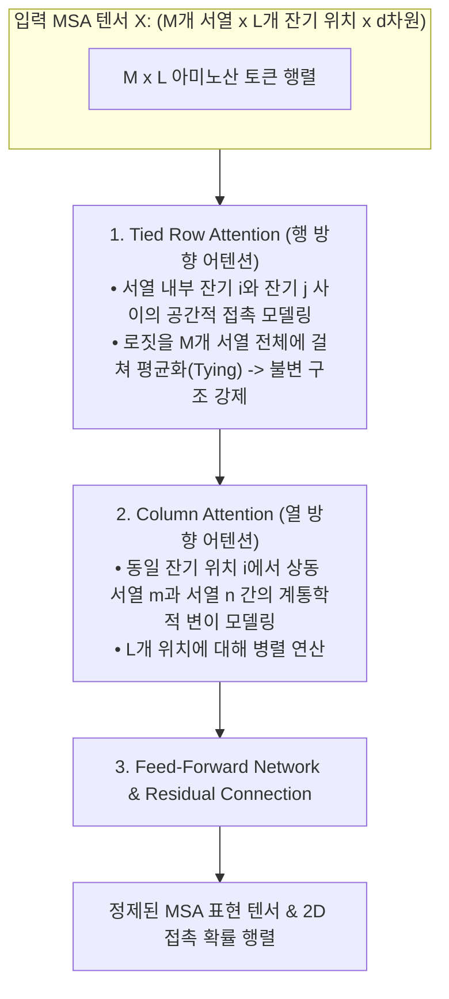

* **Paper Title**: [MSA Transformer](http://proceedings.mlr.press/v139/rao21a.html)
* **Authors**: Roshan Rao, Jason Liu, Robert Verkuil, Joshua Meier, John Canny, Pieter Abbeel, Tom Sercu, and Alexander Rives (Meta AI Research / UC Berkeley)
* **Conference**: International Conference on Machine Learning (ICML) 2021
* **Preprint / DOI**: [bioRxiv 10.1101/2021.02.12.430858](https://doi.org/10.1101/2021.02.12.430858) / [PMLR 139:8844-8856](http://proceedings.mlr.press/v139/rao21a.html)
* **Code / Models**: [GitHub - facebookresearch/esm](https://github.com/facebookresearch/esm)

---

## 1. 서론: 단일 서열 모델의 근본적 딜레마

ESM-1b와 같은 단일 서열 기반 단백질 언어 모델은 2.5억 개의 서열 데이터로부터 눈부신 성능을 보여주었습니다. 그러나 분자생물학자들의 관점에서는 매우 비효율적인 접근이기도 했습니다:

> **"수십 년간 진화생물학이 축적한 수천만 건의 다중 서열 정렬(MSA) 데이터에는, 상동 단백질들 사이의 공진화(Co-evolution) 패턴이 이미 눈앞에 2차원 행렬로 펼쳐져 있다. 왜 이 정렬 정보를 버리고 오직 1개의 서열만을 모델에 입력하여, 모델 파라미터가 진화 역사를 처음부터 끝까지 암기하여 추론하도록 강요해야 하는가?"**

단일 서열 모델은 서열 내 잔기 간의 물리적 결합 규칙을 모델의 거대한 파라미터 메모리(Parametric Memory)에 의존하여 유추해야 합니다. 반면, 분석 대상 단백질과 진화적 친척 관계인 상동 서열 수십~수백 개를 묶은 **다중 서열 정렬(Multiple Sequence Alignment, MSA) 행렬**을 모델에 직접 입력할 수 있다면, 모델은 외부 지식을 인출하지 않고도 주어진 입력 행렬 내부에서 **공변이(Co-variation) 신호를 실시간 인-컨텍스트(In-context)로 직접 계산**할 수 있습니다.

문제는 연산 복잡도였습니다. $M$개의 서열과 길이 $L$을 가진 MSA는 총 $M \times L$개의 토큰으로 구성됩니다. 표준 트랜스포머의 풀 셀프 어텐션(Full Self-Attention)을 적용할 경우 복잡도는 $\mathcal{O}((ML)^2)$에 달합니다. 예를 들어 $M=256, L=512$인 일반적인 MSA만 해도 토큰 수가 약 13만 개에 달해, 어텐션 행렬 하나를 계산하는 데만 수십 GB의 GPU VRAM이 소모되며 즉각적인 OOM(Out of Memory)이 발생합니다.

Meta AI Research 연구진은 이 2차원 행렬을 **행(Row)과 열(Column) 축으로 분해하여 교대로 연산하는 Tied Axial Factorized Attention** 메커니즘을 고안하여 이 계산 장벽을 완벽히 허물었습니다.

---

## 2. 모델 아키텍처: Tied Axial Factorized Attention의 수학적 전개



### 2.1. 행 방향 어텐션 (Tied Row Attention)
각 서열 $m \in \{1, \dots, M\}$ 내부에서 잔기 $i$와 잔기 $j$ 사이의 구조적 상호작용을 모델링합니다.

표준적인 멀티헤드 어텐션에서 쿼리 $Q_{m, i}$, 키 $K_{m, j}$의 내적 로짓을 구한 뒤, <strong>M개 서열 전체에 걸쳐 로짓을 평균화(Tying)</strong>하는 연산을 수행합니다:

$$
S_{i, j}^{(h)} = \frac{1}{M} \sum_{m=1}^M \frac{Q_{m, i}^{(h)} \cdot {K_{m, j}^{(h)}}^T}{\sqrt{d_k}}
$$

이 평균화된 스칼라 유사도 $S_{i, j}^{(h)}$에 소프트맥스를 취해 서열 내 모든 잔기 $j$에 대한 확률을 구하고 밸류 $V_{m, j}^{(h)}$를 집계합니다:

$$
\text{RowAttn}(X)_{m, i}^{(h)} = \sum_{j=1}^L \text{Softmax}_j\left( S_{i, j}^{(h)} \right) V_{m, j}^{(h)}
$$

#### 🧬 Tied 어텐션의 생물학적 귀납적 편향 (Inductive Bias)
"상동 단백질 패밀리에 속한 서열들은 아미노산 구성이 조금씩 다를지라도, **3차원 입체 구조의 접힘 방식(Tertiary Fold)은 모든 서열에서 동일하게 보존**된다."
어텐션 로짓을 $M$개 서열에 걸쳐 강제로 평균화(Tying)함으로써, 특정 개별 서열의 노이즈나 시퀀싱 에러에 휘둘리지 않고 모든 상동 서열이 공유하는 단 하나의 불변적 3D 접촉 골격을 추출하도록 모델 아키텍처 수준에서 강제합니다.

---

### 2.2. 열 방향 어텐션 (Column Attention)
동일한 잔기 위치 $i \in \{1, \dots, L\}$에서, 서로 다른 서열 $m$과 $n$ 사이의 계통학적(Phylogenetic) 연관 관계를 모델링합니다:

$$
A_{i, m, n}^{(h)} = \text{Softmax}_n\left( \frac{Q_{m, i}^{(h)} \cdot {K_{n, i}^{(h)}}^T}{\sqrt{d_k}} \right)
$$

$$
\text{ColAttn}(X)_{m, i}^{(h)} = \sum_{n=1}^M A_{i, m, n}^{(h)} V_{n, i}^{(h)}
$$

이 연산은 동일한 정렬 컬럼에 위치한 아미노산들이 진화 계통수 상에서 어떤 경로로 분기하고 보존되었는지를 추적합니다.

---

### 2.3. 계산 복잡도 및 메모리 효율성 비교

| 어텐션 연산 방식 | 연산 복잡도 (Time) | 메모리 복잡도 (Space) | $M=256, L=512$ 시 복잡도 스케일 |
| :--- | :---: | :---: | :---: |
| **표준 2D Full Self-Attention** | $\mathcal{O}(M^2 L^2)$ | $\mathcal{O}(M^2 L^2)$ | $\approx 1.7 \times 10^{10}$ (OOM 발생) |
| **MSA Transformer Factorized** | $\mathcal{O}(M L^2 + L M^2)$ | $\mathcal{O}(M L^2 + L M^2)$ | $\approx 1.0 \times 10^{8}$ (**170배 절감**) |

이 획기적인 복잡도 절감 덕분에 표준적인 32GB VRAM GPU 1장에서 수백 개의 서열이 포함된 거대한 MSA를 한 번에 올려 학습 및 추론이 가능해졌습니다.

---

## 3. AlphaFold2의 Evoformer와의 비교 분석

2021년 비슷한 시기에 등장한 DeepMind의 <strong>AlphaFold2(Evoformer)</strong>와 Meta의 **MSA Transformer**는 모두 2차원 MSA 축 분해 어텐션을 핵심으로 채택했습니다. 두 모델의 구조적 차이점을 비교하면 다음과 같습니다:

```
[ Evoformer vs MSA Transformer 구조적 설계 비교 ]

1. AlphaFold2 (Evoformer):
   - 목적: 지도학습 기반 전원자 3D 좌표 직접 복원
   - 트랙 구조: MSA Representation (M x L) <---> Pair Representation (L x L) 양방향 결합
   - 기하 모듈: Triangle Multiplicative Update & Triangle Attention (L x L 트랙) 필수 탑재

2. MSA Transformer:
   - 목적: 비지도 언어 모델 사전 학습 (2D Masked Language Modeling)
   - 트랙 구조: 오직 단일 MSA 텐서 (M x L x d) 하나만 유지
   - 기하 모듈: 별도의 Pair 트랙 없이, Tied Row Attention 로짓 S_{ij} 자체가 2D 접촉 지도를 직접 형성!
```

Evoformer가 명시적인 $L \times L$ 잔기 쌍 트랙을 별도로 두고 복잡한 삼각 기하 연산을 돌린 반면, MSA Transformer는 **언어 모델 특유의 가중치 공유(Tied Attention)만으로 별도의 2D 트랙 없이도 완벽한 3D 접촉 지도를 도출**해 내는 놀라운 경량성을 달성했습니다.

---

## 4. 학습 세부 사항 및 2D Masked Language Modeling

* **학습 코퍼스**: UniRef50을 기반으로 HHblits를 돌려 구축한 **2,600만 개의 MSA 군집 (UniClust30 기반)**.
* **2D 마스킹 전략**: 
  입력 MSA 행렬에서 원소의 15%를 무작위 마스킹하되, 특정 위치 $i$의 모든 서열이 동시에 마스킹되는 것을 방지하기 위해 각 행마다 독립적인 난수 마스크를 적용합니다.
* **모델 스펙**:
  * 레이어 수: 12 Tied Row-Column Blocks
  * 은닉 차원 ($d_{\text{model}}$): 768
  * 어텐션 헤드 수: 12 heads
  * **총 파라미터 수: 약 1억 개 (100M)**
  * ESM-1b(650M)의 1/6 수준에 불과한 콤팩트한 크기입니다.

---

## 5. 정량 벤치마크 및 비교 결과

### 5.1. 3D 접촉 예측 정확도 (CASP13 & CAMEO 벤치마크)

Top-$L$ Long-range Contact Precision ($|i - j| \ge 24$) 비교:

| 모델 (Model) | 모델 유형 | 파라미터 수 | 입력 형태 | Top-$L$ Long-range Precision |
| :--- | :---: | :---: | :---: | :---: |
| **CCMpred** | 고전 통계역학 Potts | - | MSA | 21.0% |
| **GREMLIN** | DCA 유사우도 최적화 | - | MSA | 25.8% |
| **DeepCov** | 지도학습 CNN | 2.5M | MSA | 41.2% |
| **ESM-1b** | 단일 서열 언어 모델 | 650M | 단일 서열 | 45.8% |
| **MSA Transformer** | **2D 다중 서열 언어 모델** | **100M** | **MSA** | **62.1%** |

> [!IMPORTANT]
> **성능 격차의 충격**
> MSA Transformer는 650M 크기의 거대 모델인 ESM-1b를 **무려 16.3%p 차이로 압도**했습니다. 이는 단백질 접힘 문제를 풀 때 <strong>"서열을 하나씩 떼어놓고 파라미터를 키우는 것보다, 상동 서열들의 다중 정렬 데이터를 올바른 차원적 구조(2D Axial Attention)로 직접 소화하는 아키텍처가 훨씬 더 결정적이다"</strong>는 사실을 입증합니다.

---

### 5.2. MSA 깊이($N_{\text{eff}}$)에 따른 강인성 분석

상동 서열의 수($N_{\text{eff}}$)가 접촉 예측 정밀도에 미치는 영향을 구간별로 세분화하여 분석한 결과입니다:

```
Top-L Precision (%)
  70 ┤                                      ● MSA Transformer (68.4%)
  60 ┤                       ● MSA Transformer (58.1%)
     │                                      ■ GREMLIN (42.5%)
  50 ┤        ● MSA Transformer (47.2%)
     │                       ■ GREMLIN (28.3%)
  40 ┤        ▲ ESM-1b (45.8% - 단일 서열 일관)
     │        ■ GREMLIN (11.2% - 붕괴)
  30 ┤
     └─────────────────────────────────────────────────────────────>
        N_eff < 16           16 <= N_eff < 128         N_eff >= 128
```

1. **상동 서열이 적은 구간 ($N_{\text{eff}} < 16$)**:
   고전적 통계 모델인 GREMLIN은 공분산 역행렬이 발산하여 정밀도가 11.2%로 무너집니다. 반면 MSA Transformer는 47.2%를 유지하며, 단일 서열 모델인 ESM-1b(45.8%)보다도 우수한 성능을 보여줍니다.
2. **상동 서열이 풍부한 구간 ($N_{\text{eff}} \ge 128$)**:
   정밀도가 68.4%까지 치솟아 기존 모든 방법론을 압도합니다.

---

## 6. PyTorch 실습: MSA Transformer 추론 및 접촉 지도 추출

```python
import torch
import esm

# 1. MSA Transformer 모델 및 알파벳 로드
msa_model, msa_alphabet = esm.pretrained.esm_msa1b_t12_100M_UR50S()
msa_batch_converter = msa_alphabet.get_batch_converter()
msa_model.eval().cuda()

# 2. MSA 데이터 로드 (A3M 정렬 파일 또는 튜플 리스트)
# (패밀리 ID, [(서열 ID, 아미노산 서열), ...])
msa_data = [
    ("family_1", [
        ("seq_query", "MTEYKLVVVGAGGVGKSALTIQLIQNHFVDEYDPTIEDSYRKQVVIDGETCLLDILDTAGQEEYSAMRDQYMRTGEGFLCVFAINNTKSFEDIHHYREQIKRVKDSEDVPMVLVGNKCDLPSRTVDTKQAQDLARSYGIPFIETSAKTRQGVDDAFYTLVREIRKHKEK"),
        ("seq_homolog1", "MTEYKLVVVGAGGVGKSALTIQLIQNHFVDEYDPTIEDSYRKQVVIDGETCLLDILDTAGQEEYSAMRDQYMRTGEGFLCVFAINNTKSFEDIHHYREQIKRVKDSEDVPMVLVGNKCDLPSRTVDTKQAQDLARSYGIPFIETSAKTRQGVEDAFYTLVREIRKHKEK"),
        ("seq_homolog2", "MTEYKLVVVGADGVGKSALTIQLIQNHFVDEYDPTIEDSYRKQVVIDGETCLLDILDTAGQEEYSAMRDQYMRTGEGFLCVFAINNTKSFEDIHHYREQIKRVKDSEDVPMVLVGNKCDLPSRTVDTKQAQDLARSYGIPFIETSAKTRQGVDDAFYTLVREIRKHKEK"),
    ])
]

labels, strs, tokens = msa_batch_converter(msa_data)
# tokens shape: [Batch, Num_sequences, Length] -> [1, 3, 168]

# 3. 모델 순전파 및 2D 접촉 지도 도출
with torch.no_grad():
    results = msa_model(tokens.cuda(), repr_layers=[12], return_contacts=True)

# 4. Tied Row Attention으로부터 계산된 접촉 지도 (Shape: [L, L])
contact_map = results["contacts"][0].cpu().numpy()
print("MSA Transformer가 도출한 접촉 지도 Shape:", contact_map.shape)
```

---

## 7. AI 연구자를 위한 한계점 및 후속 연구에 미친 영향

### 7.1. MSA Transformer의 실무적 한계
1. **정렬 전처리(MSA Preprocessing) 지연 시간**:
   추론 자체는 100M 모델답게 수백 밀리초 만에 끝나지만, 쿼리 서열 1개에 대해 100개 이상의 상동 서열을 유전체 DB에서 찾아 정렬을 만드는 전처리(MMseqs2 또는 HHblits)에 **수 분에서 수십 분이 소요**됩니다. 이는 수천만 개 서열을 초고속으로 훑어야 하는 가상 스크리닝에서 치명적인 병목이었습니다.
2. **최대 입력 서열 수의 한계**:
   VRAM 제약으로 인해 동시에 입력할 수 있는 서열 수 $M$이 통상 $128 \sim 256$개로 제한되었습니다. 따라서 수천 개의 상동 서열 중 어떤 서열들을 대표로 서브샘플링(Sub-sampling)할 것인가에 따라 결과가 흔들리는 민감도 문제가 있었습니다.

### 7.2. 후속 연구로의 전환
이 전처리 병목을 목격한 연구진은 다음과 같은 근본적인 결론에 도달했습니다:
> **"MSA 검색 시간을 감수할 수 없는 초대형 메타유전체 분석에서는, 단일 서열 모델을 150억 개(15B) 파라미터로 스케일업하여 MSA 없이 단일 서열만으로 MSA Transformer의 성능을 모사하도록 만들자!"**

이것이 바로 단일 서열 구조 예측의 정점에 선 <strong>ESM-2 / ESMFold (Science 2023)</strong>의 탄생 계기였습니다.

---

## 8. 참고 문헌 (References)

1. Rao, R., Liu, J., Verkuil, R., Meier, J., Canny, J., Abbeel, P., Sercu, T., & Rives, A. (2021). MSA Transformer. *International Conference on Machine Learning (ICML)*, PMLR 139:8844–8856.
2. Jumper, J., Evans, R., Pritzel, A., Green, T., Figurnov, M., Ronneberger, O., ... & Hassabis, D. (2021). Highly accurate protein structure prediction with AlphaFold. *Nature*, 596(7873), 583–589.
3. Remmert, M., Biegert, A., Hauser, A., & Söding, J. (2012). HHblits: lightning-fast biology-sequence searching by HMM-HMM alignment. *Nature Methods*, 9(2), 173–175.
4. Morcos, F. et al. (2011). Direct-coupling analysis of protein sequence families for molecular structure prediction. *PNAS*, 108(49), E1293–E1301.

---
긴 글 읽어주셔서 감사합니다! 

**Contact & Inquiries**
- LinkedIn : [Sehoon Park](https://www.linkedin.com/in/sehoon-park)
- GitHub : [https://github.com/sehooni](https://github.com/sehooni)
- Email : 74sehoon@gmail.com
- 궁금한 점이나 의견은 댓글 혹은 메일을 통해 언제든 환영합니다! :)
