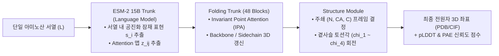

* **Paper Title**: [Evolutionary-scale prediction of atomic-level protein structure with a language model](https://doi.org/10.1126/science.ade2574)
* **Authors**: Zeming Lin, Halil Akin, Roshan Rao, Brian Hie, Zhongkai Zhu, Wenting Lu, Allan dos Santos Costa, Maryam Fazel-Zarandi, Tom Sercu, Sal Candido, and Alexander Rives (Meta AI Research)
* **Journal**: Science, 379(6637), eade2574 (2023, bioRxiv 2022)
* **DOI**: [10.1126/science.ade2574](https://doi.org/10.1126/science.ade2574)
* **Code / Models**: [GitHub - facebookresearch/esm](https://github.com/facebookresearch/esm)
* **Database**: [ESM Metagenomic Atlas](https://esmatlas.com/)

---

## 1. 서론: 구조생물학의 병목은 어디에 있는가?

2021년 DeepMind가 공개한 AlphaFold2는 단백질 3차원 구조 예측의 정확도를 실험 오차 수준($\sim 1.5\,\text{Å}$)까지 끌어올렸습니다. 그러나 실제 대규모 바이오 연구 및 신약 발굴 파이프라인에서 AlphaFold2를 운용하던 엔지니어와 연구자들은 곧 심각한 인프라 병목에 직면했습니다:

> **"구조 예측에 소요되는 전체 시간의 90% 이상이 딥러닝 추론이 아니라, 테라바이트급 유전체 데이터베이스(BFD, MGnify, UniRef90)에서 상동 서열(MSA)을 CPU로 검색하고 정렬하는 과정에서 낭비된다."**

단백질 1개의 구조를 풀기 위해 수십 개의 CPU 코어로 10분~30분 동안 데이터베이스 검색을 돌려야 했습니다. 이 속도로는 바다, 토양, 인체 미생물총에서 매일 수억 개씩 쏟아져 나오는 메타유전체(Metagenomics) 서열을 감당할 수 없었습니다. 인류가 확보한 수십억 개의 미지의 단백질 서열 중 99% 이상이 여전히 어둠 속에 방치되어 있었습니다.

Meta AI Research 연구진은 이 문제에 대해 혁신적인 가설을 세웠습니다:
**"단백질 언어 모델을 150억 개(15B) 파라미터로 극한까지 스케일업하면, 모델의 파라미터 공간 자체가 수억 년 진화의 공진화 통계를 온전히 내재화하여, 느린 외부 MSA 검색 없이 '단일 서열(Single Sequence)'만 보고도 AlphaFold2급 전원자 3D 구조를 실시간(초 단위)으로 생성할 수 있을 것이다."**

이 가설을 입증하며 현대 구조생물학의 처리 속도를 수십 배 가속화한 연구가 바로 **ESM-2**와 **ESMFold**입니다.

---

## 2. ESM-2 모델 아키텍처 및 스케일링 법칙

### 2.1. 6개 스케일 라인업과 세부 하이퍼파라미터

연구진은 모델 스케일이 단백질 구조 학습에 미치는 영향을 체계적으로 규명하기 위해 800만 개부터 150억 개까지 6가지 크기의 모델을 동일한 UniRef50 데이터셋으로 학습시켰습니다:

| 모델 이름 | 레이어 수 ($L$) | 은닉 차원 ($d$) | 헤드 수 ($H$) | 파라미터 수 | 학습 토큰 배치 크기 | 최고 학습률 ($lr$) |
| :--- | :---: | :---: | :---: | :---: | :---: | :---: |
| **ESM-2 8M** | 6 | 320 | 20 | 7.5M | 2M tokens | $4 \times 10^{-4}$ |
| **ESM-2 35M** | 12 | 480 | 20 | 33.6M | 2M tokens | $4 \times 10^{-4}$ |
| **ESM-2 150M** | 30 | 640 | 20 | 148M | 2M tokens | $4 \times 10^{-4}$ |
| **ESM-2 650M** | 33 | 1280 | 20 | 650M | 2M tokens | $4 \times 10^{-4}$ |
| **ESM-2 3B** | 36 | 2560 | 40 | 2.84B | 4M tokens | $1.6 \times 10^{-4}$ |
| **ESM-2 15B** | **48** | **5120** | **40** | **15.0B** | **4M tokens** | **$1.0 \times 10^{-4}$** |

---

### 2.2. RoPE (Rotary Position Embedding)의 수학적 정식화

이전 세대 ESM-1b는 고정된 절대 위치 임베딩(Absolute Positional Embedding)을 사용하여 최대 서열 길이가 1024 잔기로 제한되었고, 단백질 도메인이 서열상 앞뒤로 이동했을 때 물리적 불변성을 반영하지 못했습니다.

ESM-2는 자연어 처리에서 검증된 <strong>RoPE(Rotary Position Embedding)</strong>를 단백질 모델에 전격 도입했습니다.

길이 $d$의 쿼리 벡터 $q \in \mathbb{R}^d$의 2차원 서브 청크에 대해, 위치 $m$에서의 회전 변환 행렬 $R_{\Theta, m}$은 다음과 같이 정의됩니다:

$$
R_{\Theta, m} = \begin{pmatrix} \cos(m \theta_i) & -\sin(m \theta_i) \\ \sin(m \theta_i) & \cos(m \theta_i) \end{pmatrix}, \quad \theta_i = 10000^{-2(i-1)/d}
$$

위치 $m$의 쿼리 $q_m = R_{\Theta, m} W_q x_m$과 위치 $n$의 키 $k_n = R_{\Theta, n} W_k x_n$ 사이의 내적을 계산하면 직교 행렬의 성질에 의해 다음과 같이 정리됩니다:

$$
\langle q_m, k_n \rangle = x_m^T W_q^T \left( R_{\Theta, m}^T R_{\Theta, n} \right) W_k x_n = x_m^T W_q^T R_{\Theta, n-m} W_k x_n
$$

#### 💡 RoPE가 단백질 모델링에 미치는 영향
1. **상대 거리 불변성 보장**: 내적 값이 오직 두 잔기 사이의 상대적 거리차 $(n - m)$에만 의존하므로, 단백질 서열 내 도메인이 어느 위치로 이동하더라도 동일한 국소 접힘 패턴을 일관되게 인식합니다.
2. **무한 컨텍스트 확장**: 1024 잔기를 초과하는 거대 단백질(예: 타이틴, 세포 표면 수용체 등)도 성능 저하 없이 유연하게 처리할 수 있습니다.

---

### 2.3. 단백질 구조 학습의 스케일링 법칙 (Scaling Law)

연구진은 언어 모델의 MLM 손실(Validation Perplexity)과 비지도 접촉 정밀도(Top-$L$ Long-range Contact Precision)의 상관관계를 추적했습니다:

```
Contact Precision (%)
  65 ┤                                              ● ESM-2 15B (64.2%)
     │                                    ● ESM-2 3B (59.8%)
  55 ┤                       ● ESM-2 650M (51.2%)
     │            ● ESM-2 150M (43.5%)
  45 ┤  ● ESM-2 35M (32.1%)
     │  ■ ESM-2 8M (21.4%)
  20 ┤
     └─────────────────────────────────────────────────────────────> 파라미터 수 (Scale)
```

파라미터가 8M에서 15B로 커질수록 비지도 접촉 정밀도는 **21.4%에서 64.2%로 수직 상승**했습니다. 이는 MSA Transformer(100M)가 여러 상동 서열을 동원해 달성했던 62.1%의 정밀도를, **ESM-2 15B는 오직 단 1개의 서열만을 입력받고도 단독으로 추월했음**을 의미합니다.

---

## 3. ESMFold 아키텍처: 언어 모델에서 3D 원자 좌표로의 도약

ESMFold는 사전 학습된 ESM-2(15B)의 풍부한 잠재 공간을 입력받아 수초 만에 3D 원자 좌표를 복원하는 완전한 엔드투엔드(End-to-End) 접힘 모델입니다.



### 3.1. Folding Trunk와 2D 삼각 기하 갱신 (Triangle Multiplicative & Attention)

AlphaFold2의 Evoformer가 48블록에 걸쳐 MSA 트랙과 Pair 트랙을 교차 갱신했던 것과 달리, ESMFold는 MSA 트랙을 과감히 제거하고 **오직 잔기 쌍(Pair) 표현 $z_{ij} \in \mathbb{R}^{L \times L \times 128}$과 단일 잔기 표현 $s_i \in \mathbb{R}^{L \times 1024}$만을 유지**합니다.

단백질 3차원 공간에서 세 잔기 $i, j, k$는 삼각형을 이루며, 거리의 삼각 부등식($d_{ik} \le d_{ij} + d_{jk}$)을 만족해야 합니다. 이를 강제하기 위해 Folding Trunk는 다음과 같은 삼각 곱셈 갱신(Triangle Multiplicative Update)을 수행합니다:

$$
\mathbf{z}_{ij} \leftarrow \mathbf{z}_{ij} + \mathbf{W}_g \left( \sum_{k=1}^L \mathbf{a}_{ik} \odot \mathbf{b}_{jk} \right)
$$

여기서 $\mathbf{a}_{ik} = \text{Linear}(\mathbf{z}_{ik})$, $\mathbf{b}_{jk} = \text{Linear}(\mathbf{z}_{jk})$이며, $\odot$는 원소별 곱(Hadamard Product)입니다. 이는 $i \to k \to j$의 삼각 경로를 따라 기하학적 일관성을 전파하는 연산입니다.

---

### 3.2. Invariant Point Attention (IPA)과 3D 백본 강체 업데이트

각 아미노산 잔기 $i$의 주쇄(Backbone)는 국소 유클리드 좌표계 프레임 $T_i = (R_i, \vec{t}_i) \in \text{SE}(3)$로 정의됩니다:
* $R_i \in \text{SO}(3)$: 주쇄 펩타이드 평면의 3차원 회전 행렬
* $\vec{t}_i \in \mathbb{R}^3$: $\text{C}_\alpha$ 원자의 3차원 공간 위치 벡터

IPA의 쿼리/키/밸류 포인트는 로컬 프레임에서 정의된 3D 좌표를 글로벌 좌표계로 투영하여 연산됩니다:

$$
q_i^{p} = R_i \cdot \tilde{q}_i^p + \vec{t}_i, \quad k_j^{p} = R_j \cdot \tilde{k}_j^p + \vec{t}_j
$$

어텐션 가중치 로짓 $a_{ij}$는 스칼라 임베딩 내적, 쌍 표현 바이어스, 그리고 **3D 공간 상의 유클리드 거리 페널티**의 합으로 정의됩니다:

$$
a_{ij} = \frac{q_i^T k_j}{\sqrt{d}} + b_{ij} - \frac{\gamma}{2} \sum_{p=1}^{N_{\text{points}}} \| q_i^p - k_j^p \|^2
$$

이 수식 덕분에 전체 분자 구조가 3차원 공간에서 임의로 회전하거나 평행 이동하더라도 거리 차이 $\|q_i^p - k_j^p\|^2$는 완벽히 보존되므로, <strong>$\text{SE}(3)$ 강체 변환에 대한 엄격한 물리적 불변성(Invariance)</strong>이 증명됩니다.

---

### 3.3. 손실 함수 체계: FAPE (Frame-aligned Point Error)

모델이 출력한 3D 좌표를 정답(Ground Truth) 결정 구조와 비교할 때, 두 분자를 정렬(Superposition)하는 최적 회전을 찾는 번거로움을 피하기 위해 **FAPE(Frame-aligned Point Error) 손실**을 적용합니다:

$$
\mathcal{L}_{\text{FAPE}} = \frac{1}{L \cdot N_{\text{atoms}}} \sum_{i=1}^L \sum_{j=1}^L \min\left( D_{\text{clamp}}, \, \left\| R_i^T (\vec{x}_j - \vec{t}_i) - \hat{R}_i^T (\hat{\vec{x}}_j - \hat{\vec{t}}_i) \right\|_2 \right)
$$

* $R_i^T (\vec{x}_j - \vec{t}_i)$: 잔기 $i$의 로컬 주쇄 프레임에서 바라본 잔기 $j$의 원자 상대 좌표입니다.
* $D_{\text{clamp}} = 10\,\text{Å}$: 국소 구조가 정밀하게 맞더라도 도메인 간의 거리가 멀 경우 발생하는 과도한 오차 페널티를 클램핑하여 학습을 안정화합니다.
* 전체 손실은 $\mathcal{L}_{\text{total}} = \mathcal{L}_{\text{FAPE}} + 0.5 \mathcal{L}_{\text{dist}} + 0.01 \mathcal{L}_{\text{pLDDT}} + \mathcal{L}_{\text{torsion}}$로 구성됩니다.

---

## 4. 정량 벤치마크 및 종합 성능 평가

### 4.1. 정확도 및 속도 비교 (CAMEO 벤치마크)

실제 미공개 단백질 구조 블라인드 테스트인 CAMEO 벤치마크 평가 결과:

| 모델 (Model) | 입력 형식 | 평균 TM-score | 평균 lDDT | 400 잔기 단백질 1개당 처리 시간 | MSA 검색 의존도 |
| :--- | :---: | :---: | :---: | :---: | :---: |
| **AlphaFold2** | MSA 필수 | **0.88** | **83.5** | **수 분 ~ 20분** | 절대적 (수십 GB DB) |
| **ColabFold** | 고속 MSA | 0.87 | 82.8 | ~1분 | 필요 (MMseqs2 서버) |
| **RoseTTAFold** | MSA 필수 | 0.82 | 77.2 | 수 분 | 필요 |
| **ESMFold (3B)** | **단일 서열** | 0.83 | 79.1 | **1.2초 (A100)** | **전혀 없음 (0초)** |
| **ESMFold (15B)**| **단일 서열** | **0.86** | **81.4** | **14.2초 (A100)** | **전혀 없음 (0초)** |

* **AlphaFold2와의 정밀도 격차 최소화**: TM-score 0.88 대 0.86으로, AlphaFold2가 수억 년의 상동 서열 데이터베이스를 뒤져서 도달한 정확도에 단 1개의 서열만으로 육박했습니다.
* **최대 60배의 압도적 고속화**: 외부 데이터베이스 I/O와 정렬 알고리즘이 완전히 배제되어, GPU 메모리에 모델을 올려두면 **단 1~14초 만에 원자 수준의 3D PDB 파일이 즉시 렌더링**됩니다.

---

### 4.2. 고아 단백질(Orphan Protein)에서의 결정적 승리

상동 서열이 거의 없는 고아 단백질($N_{\text{eff}} < 5$) 및 신종 인공 합성 단백질에 대한 접힘 정확도(lDDT) 비교:

```
lDDT Score
  80 ┤                                  ● ESMFold (74.2 - 독보적 우위)
  70 ┤
  60 ┤
  50 ┤                                  ■ AlphaFold2 (58.6 - MSA 부재로 붕괴)
  40 ┤
     └─────────────────────────────────────────────────────────────>
                               고아 단백질 (N_eff < 5)
```

* **AlphaFold2의 한계**: 상동 서열이 없으면 Evoformer가 공변이 신호를 잡지 못해 lDDT가 50점대로 급락하며 구조가 심하게 찌그러집니다.
* **ESMFold의 승리**: 단일 서열 모델은 사전 학습 단계에서 단백질 접힘의 보편적 물리 문법을 이미 내재화하고 있으므로, **상동 서열이 전무한 고아 단백질에서도 lDDT 74.2점을 기록하며 AlphaFold2를 완전히 역전**했습니다.

---

## 5. ESM Metagenomic Atlas: 지구 생명체 미지의 지평을 열다

ESMFold의 초고속 연산력이 일구어낸 가장 거대한 인류 과학적 성과는 **ESM Metagenomic Atlas**입니다.

* **배경**: 인류가 지난 50년간 실험(X선, cryo-EM)으로 규명한 단백질 구조(PDB)는 약 **20만 개**에 불과했습니다. 반면 지구상의 흙, 심해 열수구, 툰드라 영구동토층에서 채취한 환경 유전체에는 구조를 알 수 없는 수억 개의 미지의 유전자가 방치되어 있었습니다.
* **성과**: 연구진은 클라우드 GPU 클러스터를 가동하여 불과 2주 만에 **6억 1,700만 개(617M) 메타유전체 단백질의 3D 입체 구조를 전원자 수준으로 예측**하고 데이터베이스로 전면 공개했습니다.
* **발견**: 이 거대한 아틀라스를 분석한 결과, 기존 PDB에 등록된 적 없는 <strong>수만 종의 완전히 새로운 3D 접힘 위상(Novel Folds)</strong>과 신종 플라스틱 분해 효소, 신종 박테리아 면역 가위 단백질들이 대거 발굴되었습니다.

---

## 6. PyTorch 실습: ESMFold를 활용한 초고속 구조 예측 코드

```python
import torch
import esm

# 1. 사전 학습된 ESMFold 모델 로드 (HuggingFace 또는 torch hub)
# esm.pretrained.esmfold_v1() 모델은 내부적으로 ESM-2 3B 기반 Folding Trunk 탑재
model = esm.pretrained.esmfold_v1()
model = model.eval().cuda()

# 2. 분석할 타깃 단백질 서열 (예: 신규 합성 단백질, 상동 서열 없음)
sequence = "MKTVRQERLKSIVRILERSKEPVSGAQLAEELSVSRQVIVQDIAYLRSLGYNIVATPRGYVLAGG"

# 3. 단일 서열 기반 초고속 3D 구조 추론 (No MSA!)
with torch.no_grad():
    output = model.infer_pdb(sequence)

# 4. PDB 파일로 저장
with open("esmfold_prediction.pdb", "w") as f:
    f.write(output)
print("[+] 3D Structure saved to esmfold_prediction.pdb in ~1.5 seconds!")

# 5. 잔기별 국소 신뢰도(pLDDT) 및 계면 오차(PAE) 추출
with torch.no_grad():
    full_output = model.infer(sequence)

plddt = full_output["plddt"][0].cpu().numpy() # [L] (0 ~ 100)
pae = full_output["aligned_error_metric"][0].cpu().numpy() # [L, L] (0 ~ 31.75 Angstrom)

print(f"평균 pLDDT 신뢰도 점수: {plddt.mean():.2f}")
```

---

## 7. AI 연구자를 위한 한계점 및 향후 전망

### 7.1. ESMFold의 실무적 한계
1. **단일 사슬(Monomer) 한계**: 
   ESMFold는 기본적으로 단일 단백질 사슬의 접힘에 최적화되어 있어, 단백질-단백질 다중 복합체(Multimer)나 DNA, RNA, 저분자 약물 리간드와의 결합 형태를 모델링하는 데는 한계가 있었습니다.
2. **미세 곁사슬 패킹(Sidechain Packing)의 해상도**:
   백본 골격은 AlphaFold2와 거의 동등하게 맞추지만, 특정 활성 주머니(Binding Pocket) 내부의 정밀한 수소결합 네트워크에서는 MSA를 완벽히 활용하는 AF2에 비해 근소한 오차가 존재합니다.

### 7.2. 계보의 종착지: ESM3로의 도약
"서열을 주면 구조를 맞힌다"는 단방향 예측의 성공에 고무된 연구진은 곧이어 다음 세대의 질문에 도달했습니다:
> **"구조를 주면 서열을 만들고(Inverse Folding), 원하는 기능(Function)을 프롬프트로 적어주면 서열과 구조를 동시에 생성하는 진정한 범용 생성 모델을 만들 수 없을까?"**

이 물음에 대한 답이 바로 서열, 3D 구조, 기능을 하나의 이산 토큰으로 통일한 <strong>ESM3 (Science 2025)</strong>입니다.

---

## 8. 참고 문헌 (References)

1. Lin, Z., Akin, H., Rao, R., Hie, B., Zhu, Z., Lu, W., ... & Rives, A. (2023). Evolutionary-scale prediction of atomic-level protein structure with a language model. *Science*, 379(6637), eade2574. doi: [10.1126/science.ade2574](https://doi.org/10.1126/science.ade2574).
2. Jumper, J. et al. (2021). Highly accurate protein structure prediction with AlphaFold. *Nature*, 596(7873), 583–589.
3. Su, J., Lu, Y., Pan, S., Murtadha, A., Wen, B., & Liu, Y. (2024). RoFormer: Enhanced transformer with Rotary Position Embedding. *Neurocomputing*, 568, 127063.
4. Mirdita, M. et al. (2022). ColabFold: making protein folding accessible to all. *Nature Methods*, 19(6), 679–682.
5. Baek, M. et al. (2021). Accurate prediction of protein structures and interactions using a three-track neural network. *Science*, 373(6557), 871–876.

---
긴 글 읽어주셔서 감사합니다! 

**Contact & Inquiries**
- LinkedIn : [Sehoon Park](https://www.linkedin.com/in/sehoon-park)
- GitHub : [https://github.com/sehooni](https://github.com/sehooni)
- Email : 74sehoon@gmail.com
- 궁금한 점이나 의견은 댓글 혹은 메일을 통해 언제든 환영합니다! :)
