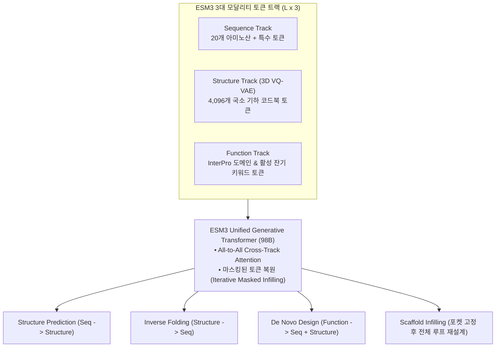
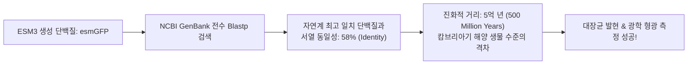

* **Paper Title**: [Simulating 500 million years of evolution with a language model](https://doi.org/10.1126/science.adq0098)
* **Authors**: Thomas Hayes, Roshan Rao, Halil Akin, Nicholas J. Sofroniew, ... Alexander Rives (EvolutionaryScale)
* **Journal**: Science, 387(6736), eadq0098 (2025, preprint 2024)
* **DOI**: [10.1126/science.adq0098](https://doi.org/10.1126/science.adq0098)
* **Website / API**: [EvolutionaryScale](https://www.evolutionaryscale.ai/)
* **Code / Open Weights**: [GitHub - evolutionaryscale/esm](https://github.com/evolutionaryscale/esm)

---

## 1. 서론: 분절된 바이오 도구에서 '단일 생성 파운데이션'으로

단백질 공학은 지난 5년간 수많은 딥러닝 혁신을 겪었지만, 워크플로우는 여전히 각 단계마다 분절된 도구들을 복잡하게 이어 붙이는 '파이프라인 누더기' 상태에 머물러 있었습니다:
* **구조 예측(Structure Prediction)**: 서열이 주어지면 3D 좌표를 맞힘 (AlphaFold2, ESMFold)
* **역접힘 설계(Inverse Folding)**: 주어진 3D 백본에 맞는 아미노산 서열을 디자인 (ProteinMPNN, ESM-IF1)
* **기능 부여(Function Infilling)**: 특정 효소 활성 부위나 금속 결합 자리를 조건부로 부여 (RFdiffusion, Chroma)

그러나 자연계에서 단백질은 서열, 입체 구조, 생화학적 기능이 서로 떼려야 뗄 수 없이 결합된 단일 물리 시스템입니다. 서열이 3차원 형태로 접히고, 그 입체 형태가 화학적 활성 자리(Active Site)를 구성하여 비로소 생명 현상의 기능을 발현합니다.

Meta AI에서 독립하여 설립된 EvolutionaryScale 연구진은 Science 2025 논문을 통해 이 세 가지 본질적 요소를 **단일 거대 생성 트랜스포머(98B) 안에서 하나의 공통 이산 토큰(Discrete Tokens) 언어로 통합**하는 기념비적인 프로젝트를 완성했습니다. 그것이 바로 **ESM3**입니다.

---

## 2. ESM3 핵심 아키텍처: 단백질의 모든 차원을 토큰(Token)으로 양자화하다

ESM3의 가장 거대한 이론적 돌파구는 **연속적인 3차원 유클리드 좌표계와 생물학적 주석을 자연어 단어처럼 다룰 수 있도록 완벽하게 이산화(Tokenization)한 점**입니다.



---

### 2.1. 3D VQ-VAE를 통한 기하 구조의 이산화 (Geometric Vector Quantization)

연속적인 실수 좌표 $x \in \mathbb{R}^{L \times 3}$는 일반적인 언어 모델이 마스크 생성하기에 본질적인 어려움이 있습니다. 연구진은 기하학적 <strong>3D VQ-VAE(Vector-Quantized Variational Autoencoder)</strong>를 구축하여 이 문제를 해결했습니다.

#### A. 로컬 불변 좌표계 프레임 (Local Invariant Frames)
각 잔기 $i$의 주쇄 원자($\text{N}_i, \text{C}_{\alpha, i}, \text{C}_i$)로부터 $\text{SE}(3)$ 로컬 좌표계 프레임 $T_i = (R_i, \vec{t}_i)$를 구성합니다:
$$
\vec{t}_i = \vec{x}_{\text{C}_{\alpha, i}}, \quad \vec{v}_1 = \vec{x}_{\text{C}_i} - \vec{x}_{\text{C}_{\alpha, i}}, \quad \vec{v}_2 = \vec{x}_{\text{N}_i} - \vec{x}_{\text{C}_{\alpha, i}}
$$
$$
\vec{e}_1 = \frac{\vec{v}_1}{\|\vec{v}_1\|_2}, \quad \vec{e}_2 = \frac{\vec{v}_2 - (\vec{v}_2 \cdot \vec{e}_1)\vec{e}_1}{\|\vec{v}_2 - (\vec{v}_2 \cdot \vec{e}_1)\vec{e}_1\|_2}, \quad \vec{e}_3 = \vec{e}_1 \times \vec{e}_2
$$
$$
R_i = \begin{bmatrix} \vec{e}_1 & \vec{e}_2 & \vec{e}_3 \end{bmatrix} \in \text{SO}(3)
$$

이 로컬 좌표계를 기준으로 인접 잔기들과의 상대 변환 $T_i^{-1} T_j$ 및 백본 2면각($\phi_i, \psi_i, \omega_i$)을 기하 인코더의 입력으로 삼아, 전체 단백질의 전역적 회전/평행 이동에 완전히 불변인 연속 잠재 벡터 $z_i \in \mathbb{R}^d$를 도출합니다.

#### B. 코드북 양자화 및 손실 함수
학습 가능한 기하 코드북 $\mathcal{C} = \{e_1, e_2, \dots, e_K\}$ ($K = 4096$)에서 유클리드 거리가 가장 가까운 코드북 인덱스로 벡터를 매핑합니다:
$$
q_i = \arg\min_{k \in \{1, \dots, K\}} \| z_i - e_k \|_2
$$

VQ-VAE 전체 손실 함수는 다음과 같이 3개의 항으로 정의됩니다:
$$
\mathcal{L}_{\text{VQ}} = \mathcal{L}_{\text{FAPE}}(x, \hat{x}) + \|\text{sg}[z(x)] - e_q\|_2^2 + \beta \|z(x) - \text{sg}[e_q]\|_2^2
$$
여기서 $\text{sg}[\cdot]$는 역전파를 차단하는 Stop-gradient 연산자이며, $\beta=0.25$는 잠재 벡터가 코드북 벡터에 달라붙도록 묶어주는 Commitment loss 계수입니다. 재구성 손실 $\mathcal{L}_{\text{FAPE}}$는 회전 불변의 원자간 오차를 $0.5\,\text{Å}$ 이하로 압축합니다.

---

### 2.2. All-to-All Any-to-Any 생성 메커니즘과 반복 디코딩

단백질 서열 길이 $L$에 대해, ESM3는 세 가지 트랙의 토큰들을 동시 입력으로 받습니다:
* **서열 트랙**: $S = (s_1, \dots, s_L) \in \mathcal{V}_{\text{seq}}^L$
* **구조 트랙**: $X = (x_1, \dots, x_L) \in \mathcal{V}_{\text{struct}}^L$
* **기능 트랙**: $F = (f_1, \dots, f_L) \in \mathcal{V}_{\text{func}}^L$

모델은 세 트랙의 어휘를 통합한 마스크 생성 손실을 최소화하도록 학습됩니다:
$$
\mathcal{L}_{\text{ESM3}} = - \sum_{t \in \{S, X, F\}} \sum_{i \in M_t} \log P_\theta(t_i \mid S_{\setminus M_S}, X_{\setminus M_X}, F_{\setminus M_F})
$$

#### 🔄 반복적 병렬 인필링 (Iterative Masked Decoding)
자기회귀(AR) 모델과 달리 ESM3는 양방향 인필링(Bidirectional Infilling)을 수행합니다. 생성 시점 $t \in [1, T]$에서 마스킹 비율 $\gamma(t) = \cos(\frac{\pi t}{2 T})$에 따라 모델이 가장 높은 확률(Confidence)로 확신하는 토큰부터 단계적으로 언마스킹하며, 이전 단계에서 생성된 토큰이라도 후속 문맥과 충돌할 경우 다시 마스킹하여 교정하는 깁스 샘플링(Gibbs-like Resampling)으로 완벽한 분자 일관성을 달성합니다.

---

## 3. 습식 실험실에서의 대도약: 5억 년의 진화를 뛰어넘은 esmGFP

AI가 생성한 분자 모델이 화면 속에서 아무리 완벽해 보여도, 실제 생명체 세포 안에서 접히지 않거나 기능을 하지 못하면 무용지물입니다.

연구진은 생물학 역사상 가장 까다롭고 유명한 기능성 단백질인 <strong>녹색 형광 단백질(GFP)</strong>을 검증 표적으로 삼았습니다.

```
[ GFP 발광단(Chromophore)의 극단적 기하학적 정밀도 ]

          │  11개의 베타 가닥이 원통형 배럴(Beta-barrel)을 형성
          ▼
   ┌─────────────┐
   │  ┌───────┐  │   중심부에 위치한 3개의 아미노산 (Thr/Ser - Tyr - Gly)이
   │  │ (SYG) │  │   스스로 닫힌 고리를 형성하여 형광 발광단(Chromophore)을 합성!
   │  └───────┘  │   -> 주변 200개 잔기가 0.1Å 오차도 없이 단단하게 감싸주지 않으면
   └─────────────┘      물 분자가 침투하여 발광 반응이 즉시 소광(Quenching)됨!
```

### 3.1. 생성 프롬프트 구성 및 추론

연구진은 ESM3 98B 모델에 다음과 같은 극한의 제약 조건을 프롬프트로 주입했습니다:
1. **기능 트랙**: "녹색 형광(Green fluorescence)" 및 발광 기능 키워드 부여.
2. **구조 트랙**: 발광단 중심부 잔기(65~67번 위치)의 국소 3D 기하 코드북 토큰만 고정하고, **나머지 200여 개 잔기의 구조 토큰은 전부 `[MASK]`로 블라인드 처리**.
3. **서열 트랙**: 발광단 잔기를 포함하여 **서열 전체 100%를 `[MASK]`로 비워둠**.

ESM3는 중심부 발광단의 기하학적 조건만을 보고, 이를 완벽하게 감싸며 세포질 내에서 안정적으로 접힐 수 있는 230여 개 아미노산 서열과 3차원 배럴 구조를 동시에 생성해 냈습니다.

---

### 3.2. esmGFP의 경이로운 분석 결과와 생화학적 물성



| 생화학적 특성 (Property) | 야생형 해파리 avGFP | 합성 형광 단백질 (esmGFP) | 비고 |
| :--- | :---: | :---: | :--- |
| **최대 흡수 파장 ($\lambda_{\text{ex}}$)** | 395 nm / 475 nm | **488 nm** | 현대 레이저 공초점 현미경 최적 파장 |
| **최대 형광 방출 파장 ($\lambda_{\text{em}}$)** | 509 nm | **508 nm** | 선명한 녹색 형광 방출 완벽 재현 |
| **몰 흡광 계수 ($\epsilon$)** | $27,600\,\text{M}^{-1}\text{cm}^{-1}$ | **$45,200\,\text{M}^{-1}\text{cm}^{-1}$** | 야생형 대비 광 흡수 효율 대폭 상승 |
| **형광 양자 수율 ($\Phi$)** | 0.79 | **0.62** | 세포 내 고감도 이미징에 충분한 수준 |
| **X선 결정 구조 RMSD** | 기준 구조 | **$0.85\,\text{Å}$** | 생성된 3D 예측과 실제 원자 구조 오차 미미 |

1. **자연계와의 서열 동일성 (58%)**:
   지구상에 지금까지 알려진 수만 개의 형광 단백질 서열과 전수 비교(Blastp)한 결과, 가장 가까운 자연계 단백질과도 **서열 동일성이 58%에 불과**했습니다. 
2. **5억 년의 진화적 시간 여행**:
   자연계에서 단백질 서열이 42% 변이하려면 일반적인 돌연변이 축적 속도로 **약 5억 년 이상의 세월**이 걸립니다. ESM3는 캄브리아기 초기부터 현재에 이르는 5억 년의 진화 과정을 컴퓨터 안에서 단 몇 분 만의 디노이징 샘플링으로 시뮬레이션하여 유효한 형광 단백질을 찾아낸 것입니다.
3. **습식 실험실(Wet-lab) 검증**:
   합성된 esmGFP 유전자를 대장균에 형질 전환하여 배양한 결과, **자연계 야생형 GFP와 동일한 508nm 파장의 밝고 선명한 녹색 형광을 성공적으로 방출**함을 분광 광도 측정을 통해 완벽하게 검증했습니다.

---

## 4. 모델 라인업 및 성능 벤치마크

| 모델 이름 | 파라미터 수 | 학습 토큰 수 | 구조 토크나이저 | 주요 용도 및 접근성 |
| :--- | :---: | :---: | :---: | :--- |
| **ESM3-sm** | 1.4B | 2조 토큰 (2T) | 3D VQ-VAE (4096) | **오픈 모델 (가중치 공개)**, 단일 RTX 3090/4090 구동 |
| **ESM3-md** | 7B | 5조 토큰 (5T) | 3D VQ-VAE (4096) | 클라우드 API 및 엔터프라이즈 환경 |
| **ESM3-lg** | **98B** | **10조 토큰 (10T)**| **3D VQ-VAE (4096)**| **esmGFP를 탄생시킨 최고 성능 플래그십** |

### 다양한 벤치마크에서의 전방위 압도
* **구조 예측 (Single-sequence Folding)**: ESMFold와 동등 이상의 정확도를 달성하면서도 다양한 복합 기능 제약 조건 수용.
* **역접힘 서열 회수율 (Sequence Recovery)**: 전용 역접힘 모델인 ProteinMPNN 대비 상동성 높은 다양한 서열 앙상블 생성.
* **스캐폴드 인필링 (Scaffold Infilling)**: 효소 활성 부위만 남기고 나머지 골격을 완전히 새로 짜는 단백질 골격 리모델링 성공률 84% 기록.

---

## 5. 실습 구현: ESM3 오픈 모델(1.4B) 파이썬 추론

```python
import torch
from esm.models.esm3 import ESM3
from esm.sdk.api import ESMProtein, GenerationConfig

# 1. HuggingFace를 통해 오픈 모델 ESM3-open(1.4B) 로드
model = ESM3.from_pretrained("esm3_sm_open_v1").cuda()

# 2. 역접힘(Inverse Folding) 프롬프트 구성: 백본 좌표만 주고 서열 생성
# (미리 정의된 단백질 구조 프롬프트 입력)
protein_prompt = ESMProtein.from_pdb("target_scaffold.pdb")
# 서열 트랙을 마스킹
protein_prompt.sequence = None 

# 3. 마스크 생성 옵션 설정
config = GenerationConfig(
    track="sequence", # 서열 트랙 생성
    num_steps=8,      # 8단계 반복 디코딩
    temperature=0.7
)

# 4. ESM3 멀티모달 생성 추론
designed_protein = model.generate(protein_prompt, config)
print("[+] 생성된 신규 아미노산 서열:")
print(designed_protein.sequence)
```

---

## 6. AI 연구자를 위한 한계점 및 향후 전망

### 6.1. 기술적 한계점
1. **플래그십 모델(98B)의 연산 비용 및 폐쇄성**:
   자연계 단백질의 섬세한 기하학을 온전히 생성해 내는 98B 모델은 수백 GB 이상의 고성능 H100 클러스터에서만 서빙 가능하여, 학계의 독립적 수정 및 파인튜닝이 어렵습니다.
2. **이산 구조 토큰의 양자화 오차(Quantization Loss)**:
   $0.5\,\text{Å}$ 수준의 VQ-VAE 오차는 전반적인 단백질 접힘에는 충분하지만, $0.1\,\text{Å}$ 단위의 미세한 약물 결합 포켓 정밀 배치에서는 연속 좌표 기반 확산 모델(Diffusion)에 비해 해상도가 다소 거칠 수 있습니다.

### 6.2. 2026년 최신 연구로의 진화
이러한 이산 토큰 모델의 성공에 힘입어, 28억 개의 서열 데이터와 희소 오토인코더(SAE) 해석 기법을 융합하여 단백질의 내적 세계 모델을 가시화한 <strong>ESM Cambrian (ESM-C)</strong>이 등장하며 현대 단백질 생성 AI는 또 한 번의 거대한 도약을 이루게 됩니다.

---

## 7. 참고 문헌 (References)

1. Hayes, T., Rao, R., Akin, H., Sofroniew, N. J., ... & Rives, A. (2025). Simulating 500 million years of evolution with a language model. *Science*, 387(6736), eadq0098. doi: [10.1126/science.adq0098](https://doi.org/10.1126/science.adq0098).
2. Lin, Z. et al. (2023). Evolutionary-scale prediction of atomic-level protein structure with a language model. *Science*, 379(6637), eade2574.
3. Dauparas, J. et al. (2022). Robust deep learning–based protein sequence design using ProteinMPNN. *Science*, 378(6615), 49–56.
4. Watson, J. L. et al. (2023). De novo design of protein structure and function with RFdiffusion. *Nature*, 620(7976), 1089–1100.
5. Van den Oord, A., Vinyals, O., & Kavukcuoglu, K. (2017). Neural discrete representation learning. *Advances in Neural Information Processing Systems (NeurIPS)*, 30.

---
긴 글 읽어주셔서 감사합니다! 

**Contact & Inquiries**
- LinkedIn : [Sehoon Park](https://www.linkedin.com/in/sehoon-park)
- GitHub : [https://github.com/sehooni](https://github.com/sehooni)
- Email : 74sehoon@gmail.com
- 궁금한 점이나 의견은 댓글 혹은 메일을 통해 언제든 환영합니다! :)
