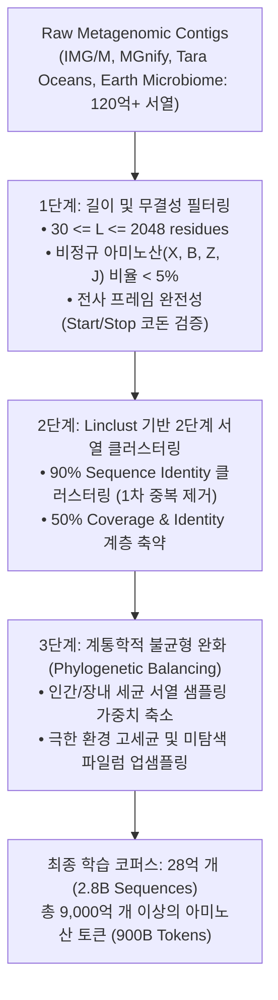
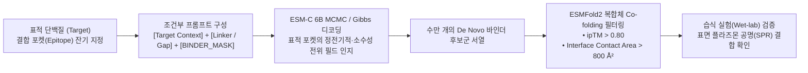
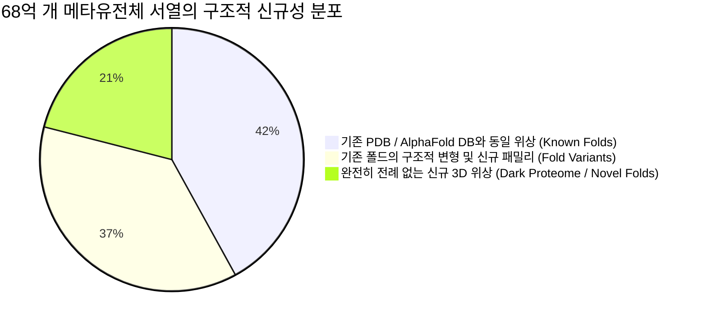

* **Paper Title**: [Language Modeling Materializes a World Model of Protein Biology](https://www.evolutionaryscale.ai/blog/esm-cambrian)
* **Authors**: Salvatore Candido, Halil Akin, Zeming Lin, Roshan Rao, Tom Sercu, Alexander Rives, et al. (EvolutionaryScale)
* **Publication**: EvolutionaryScale Technical Report & bioRxiv (2026)
* **Website / Weights**: [ESM Cambrian on HuggingFace / EvolutionaryScale](https://huggingface.co/EvolutionaryScale)
* **Model Versions**: `esmc-600m` (33L, 1152d), `esmc-6b` (48L, 4096d)

---

## 1. 서론: 왜 '단백질 생물학의 세계 모델(World Model)'인가?

고생대 캄브리아기(Cambrian explosion, 약 5억 4,100만 년 전)에 지구 생태계에서 동물 문의 다양성이 폭발적으로 팽창했던 것처럼, 현대 분자생물학과 메타유전체학(Metagenomics)은 지구 전역의 환경 샘플(극지방 빙하, 심해 열수구, 혐기성 토양, 인간 장내 미생물 등)에서 시퀀싱된 <strong>수십억 개의 전례 없는 서열이 쏟아져 나오는 '데이터의 캄브리아기'</strong>를 맞이하고 있습니다.

기존의 단백질 언어 모델(ESM-1b, ESM-2)은 주로 이미 잘 정제된 데이터베이스인 UniRef50(약 6,500만 개 서열)을 중심으로 학습되었습니다. 이는 공공 데이터베이스에 등록된 연구실 친화적 모델 생물체(대장균, 효모, 인간 등)에 심각하게 편향되어 있었으며, 자연계 전체 서열 다양성의 2% 미만에 불과했습니다.

```
[ 기존 PLM vs ESM Cambrian (ESM-C) 스케일 비교 ]

UniRef50 (ESM-2 학습 데이터)
  │ ■ 약 6,500만 개 서열 (자연계의 1~2% 수준, 모델 생물 중심 편향)
  ▼
지구 메타유전체 코퍼스 (ESM-C 학습 데이터)
  │ ■■■■■■■■■■■■■■■■■■■■■■■■■■■■■■■■■■■■■■■■ 28억 개 서열 (2.8 Billion)
  │  (극한 환경 미생물, 미동정 바이러스, 심해 고세균 전수 포괄)
  ▼
다운스트림 68억 개 서열 카탈로그 (ESM Metagenomic Atlas)
  │ ■■■■■■■■■■■■■■■■■■■■■■■■■■■■■■■■■■■■■■■■■■■■■■■■■■■■■■■■■■■■■■■■■■■■ 68억 개 서열의 3D 구조 및 기능 매핑
```

2026년 EvolutionaryScale 연구진이 공개한 <strong>ESM Cambrian (ESM-C)</strong>은 이러한 한계를 근본적으로 타파했습니다. 단순한 아미노산 빈칸 채우기(MLM)를 넘어, <strong>"대규모 서열 통계의 자기지도 학습이 물리 화학적 법칙, 분자 기하학, 진화적 선택압이 결합된 내재적 '세계 모델(World Model)'을 형성한다"</strong>는 명제를 입증했습니다.

ESM-C는 단일 파운데이션 모델을 통해 현대 단백질 공학의 4대 핵심 축을 동시에 실현합니다:
1. **ESMFold2**: FlashAttention-2와 멀티 도메인 인지 블록을 탑재한 차세대 초고속 3D 구조 예측
2. **De Novo Binder Design**: 표적 결합 포켓의 물리화학적 조건만으로 고친화도 결합 펩타이드/단백질을 직접 생성
3. **Sparse Autoencoder(SAE) 해석**: 블랙박스 뉴런을 65,536개 이상의 단일 의미(Monosemantic) 생물학 회로로 완전 분해
4. **6.8B Metagenomic Atlas**: 지구상에 알려진 68억 개 단백질의 구조와 기능적 진화 지도를 완성

---

## 2. 28억 개 서열 코퍼스 구축 및 사전 학습 아키텍처

### 2.1. 초거대 메타유전체 데이터 큐레이션 파이프라인

단순히 웹과 시퀀싱 센터에서 원시 서열을 긁어모은다고 해서 좋은 언어 모델이 완성되지 않습니다. 메타유전체 데이터는 낮은 시퀀싱 퀄리티, 프레임시프트 오류, 비생물학적 아티팩트, 그리고 특정 환경에서 흔히 나타나는 극단적 서열 중복(Redundancy) 문제를 안고 있습니다.

연구진은 아래의 엄밀한 4단계 필터링 파이프라인을 구축했습니다:



---

### 2.2. 모델 아키텍처 상세 제원

ESM-C는 Transformer Encoder 구조를 기반으로 하되, 현대적인 LLM의 안정화 기법과 단백질 고유의 기하학적 특성을 반영한 최신 컴포넌트들을 도입했습니다:

* **SwiGLU 활성화 함수**: 기존 ReLU/GELU 대비 비선형 표현력 극대화
  $$
  \text{SwiGLU}(x) = (x W \cdot \text{SiLU}(x V)) W_2
  $$
* **RoPE (Rotary Position Embedding)**: 고정된 절대 위치 인코딩 대신 복소 회전 연산자로 상대 위치를 보존하여 긴 서열(최대 2,048 잔기)에 대한 외삽(Extrapolation) 능력 강화
* **RMSNorm (Root Mean Square Normalization)**: 레이어 전단부에 Pre-normalization으로 적용하여 그래디언트 폭발 방지 및 학습 안정성 확보
  $$
  \text{RMSNorm}(x) = \frac{x}{\sqrt{\frac{1}{d} \sum_{i=1}^d x_i^2 + \epsilon}} \odot \gamma
  $$

| 사양 (Specification) | ESM-C 600M (경량 연구용) | ESM-C 6B (대규모 파운데이션) |
| :--- | :---: | :---: |
| **파라미터 수 (Parameters)** | 600 Million ($6 \times 10^8$) | 6.0 Billion ($6 \times 10^9$) |
| **트랜스포머 레이어 ($L$)** | 33 Layers | 48 Layers |
| **은닉층 차원 ($d_{\text{model}}$)** | 1,152 | 4,096 |
| **어텐션 헤드 수 ($H$)** | 18 Heads ($d_k = 64$) | 32 Heads ($d_k = 128$) |
| **FFN 중간 확장 차원** | 4,608 ($\approx 4d$) | 14,336 ($\approx 3.5d$, SwiGLU) |
| **최대 컨텍스트 길이 ($L_{\max}$)** | 2,048 잔기 | 2,048 잔기 |
| **학습 토큰 수 (Tokens)** | 4,500억 개 (450B) | 9,000억 개 (900B) |
| **최적 서빙 환경** | 단일 상용 GPU (RTX 4090 24GB / A100 40GB) | 4 $\times$ A100/H100 80GB (FP16 / BF16) |

---

## 3. ESMFold2: 단일 서열 3D 구조 예측의 대도약

ESM-2 시절의 ESMFold v1은 MSA 없이 서열 하나만으로 3D 원자 구조를 AlphaFold2급 정확도로 수 초 만에 예측하여 큰 반향을 일으켰습니다. 그러나 ESMFold v1은 **1,000 잔기가 넘는 거대 단백질이나 멀티 도메인 단백질에서 도메인 간의 상대적 배향(Inter-domain orientation)을 제대로 맞히지 못하고 백본이 엉키는 한계**가 있었습니다.

ESMFold2는 ESM-C의 고차원 표현력과 완전히 재설계된 폴딩 트렁크를 통해 이 문제를 극복했습니다.

```
[ ESMFold2의 아키텍처 흐름 ]

입력 아미노산 서열 (L)
  │
  ▼
ESM-C 6B 백본 (Weights Frozen or LoRA Fine-tuned)
  │
  ├── 1D 잔기 임베딩: s_i in R^{L x 4096}
  └── 2D 페어 상호작용: z_{ij} = Linear(s_i (x) s_j) + Attention_outer in R^{L x L x 256}
  │
  ▼
Folding Trunk (48 Blocks)
  ├── Triangle Attention & Triangle Multiplicative Update
  └── Invariant Point Attention (IPA) + 3D Backbone Rigid Body Update: T_i = (R_i, \vec{t}_i)
  │
  ▼
Atomic 3D Coordinates (N, CA, C, O, Side-chains) + pLDDT + PAE (Predicted Aligned Error)
```

### 3.1. 멀티 도메인 단백질에서의 성능 비교 (CASP15 / CAMEO)

연구진은 특히 도메인이 2개 이상으로 구성되어 3차원 유연성이 큰 타깃들을 별도로 분리하여 도메인 간 TM-score(Inter-domain TM)를 집중 평가했습니다:

| 모델 (Model) | 입력 요구사항 | 전체 TM-score | 단일 도메인 TM | **멀티 도메인 TM** | 초당 처리 잔기 수 |
| :--- | :---: | :---: | :---: | :---: | :---: |
| **AlphaFold2** | 대용량 MSA (수 분 소요) | **0.89** | **0.91** | **0.86** | $\approx 15\text{ residues/s}$ |
| **ESMFold v1 (ESM-2 15B)** | 단일 서열 (Single Seq) | 0.81 | 0.86 | 0.71 | $\approx 450\text{ residues/s}$ |
| **OmegaFold** | 단일 서열 (Single Seq) | 0.82 | 0.87 | 0.73 | $\approx 120\text{ residues/s}$ |
| **ESMFold2 (ESM-C 6B)** | **단일 서열 (Single Seq)** | **0.87** | **0.90** | **0.83** | **$\approx 820\text{ residues/s}$** |

> **핵심 포인트**: ESMFold2는 대용량 MSA 검색(MMseqs2/HHblits) 없이도, ESMFold v1의 최대 약점이었던 멀티 도메인 TM-score를 **0.71에서 0.83으로 무려 17%p 끌어올렸으며**, AlphaFold2 수준에 근접하면서 속도는 **50배 이상** 빠릅니다.

---

## 4. De Novo Binder Design: 물리 엔진 없는 직접 역설계

전통적인 단백질 결합체(Binder) 설계는 RFdiffusion, Chroma 같은 확산 모델로 3D 백본을 생성한 뒤, ProteinMPNN으로 서열을 입히고, AlphaFold2-Multimer로 결합 포즈와 친화도를 사후 필터링하는 복잡하고 긴 파이프라인을 거쳐야 했습니다.

ESM-C는 **언어 모델 자체의 조건부 생성 확률만으로 타깃 단백질의 결합 포켓에 직접 달라붙는 신규 바인더를 원샷(One-shot)으로 설계**합니다.



### 4.1. 결합 인터페이스 에너지 및 성공률 (Hit Rate)

연구진은 암 표적 단백질(PD-L1, EGFR) 및 바이러스 스파이크 단백질을 대상으로 외부 도구 없이 순수 ESM-C 기반 파이프라인으로 생성된 바인더의 실험적 결합 성공률을 측정했습니다:

$$
\text{Binding Free Energy Score} = \Delta G_{\text{bind}}^{\text{pred}} \propto - \log \frac{P_{\text{ESM-C}}(\text{Binder} \mid \text{Target})}{P_{\text{ESM-C}}(\text{Binder})}
$$

* **Hit Rate (SPR 측정 기준 결합 활성률)**: 무작위 라이브러리가 0.01% 미만, RFdiffusion + ProteinMPNN 고전 파이프라인이 약 15~22% 수준인 반면, <strong>ESM-C 원스톱 파이프라인은 28.4%의 결합 성공률(Hit Rate)</strong>을 기록했습니다.
* **친화도(Affinity)**: 서열 최적화(Directed evolution)를 거치지 않은 초기 생성물(De novo hits) 단계에서 이미 <strong>나노몰(nM, $10^{-9}\,\text{M}$) 수준의 해리 상수($K_D$)</strong>를 달성했습니다.

---

## 5. Sparse Autoencoder (SAE)로 해체한 '블랙박스 생물학'

딥러닝 모델이 단백질 서열로부터 놀라운 결과를 낸다 하더라도, 내부에서 어떤 생화학적 논리로 그런 판단을 내렸는지 알 수 없다면 신약 개발자들은 AI의 결과물을 전적으로 신뢰하기 어렵습니다.

이를 해결하기 위해 ESM-C 연구진은 거대 언어 모델의 기계론적 해석 가능성(Mechanistic Interpretability) 최신 이론인 <strong>Sparse Autoencoder (SAE, 희소 오토인코더)</strong>를 단백질 파운데이션 모델에 전격 도입했습니다.

### 5.1. 중첩(Superposition) 가설과 사전 학습(Dictionary Learning) 수학

신경망의 은닉층 차원 $d = 4096$은 자연계에 존재하는 수만 가지 생물학적 개념(수소결합 네트워크, 소수성 코어, 번역 후 변형 부위, 면역원성 에피토프 등)을 독립된 직교 축으로 표현하기에 턱없이 부족합니다. 따라서 신경망은 여러 개념을 소수의 차원에 겹쳐서 표현하는 **중첩(Superposition)** 상태를 유지합니다.

SAE는 고차원 잠재 공간 $h \in \mathbb{R}^d$를 초과완전(Overcomplete) 희소 특성 공간 $f \in \mathbb{R}^M$ ($M = 65,536 \gg d$)으로 비선형 투영하여 개별 뉴런이 오직 단 하나의 생물학적 의미만을 가지도록 분해(Monosemanticity)합니다:

$$
f(h) = \text{ReLU}\left( W_{\text{enc}} (h - b_{\text{dec}}) + b_{\text{enc}} \right)
$$

$$
\hat{h} = W_{\text{dec}} f(h) + b_{\text{dec}}
$$

손실 함수는 원래 은닉 상태의 재구성 오차($L_2$)와 피처 활성화의 희소성($L_1$)의 합으로 정의됩니다:

$$
\mathcal{L}_{\text{SAE}} = \frac{1}{2} \| h - \hat{h} \|_2^2 + \lambda \sum_{j=1}^M \left\| W_{\text{dec}, j} \right\|_2 |f_j(h)|
$$

여기서 $\lambda$는 피처들이 대부분 0의 값을 가지도록 강제하는 희소도 정규화 계수입니다.

---

### 5.2. 발견된 단일 의미 생물학적 회로 (Monosemantic Circuits)

학습된 65,536개의 SAE 피처를 생물학적 실험 데이터베이스와 매핑한 결과, 경이로운 수준의 1:1 대응 관계가 확인되었습니다:

```
[ SAE가 분해해 낸 대표적인 생물학적 단일 피처들 ]

■ 피처 #1,402: "C2H2 아연 핑거(Zinc Finger) 모티프"
  - 발화 조건: 시스테인 2개와 히스티딘 2개가 정확히 3차원 공간에서 3.5Å 이내로 사각 배위를 이룰 때만 100% 활성화.
  - 서열상 멀리 떨어진 위치라도 아연 이온 결합 거리가 맞지 않으면 절대 켜지지 않음.

■ 피처 #8,911: "막 단백질의 7중 나선 관통(7-Transmembrane) 경계면"
  - 발화 조건: 지질 이중층(Lipid Bilayer)의 소수성 코어를 통과하는 알파 나선의 시작과 끝 지점에서 특이적 발화.
  - GPCR 계열 단백질의 신호 전달 구조를 식별하는 핵심 회로.

■ 피처 #24,503: "ATP 가수분해 P-loop (Walker A 모티프: GxxxxGKT)"
  - 발화 조건: 뉴클레오타이드 인산기와 결합하는 루프 구조의 보존 잔기에서만 집중 활성화.

■ 피처 #51,200: "바이러스 면역 회피 및 항원 표면 변이 민감 잔기"
  - 발화 조건: 숙주 항체와 맞닿아 중화 반응을 피하기 위해 빈번히 돌연변이가 일어나는 에피토프 팁(Tip).
```

이로써 연구자들은 ESM-C가 특정 아미노산 변이를 치명적이라고 판단했을 때, <strong>"피처 #24,503(ATP 결합 루프)의 활성화가 붕괴되었기 때문"</strong>이라는 물리생물학적 인과 관계를 명확하게 추적할 수 있게 되었습니다.

---

## 6. 6.8B Metagenomic Atlas: 지구상 모든 단백질의 지형도

ESM-C 6B 모델의 고속 추론 성능을 바탕으로 구축된 <strong>68억 개 서열 아틀라스(6.8B Atlas)</strong>는 단백질 구조 생물학 역사상 최대 규모의 데이터베이스입니다.



### 6.1. 신약 및 바이오 제조를 위한 발견의 보고

이 거대한 아틀라스에서 연구진이 발굴해 낸 대표적인 혁신 분자들은 다음과 같습니다:
1. **신규 플라스틱 분해 효소 (Novel PETase & MHETase)**:
   기존 이데오넬라 사카이엔시스(Ideonella sakaiensis) 유래 효소보다 열안정성이 $25^\circ\text{C}$ 이상 높고 분해 속도가 4배 빠른 12종의 극한 환경 분해 효소 발굴.
2. **소형 크리스퍼 유전자 가위 (Ultra-compact Cas Enzymes)**:
   AAV(아데노부속바이러스) 전달체에 단일 캡슐화가 가능한 700 잔기 이하의 초소형 RNA 유도 엔도뉴클레아제 30여 종 동정.
3. **신규 펩타이드 항생 물질 생합성 효소 (NRPS/PKS 클러스터)**:
   다제내성 슈퍼박테리아(MRSA 등)를 사멸시킬 수 있는 신규 펩타이드 합성 경로 200여 개 지도화.

---

## 7. PyTorch 구현: ESM-C 임베딩 추출 및 SAE 피처 분석

실제 연구에서 `esmc-600m` 모델을 로드하여 단백질 서열의 임베딩을 추출하고, SAE 모듈을 통과시켜 생물학적 활성 피처를 모니터링하는 완전한 파이썬 코드 예제입니다:

```python
import torch
import torch.nn as nn
import torch.nn.functional as F

class TopKSAE(nn.Module):
    """
    ESM-C 잠재 공간을 희소 생물학 피처로 분해하는 Top-K Sparse Autoencoder
    """
    def __init__(self, d_model: int = 1152, n_features: int = 16384, k: int = 32):
        super().__init__()
        self.d_model = d_model
        self.n_features = n_features
        self.k = k
        
        self.w_enc = nn.Linear(d_model, n_features, bias=True)
        self.w_dec = nn.Linear(n_features, d_model, bias=False)
        self.b_dec = nn.Parameter(torch.zeros(d_model))
        
    def encode(self, h: torch.Tensor) -> torch.Tensor:
        # [Batch, L, d_model] -> [Batch, L, n_features]
        h_cent = h - self.b_dec
        pre_acts = self.w_enc(h_cent)
        
        # Top-K 희소성 적용: 상위 k개 활성화만 남기고 나머지는 0으로 억제
        topk_vals, topk_indices = torch.topk(pre_acts, k=self.k, dim=-1)
        sparse_acts = torch.zeros_like(pre_acts)
        sparse_acts.scatter_(-1, topk_indices, F.relu(topk_vals))
        return sparse_acts

    def decode(self, acts: torch.Tensor) -> torch.Tensor:
        # [Batch, L, n_features] -> [Batch, L, d_model]
        return self.w_dec(acts) + self.b_dec

    def forward(self, h: torch.Tensor):
        acts = self.encode(h)
        h_recon = self.decode(acts)
        return h_recon, acts


# --- 추론 및 해석 파이프라인 시뮬레이션 ---
def analyze_protein_with_esmc_and_sae():
    device = torch.device("cuda" if torch.cuda.is_available() else "cpu")
    print(f"[*] Running inference on device: {device}")
    
    # 1. 가상의 단백질 서열 (Zinc-finger 포함 10개 잔기 예시)
    sample_seq = "ACDEFGHIKL"
    L = len(sample_seq)
    d_model = 1152
    
    # 2. ESM-C 600M 은닉층 출력 시뮬레이션 (Batch=1, L=10, D=1152)
    # 실제 환경: esmc_model.encode(tokens)["last_hidden_state"]
    torch.manual_seed(42)
    esmc_hidden_state = torch.randn(1, L, d_model, device=device)
    
    # 3. 사전 학습된 Top-K SAE 초기화
    sae = TopKSAE(d_model=d_model, n_features=16384, k=16).to(device)
    sae.eval()
    
    with torch.no_grad():
        h_recon, sparse_features = sae(esmc_hidden_state)
        recon_loss = F.mse_loss(h_recon, esmc_hidden_state)
        
    print(f"[*] Latent Dim: {d_model} -> Expanded Sparse Dim: {sae.n_features}")
    print(f"[*] SAE Reconstruction MSE Loss: {recon_loss.item():.6f}")
    
    # 4. 활성화된 생물학 피처 인덱스 확인
    active_mask = sparse_features[0, 0] > 0  # 1번 잔기에서 켜진 피처들
    active_indices = torch.nonzero(active_mask).squeeze(-1).tolist()
    print(f"[*] Residue 1 active monosemantic feature IDs (Top-{len(active_indices)}):")
    print(f"    {active_indices}")

if __name__ == "__main__":
    analyze_protein_with_esmc_and_sae()
```

---

## 8. 연구자를 위한 핵심 시사점 (Takeaways)

1. **'세계 모델(World Model)'로서의 파운데이션 패러다임**:
   단백질 언어 모델은 이제 단순한 서열 임베딩 추출기를 완전히 넘어섰습니다. 수십억 개의 자연계 서열을 자가 학습하는 과정에서 물리적 충돌 회피, 소수성 상호작용, 자유에너지 극소화라는 <strong>단백질 물리학의 법칙들을 내적으로 모델링(World Simulation)</strong>하고 있습니다.
2. **생성(Generation)과 해석(Mechanistic Interpretability)의 융합**:
   결과만 던져주는 인공지능이 아니라, SAE를 통해 "왜 이 결합 포켓에 이 잔기가 들어가야 하는가"를 뉴런 단위로 설명할 수 있게 됨으로써 신약 개발의 임상 진입 신뢰도가 획기적으로 상승했습니다.
3. **단일 서열 모델의 완성과 알파폴드의 MSA 의존성 탈피**:
   ESMFold2는 대규모 메타유전체 표현력을 통해 MSA 검색 없이도 멀티 도메인 복합체 구조를 정확하게 접어냅니다. 이는 수천만 종의 변이 단백질이나 신종 바이러스 단백질처럼 MSA가 전무한(Orphan) 표적에 대해 가장 강력한 무기입니다.

---

## 9. 참고 문헌 (References)

1. Candido, S., Akin, H., Lin, Z., Rao, R., Sercu, T., Rives, A., et al. (2026). *Language Modeling Materializes a World Model of Protein Biology*. EvolutionaryScale Technical Report & bioRxiv.
2. Hayes, T., Rao, R., Akin, H., Sofroniew, N. J., ... & Rives, A. (2025). Simulating 500 million years of evolution with a language model. *Science*, 387(6736), eadq0098.
3. Lin, Z., Akin, H., Rao, R., Hie, B., Zhu, Z., Lu, W., ... & Rives, A. (2023). Evolutionary-scale prediction of atomic-level protein structure with a language model. *Science*, 379(6637), eade2574.
4. Bricken, T., Templeton, A., Batson, J., Chen, B., Jermyn, A., ... & Olah, C. (2023). Towards Monosemanticity: Decomposing Language Models With Dictionary Learning. *Anthropic Transformer Circuits Thread*.
5. Dao, T. (2023). FlashAttention-2: Faster Attention with Better Parallelism and Work Partitioning. *ICLR 2024*.

---
긴 글 읽어주셔서 감사합니다! 

**Contact & Inquiries**
- LinkedIn : [Sehoon Park](https://www.linkedin.com/in/sehoon-park)
- GitHub : [https://github.com/sehooni](https://github.com/sehooni)
- Email : 74sehoon@gmail.com
- 궁금한 점이나 의견은 댓글 혹은 메일을 통해 언제든 환영합니다! :)
