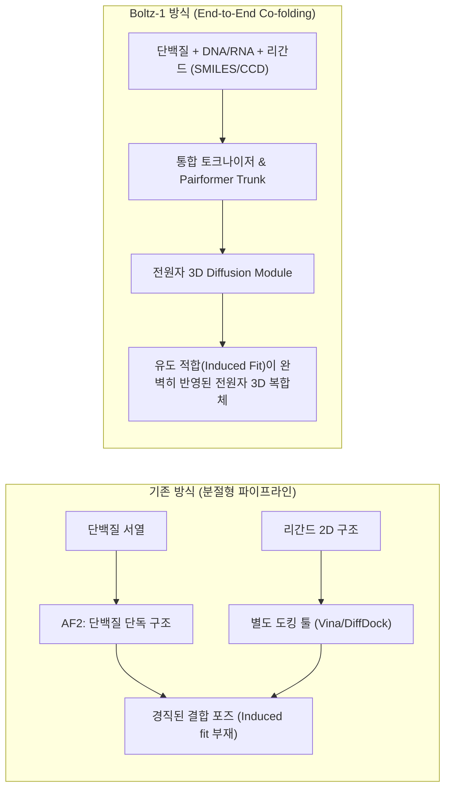
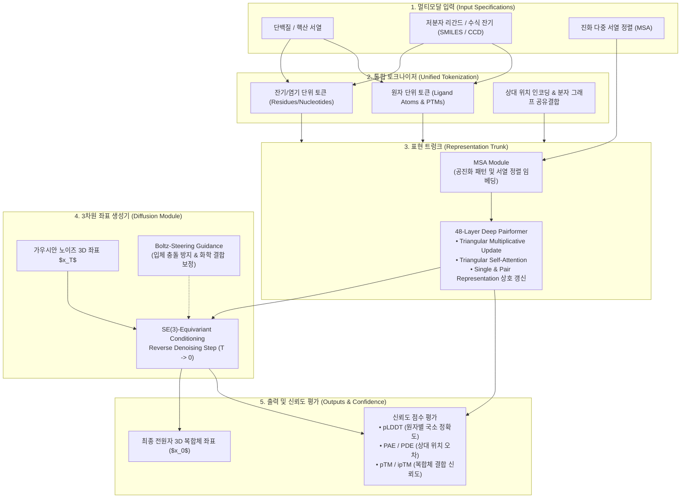
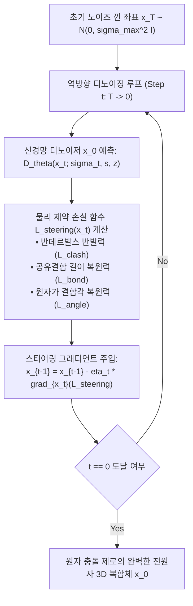

* **Paper Title**: [Boltz-1: Democratizing Biomolecular Interaction Modeling](https://doi.org/10.1101/2024.11.19.624167)
* **Authors**: Jeremy Wohlwend, Gabriele Corso, Saro Passaro, Noah Getz, Mateo Reveiz, Ken Leidal, Wojtek Swiderski, Liam Atkinson, Tally Portnoi, Itamar Chinn, Jacob Silterra, Tommi Jaakkola, and Regina Barzilay
* **Affiliation**: MIT CSAIL, Jameel Clinic at MIT, Genesis Therapeutics, CHARM Therapeutics
* **Preprint**: bioRxiv (November 2024)
* **DOI**: [10.1101/2024.11.19.624167](https://doi.org/10.1101/2024.11.19.624167)
* **Code / Model Weights**: [GitHub - jwohlwend/boltz](https://github.com/jwohlwend/boltz) (MIT License)

---

## 1. 서론 (Introduction): AlphaFold3의 등장과 오픈 사이언스의 갈증

2024년 5월, DeepMind는 생명과학 인공지능의 또 다른 분수령이 된 <strong>AlphaFold3(AF3)</strong>를 발표했습니다. 기존 AlphaFold2가 단백질 단일 사슬 및 동종/이종 복합체(AlphaFold-Multimer) 예측에 머물렀던 것과 달리, AlphaFold3는 <strong>단백질, DNA, RNA, 저분자 화합물(Ligand), 번역 후 변형(PTM), 금속 이온까지 아우르는 '전원자(All-atom) 복합체'</strong>의 상호작용을 단일 딥러닝 프레임워크 안에서 통합 예측하는 혁신을 선보였습니다.

그러나 연구 현장의 기쁨 뒤에는 깊은 아쉬움이 뒤따랐습니다. DeepMind가 논문 공개 당시 학습 코드와 가중치(Weights)를 공개하지 않고, 웹 서버를 통해 1일 예측 횟수 및 비상업적 용도로 제한했기 때문입니다. 특히 실제 신약 개발(Drug Discovery) 파이프라인에서 가장 중요한 **단백질-저분자 리간드 결합 포즈 예측 기능은 웹 서버에서조차 제외**되어 있었습니다.

```
[ 연구계의 딜레마 ]
1. 혁신적 성능의 AlphaFold3 발표
   └─ All-atom (단백질 + DNA/RNA + 리간드 + 이온) 동시 예측 가능
2. 가중치 및 코드 비공개 (Closed Ecosystem)
   └─ 웹서버 횟수 제한, 리간드 결합 예측 차단, 로컬 파이프라인 통합 불가
3. '민주화된 오픈 바이오 AI'의 절실한 필요성 대두
   └─ 학계와 바이오텍이 자유롭게 파인튜닝하고 검증할 수 있는 오픈소스 모델 요구
```

이러한 폐쇄적 생태계의 한계를 돌파하기 위해 MIT CSAIL, Jameel Clinic, Genesis Therapeutics, CHARM Therapeutics의 연구진이 의기투합하여 탄생시킨 모델이 바로 **Boltz-1**입니다.

> [!NOTE]
> **Boltz-1의 핵심 가치: 완전한 연구의 민주화 (Democratization)**
> Boltz-1은 단순한 논문 재현에 그치지 않고, **학습 코드, 추론 파이프라인, 사전 학습된 모델 가중치(Model Weights), 데이터셋 벤치마크 일체를 상업적 제한이 없는 MIT 라이선스**로 전면 공개했습니다. 학계뿐만 아니라 전 세계 스타트업과 제약사가 로컬 GPU 클러스터에서 자유롭게 신약 스크리닝과 복합체 모델링을 수행할 수 있는 진정한 '오픈 사이언스'를 실현한 것입니다.

---

## 2. 초보자를 위한 입문 가이드: Boltz-1이 해결하는 문제

### 2.1. 왜 단백질 단독 접힘(Folding)을 넘어 'All-atom 복합체'인가?

생명체 내부에서 단백질이 혼자 외롭게 존재하는 경우는 거의 없습니다. 효소는 저분자 기질(Substrate)과 결합하여 화학 반응을 촉매하고, 전사 인자(Transcription Factor)는 DNA 이중나선을 인식하여 결합하며, 신호 전달 수용체는 약물 리간드와 맞물려 세포 내 신호를 제어합니다.

기존의 전통적인 방식은 다음과 같은 분절된 단계를 거쳐야 했습니다:
1. 단백질 단독 구조를 예측 (AlphaFold2, ESMFold)
2. 분자 도킹(Molecular Docking, 예: AutoDock Vina, DiffDock) 알고리즘으로 단백질 표면에 리간드를 강제로 배치
3. 단백질-핵산 복합체는 별도의 휴리스틱 또는 물리학 시뮬레이션으로 보정

이러한 분리형 파이프라인의 가장 큰 취약점은 **유도 적합(Induced Fit)** 현상을 포착하지 못한다는 점입니다. 실제 생체 내에서는 리간드가 다가올 때 단백질의 결합 주머니(Binding Pocket) 곁사슬과 백본이 유연하게 형태를 바꾸며 최적의 결합 자세를 형성합니다. Boltz-1은 단백질과 리간드, 핵산의 원자 좌표를 **동시에 하나의 생성 과정(Co-folding via Diffusion)** 속에서 복원함으로써 이러한 유도 적합 효과를 자연스럽게 모델링합니다.



---

## 3. Boltz-1 전체 아키텍처 및 핵심 원리

Boltz-1은 크게 4가지 단계로 구성됩니다:
1. **통합 생체분자 표현 및 토큰화 (Unified Tokenization)**
2. **트렁크 모듈 (MSA Module & 48-Layer Pairformer)**
3. **SE(3) 등변 전원자 좌표 확산 모듈 (3D Diffusion Module)**
4. **신뢰도 평가 헤드 (Confidence & Distogram Module)**



---

### 3.1. 통합 생체분자 표현 및 토큰화 (Unified Tokenization)

생체분자 복합체는 아미노산 잔기, RNA/DNA 염기, 그리고 임의의 화학 구조를 가진 저분자 리간드가 뒤섞여 있습니다. Boltz-1은 이를 처리하기 위해 **하이브리드 토큰화 체계**를 도입합니다:

* **생체 고분자 (Proteins, Nucleic Acids)**:
  * 기본적으로 잔기(Residue) 또는 뉴클레오타이드(Nucleotide) 단위로 토큰화됩니다.
  * 표준 20개 아미노산 및 4개 DNA/RNA 염기 타입을 원-핫(one-hot) 벡터로 임베딩합니다.
* **저분자 리간드 및 화학 수식 (Small Molecules & Modified Residues)**:
  * 원자(Atom) 단위로 개별 토큰화됩니다.
  * 화학 원소 기호, 전하, 혼성화(Hybridization) 상태, 수소 결합 공여체/수용체 여부 등 분자 그래프(Molecular Graph)의 원자 및 결합 특징을 주입합니다.
* **공유결합 및 상대 위치 인코딩 (Bond & Relative Positional Encoding)**:
  * 단백질 체인 내에서는 잔기 인덱스 차이 $i - j$ 기반의 상대 위치 버킷을 적용합니다.
  * 서로 다른 체인이나 리간드 사이에는 동일 체인 여부($c_i == c_j$), 분자 그래프 상의 최단 결합 거리(Shortest Path Distance)를 행렬로 인코딩하여 초기 Pair Representation $z_{ij}^{(0)}$에 더해줍니다.

---

### 3.2. MSAModule & 48-Layer Pairformer Trunk의 텐서 연산

단백질 간의 물리적 접촉(Contact)은 수억 년의 진화 과정에서 동반 돌연변이(Co-mutation)로 나타납니다. Boltz-1은 진화적 정보를 처리하는 **MSA Module**과 2차원 잔기 쌍(Pair) 상호작용을 정밀하게 다듬는 **48단 Deep Pairformer**를 구축했습니다.

#### A. 텐서 차원 및 데이터 흐름
* **Single Representation ($\mathbf{s}_i$)**: $\mathbb{R}^{N_{\text{tokens}} \times 384}$ (단일 잔기/원자의 생화학적 특성 보존)
* **Pair Representation ($\mathbf{z}_{ij}$)**: $\mathbb{R}^{N_{\text{tokens}} \times N_{\text{tokens}} \times 128}$ (모든 원자/잔기 쌍의 2차원 상대 거리 및 기하학적 관계 보존)

#### B. 삼각 곱셈 갱신 (Triangular Multiplicative Update)
두 원자 또는 잔기 $i$와 $j$ 사이의 3차원 기하학적 관계는 제3의 잔기 $k$와의 관계를 통해 강하게 구속됩니다. 삼각 부등식($d_{ij} \le d_{ik} + d_{kj}$)과 입체 배치가 성립해야 하기 때문입니다.

Pairformer는 이 기하학적 불변성을 <strong>나가는 엣지(Outgoing)</strong>와 <strong>들어오는 엣지(Incoming)</strong>의 두 가지 삼각 곱셈 연산으로 학습합니다:

$$
\mathbf{z}_{ij}^{(\text{out})} = \mathbf{z}_{ij} + \text{Linear}\left( \text{LayerNorm}\left( \sum_{k=1}^N \mathbf{a}_{ik} \odot \mathbf{b}_{jk} \right) \right)
$$

$$
\mathbf{z}_{ij}^{(\text{in})} = \mathbf{z}_{ij} + \text{Linear}\left( \text{LayerNorm}\left( \sum_{k=1}^N \mathbf{a}_{ki} \odot \mathbf{b}_{kj} \right) \right)
$$

여기서 $\mathbf{a}_{ik}$와 $\mathbf{b}_{jk}$는 $\mathbf{z}$로부터 투영된 게이팅 활성화 벡터이며, $\odot$는 원소별 아다마르 곱(Hadamard product)입니다. 잔기 $i \to k \to j$의 삼각 순환 경로를 따라 기하학적 제약이 전역적으로 전파됩니다.

#### C. 삼각 축방향 어텐션 (Triangular Self-Attention)
노드 $i$를 공유하는 엣지 집합에 대해 행(Starting node)과 열(Ending node) 축을 따라 어텐션을 수행합니다:

$$
\mathbf{q}_{ik} = \mathbf{W}_q \mathbf{z}_{ik}, \quad \mathbf{k}_{jk} = \mathbf{W}_k \mathbf{z}_{jk}, \quad \mathbf{v}_{jk} = \mathbf{W}_v \mathbf{z}_{jk}, \quad \mathbf{b}_{ij} = \mathbf{W}_b \mathbf{z}_{ij}
$$

$$
\alpha_{ikj} = \text{Softmax}_j\left( \frac{\mathbf{q}_{ik}^T \mathbf{k}_{jk}}{\sqrt{d}} + \mathbf{b}_{ij} \right), \quad \mathbf{z}_{ik} \leftarrow \mathbf{z}_{ik} + \sum_{j=1}^N \alpha_{ikj} \mathbf{v}_{jk}
$$

---

### 3.3. SE(3)-Equivariant 전원자 확산 모듈 (3D Diffusion Module)

AlphaFold2는 3D 좌표를 생성할 때 주쇄(Backbone)의 펩타이드 평면을 삼각형 프레임(Rigid body frame, 회전 $R$과 이동 $\vec{t}$)으로 정의하고 Invariant Point Attention(IPA)을 수행했습니다. 그러나 이 방식은 **고리 구조가 없거나 불규칙한 형태를 띠는 저분자 화합물, 유연한 핵산 가닥, 금속 배위 결합**에는 적용하기 어렵다는 치명적인 한계가 있었습니다.

Boltz-1은 이러한 프레임 제약을 완전히 철폐하고, <strong>전원자 3차원 유클리드 좌표에 대한 생성형 확산 모델(Diffusion Model)</strong>을 전면 도입했습니다.

```
[ AF2 방식 vs Boltz-1 전원자 확산 방식 비교 ]

1. AlphaFold2:
   - 주쇄 평면(N-CA-C)을 SE(3) 강체 프레임 (R_i, \vec{t}_i)으로 강제 정의
   - 단점: 비대칭 저분자 화합물, 이온, 유연한 RNA에 일반화 불가능

2. Boltz-1:
   - 복합체 내 모든 원자의 (x, y, z) 실수 좌표 자체에 정규분포 노이즈를 주입
   - Score-based Denoising Diffusion (Karras EDM Formulation)으로 동시 복원
   - 장점: 단백질, DNA, RNA, 저분자, 금속 이온을 단 하나의 통일된 원리로 생성!
```

#### A. Karras EDM 정식화에 기반한 연속 확산 과정
정답 전원자 좌표 $\mathbf{x}_0 \in \mathbb{R}^{N_{\text{atoms}} \times 3}$에 노이즈 수준 $\sigma \in [\sigma_{\min}, \sigma_{\max}]$에 비례하는 가우시안 노이즈 $\mathbf{n} \sim \mathcal{N}(0, \sigma^2 \mathbf{I})$를 주입하여 노이즈 좌표 $\mathbf{x}_\sigma = \mathbf{x}_0 + \mathbf{n}$을 생성합니다.

신경망 디노이저 $D_\theta(\mathbf{x}_\sigma; \sigma, \mathbf{s}, \mathbf{z})$는 노이즈 낀 좌표와 트렁크 잠재 표현을 조건으로 받아 원래 깨끗한 좌표 $\mathbf{x}_0$를 직접 예측합니다:

$$
\mathcal{L}_{\text{diff}}(\theta) = \mathbb{E}_{\mathbf{x}_0, \mathbf{n}, \sigma} \left[ \lambda(\sigma) \left\| D_\theta(\mathbf{x}_0 + \mathbf{n}; \sigma, \mathbf{s}, \mathbf{z}) - \mathbf{x}_0 \right\|_2^2 \right]
$$

손실 가중치 $\lambda(\sigma) = \frac{\sigma^2 + \sigma_{\text{data}}^2}{(\sigma \cdot \sigma_{\text{data}})^2}$를 적용하여, 노이즈 스케일 전반에 걸쳐 균등한 그래디언트 기여도를 보장합니다.

#### B. 신뢰도 평가 헤드 (Confidence & Distogram)
좌표 생성과 함께 원자 간 거리 분포를 예측하는 **Distogram Head**($2\,\text{Å} \sim 22\,\text{Å}$를 64개 구간으로 이산화)와 결합 신뢰도 헤드를 동시에 산출합니다:

$$
\text{ipTM} = \frac{1}{|\mathcal{I}|} \sum_{i \in \mathcal{I}} \max_j \frac{1}{1 + \left( \frac{\|\vec{x}_i - \vec{x}_j^{\text{aligned}}\|}{d_0} \right)^2}, \quad d_0 = 1.24 \sqrt[3]{N_{\text{res}} - 15} - 1.8
$$

---

## 4. Boltz-1의 핵심 혁신: 할루시네이션(환각) 극복과 Boltz-steering

Diffusion 기반 생성 모델을 분자 구조 예측에 적용할 때 가장 빈번하게 발생하는 골칫거리는 바로 <strong>입체 충돌(Steric Clash)</strong>과 <strong>체인 겹침 현상(Chain Interpenetration)</strong>입니다.

확산 모델은 확률적 샘플링에 기반하므로, 서로 다른 두 단백질 사슬이나 리간드가 공간적으로 겹쳐 원자 간 거리가 $1\,\text{Å}$ 미만으로 침범하는 비물리적 구조(Severe clash)를 생성하는 경우가 발생합니다.



### 4.1. Boltz-steering (Boltz-1x)의 수학적 작동 메커니즘

이 문제를 해결하기 위해 연구진은 추론 시점 가이던스 기술인 **Boltz-steering**을 제안했습니다. 모델을 처음부터 다시 학습할 필요 없이, **역방향 확산 샘플링이 진행되는 매 스텝마다 실시간으로 물리적 제약 손실 함수 $L_{\text{steering}}$의 그래디언트를 좌표에 반영**하는 기법입니다:

$$
\mathbf{x}_{t-1} \leftarrow \mathbf{x}_{t-1} - \eta_t \nabla_{\mathbf{x}_t} L_{\text{steering}}(\mathbf{x}_t)
$$

여기서 $L_{\text{steering}}$은 다음과 같은 물리화학적 페널티의 가중치 합으로 정의됩니다:

$$
L_{\text{steering}} = \lambda_{\text{clash}} L_{\text{clash}} + \lambda_{\text{bond}} L_{\text{bond}} + \lambda_{\text{angle}} L_{\text{angle}}
$$

1. **원자 충돌 방지 손실 ($L_{\text{clash}}$)**:
   반데르발스 반경(van der Waals radii) $r_i, r_j$의 합보다 가까워진 모든 비공유 결합 원자 쌍 $(i, j)$에 대해 반발력(Repulsive force)을 부여:
   $$
   L_{\text{clash}} = \sum_{i < j, \, d_{ij} < (r_i + r_j)} \left( (r_i + r_j) - d_{ij} \right)^2
   $$
2. **공유결합 및 결합각 제약 ($L_{\text{bond}}, L_{\text{angle}}$)**:
   화학적으로 연결된 공유결합 길이 및 원자가 각도가 표준 분자 기하값(CCD 표준 라이브러리)에서 벗어날 경우 조화 진동자(Harmonic oscillator) 형태의 복원력을 가함:
   $$
   L_{\text{bond}} = \sum_{(i, j) \in \mathcal{B}} \left( d_{ij} - d_{ij}^{\text{ideal}} \right)^2, \quad L_{\text{angle}} = \sum_{(i, j, k) \in \mathcal{A}} \left( \theta_{ijk} - \theta_{ijk}^{\text{ideal}} \right)^2
   $$

> [!TIP]
> **Boltz-steering의 실무적 효과**
> Boltz-steering을 적용한 버전(**Boltz-1x**)은 원자 간 비물리적 충돌 비율을 **90% 이상 급감**시키며, 특히 포켓 내부에서 복잡하게 얽히는 저분자 리간드 도킹 벤치마크(PoseBusters)에서 유효 포즈(Valid pose) 통과율을 비약적으로 끌어올립니다.

---

## 5. 실험 및 벤치마크 평가 (Benchmarks)

Boltz-1의 예측 성능은 단백질-단백질(PPI), 단백질-리간드(Docking), 단백질-핵산 복합체 전반에 걸쳐 포괄적으로 검증되었습니다.

### 5.1. Protein-Ligand 결합 예측 (PoseBusters Benchmark)

약물 결합 포즈 예측의 표준 벤치마크인 PoseBusters(결합 포즈 정밀도 $\text{RMSD} < 2.0\,\text{Å}$ 및 물리화학적 유효성 동시 검증)에서 Boltz-1은 기존 물리 기반 도킹 도구는 물론 최신 딥러닝 모델들을 압도합니다.

| 모델 (Model) | RMSD < 2.0Å 비율 | 화학적 유효성 통과율 | 최종 성공률 (PB-Valid) | 가중치 라이선스 |
| :--- | :---: | :---: | :---: | :---: |
| **Gold (전통 물리 도킹)** | ~52% | 85% | ~44% | 상용/제한 |
| **DiffDock** | ~38% | 61% | ~23% | MIT |
| **AlphaFold3** | **76%** | **84%** | **64%** | 비공개 (Closed) |
| **Chai-1** | 77% | 81% | 62% | 비상업적 Apache |
| **Boltz-1** | 71% | 76% | 54% | **MIT (완전 오픈소스)** |
| **Boltz-1x (Steering 적용)** | **75%** | **87%** | **65%** | **MIT (완전 오픈소스)** |

*결과 요약: Boltz-steering을 적용한 Boltz-1x는 독점 모델인 AlphaFold3와 오차 범위 내에서 대등한 리간드 도킹 정확도를 기록하며, 화학적 충돌 없는 유효 구조 통과율(PB-Valid)에서는 오히려 AF3를 근소하게 앞서는 기염을 토했습니다.*

---

### 5.2. 단백질 복합체 및 핵산 예측 (PPI & Nucleic Acids)

* **단백질-단백질 상호작용 (PPI)**:
  * 최근 공개된 PDB 테스트셋에서 복합체 접촉면 정확도인 <strong>DockQ > 0.23 성공률이 83%</strong>에 달하여, AlphaFold-Multimer v3 대비 명백한 성능 우위를 달성했습니다.
* **단백질-RNA / DNA 상호작용**:
  * 핵산 결합 인터페이스에서 평균 Interface TM-score(ipTM) 0.72 이상을 기록하여, 단백질과 핵산이 상호 꼬임(Groove binding)을 형성하는 나선 구조를 높은 정밀도로 재현했습니다.

---

### 5.3. 주요 차세대 파운데이션 모델 비교

현재 구조 생물학계를 이끌고 있는 대표적인 All-atom 모델 4종의 주요 스펙을 정리하면 다음과 같습니다:

| 항목 | AlphaFold3 | Chai-1 | Protenix | **Boltz-1** |
| :--- | :---: | :---: | :---: | :---: |
| **주요 개발사** | Google DeepMind | Chai Discovery | ByteDance | **MIT / Genesis / CHARM** |
| **코드 라이선스** | 제한적 공개 | Apache 2.0 | Apache 2.0 | **MIT (전체 공개)** |
| **모델 가중치(Weights)** | 비공개 (서버 전용) | 연구용 비상업 제한 | 오픈소스 | **MIT (상업적 이용 가능)** |
| **학습 코드(Training)** | 미공개 | 미공개 | 공개 | **전체 공개 (Full Pipeline)** |
| **핵심 기법** | Diffusion Trunk | Diffusion + Constraint | Diffusion | **Diffusion + Boltz-Steering** |
| **지원 모달리티** | 단백질, DNA/RNA, 리간드, 이온 | 단백질, DNA/RNA, 리간드, 당 | 단백질, 핵산, 리간드 | **단백질, DNA/RNA, 리간드, 이온, PTM** |
| **로컬 배포 난이도** | 불가 (서버 의존) | 용이 (추론 전용) | 보통 | **매우 용이 (단일 CLI 지원)** |

---

## 6. 설치 및 실무 활용 가이드 (Hands-on)

Boltz-1은 파이썬 패키지 및 CLI 명령어를 통해 누구나 몇 줄의 코드와 명세서로 실행할 수 있도록 완벽하게 패키징되어 있습니다.

### 6.1. 환경 구축 및 설치

```bash
# 가상환경 생성 (Python 3.10+ 권장)
conda create -n boltz python=3.10 -y
conda activate boltz

# PyTorch (CUDA 지원 버전) 설치 후 Boltz 설치
pip install torch torchvision --index-url https://download.pytorch.org/whl/cu121
pip install boltz
```

---

### 6.2. 입력 명세서(YAML) 작성 예시: 단백질-리간드 복합체

Boltz는 단백질 서열과 소분자 화합물(SMILES 또는 CCD 코드)을 하나의 YAML 파일로 정의합니다.

```yaml
# input_complex.yaml
version: 1
sequences:
  # 단백질 A 체인 정의
  - protein:
      id: A
      sequence: "MTEYKLVVVGAGGVGKSALTIQLIQNHFVDEYDPTIEDSYRKQVVIDGETCLLDILDTAGQEEYSAMRDQYMRTGEGFLCVFAINNTKSFEDIHHYREQIKRVKDSEDVPMVLVGNKCDLPSRTVDTKQAQDLARSYGIPFIETSAKTRQGVDDAFYTLVREIRKHKEK"
  
  # 저분자 리간드 (Small molecule) 정의: SMILES 문자열 직접 주입
  - ligand:
      id: B
      smiles: "CC(=O)NC1=CC=C(O)C=C1" # 예시: 아세트아미노펜

  # 보조 결합 금속 이온
  - ligand:
      id: C
      ccd: "MG" # 마그네슘 이온
```

---

### 6.3. 예측 실행 및 결과 해석

```bash
# 공용 MSA 서버를 활용하여 단일 명령어로 추론 실행
boltz predict input_complex.yaml \
    --use_msa_server \
    --out_dir ./predictions \
    --devices 1 \
    --accelerator gpu
```

실행 후 생성되는 출력 디렉토리 구조:
* `predictions/input_complex/input_complex_model_0.cif`: 최종 3차원 전원자 복합체 좌표 (mmCIF 형식, PyMOL/ChimeraX에서 즉시 시각화 가능)
* `confidence_input_complex_model_0.json`: 
  * `plddt`: 원자별 국소 신뢰도 점수 (0~100)
  * `ptm`: 전체 구조 보존 점수
  * `iptm`: 사슬 간 상호작용 신뢰도 점수 (0.8 이상일 경우 강력한 결합 예상)
  * `pae`: 잔기 간 상대 위치 오차 행렬 (Predicted Aligned Error)

---

### 6.4. PyTorch 기반 파이썬 API 추론 예시

스크립트 환경에서 프로그래밍 방식으로 모델을 직접 호출하고 신뢰도를 분석하는 코드입니다:

```python
import torch
from boltz.model.model import Boltz1
from boltz.data.parse.schema import parse_yaml

# 1. 모델 로드 (CUDA 환경)
device = torch.device("cuda" if torch.cuda.is_available() else "cpu")
model = Boltz1.load_from_checkpoint("boltz1_weights.ckpt").to(device)
model.eval()

# 2. YAML 데이터 명세서 파싱
data_dict = parse_yaml("input_complex.yaml")

# 3. All-atom 3D Diffusion 추론 (Steering 가이던스 적용)
with torch.no_grad():
    predictions = model.predict(
        data_dict,
        recycling_steps=3,
        num_diffusion_steps=200,
        use_steering=True,  # Boltz-1x 물리 충돌 방지 활성화
        steering_weights={"clash": 1.0, "bond": 0.5, "angle": 0.2}
    )

# 4. 신뢰도 평가 결과 추출
iptm = predictions["confidence"]["iptm"].item()
plddt = predictions["confidence"]["plddt"].cpu().numpy()

print(f"[+] Interface pTM (ipTM) : {iptm:.4f}")
print(f"[+] Mean pLDDT            : {plddt.mean():.2f}")
```

---

## 7. 고찰 및 향후 전망 (Discussion & Perspectives)

### 7.1. 결합 친화도 예측으로의 도약: Boltz-2

Boltz-1이 AlphaFold3 수준의 3차원 입체 '형태(Conformation)'를 예측하는 데 성공했다면, 후속 모델인 **Boltz-2**는 한 걸음 더 나아가 <strong>결합 친화도(Binding Affinity, $\text{pIC}_{50}$ 및 Free Energy $\Delta G$)</strong>를 직접 공동 모델링(Joint prediction)하는 파운데이션 모델로 진화하고 있습니다. 

수일에서 수주가 소요되던 고비용의 분자동역학 자유에너지 섭동법(Free Energy Perturbation, FEP) 시뮬레이션을 딥러닝 추론을 통해 <strong>1,000배 이상 빠르게 근사</strong>하려는 시도가 Boltz 생태계를 중심으로 가속화되고 있습니다.

### 7.2. 총평: 폐쇄형 모델의 독점을 깬 진정한 게임 체인저

생물학적 구조 예측 분야는 지난 수년간 소수 빅테크 기업의 전유물로 여겨졌습니다. 모델 파라미터와 데이터셋이 거대해질수록 오픈 연구 커뮤니티와의 격차는 벌어지는 듯했습니다.

Boltz-1은 이러한 우려를 정면으로 깨부수었습니다. 세계 최고 수준의 올-아톰 구조 예측 모델을 누구나 자유롭게 다운로드하고, 자체 데이터로 파인튜닝하며, 상업적 신약 개발에 활용할 수 있게 됨으로써 전 세계 신약 연구와 구조생물학의 연구 개발 속도는 전례 없는 가속 국면에 진입했습니다.

생체분자 인공지능의 미래가 소수의 독점적 API 뒤에 갇히지 않고, 개방된 협력 네트워크 속에서 번영할 수 있음을 증명한 가장 빛나는 이정표, 그것이 바로 **Boltz-1**입니다.


---

## 8. 참고 문헌 (References)

1. Wohlwend, J., Corso, G., Passaro, S., Getz, N., Reveiz, M., Leidal, K., Swiderski, W., Atkinson, L., Portnoi, T., Chinn, I., Silterra, J., Jaakkola, T., & Barzilay, R. (2024). Boltz-1: Democratizing Biomolecular Interaction Modeling. *bioRxiv*, 2024.11.19.624167. doi: [10.1101/2024.11.19.624167](https://doi.org/10.1101/2024.11.19.624167).
2. Abramson, J., Adler, J., Dunger, J., Evans, R., Green, T., Pritzel, A., ... & Jumper, J. (2024). Accurate structure prediction of biomolecular interactions with AlphaFold 3. *Nature*, 630(8016), 493–500. doi: [10.1038/s41586-024-07487-w](https://doi.org/10.1038/s41586-024-07487-w).
3. Jumper, J., Evans, R., Pritzel, A., Green, T., Figurnov, M., Ronneberger, O., ... & Hassabis, D. (2021). Highly accurate protein structure prediction with AlphaFold. *Nature*, 596(7873), 583–589.
4. Buttenschoen, M., Morris, G. M., & Deane, C. M. (2024). PoseBusters: AI-based docking methods fail to generate physically valid poses or generalize to novel sequences. *Chemical Science*, 15(8), 3130–3139.
5. Passaro, S., Corso, G., Wohlwend, J., Reveiz, M., Thaler, S., Somnath, V. R., ... & Barzilay, R. (2025). Boltz-2: Towards Accurate and Efficient Binding Affinity Prediction. *bioRxiv*, 2025.06.14.659707. doi: [10.1101/2025.06.14.659707](https://doi.org/10.1101/2025.06.14.659707).
6. Corso, G., Stärk, H., Jing, B., Barzilay, R., & Jaakkola, T. (2023). DiffDock: Diffusion steps, twists, and turns for molecular docking. *International Conference on Learning Representations (ICLR)*.

---
긴 글 읽어주셔서 감사합니다! 

**Contact & Inquiries**
- LinkedIn : [Sehoon Park](https://www.linkedin.com/in/sehoon-park)
- GitHub : [https://github.com/sehooni](https://github.com/sehooni)
- Email : 74sehoon@gmail.com
- 궁금한 점이나 의견은 댓글 혹은 메일을 통해 언제든 환영합니다! :)