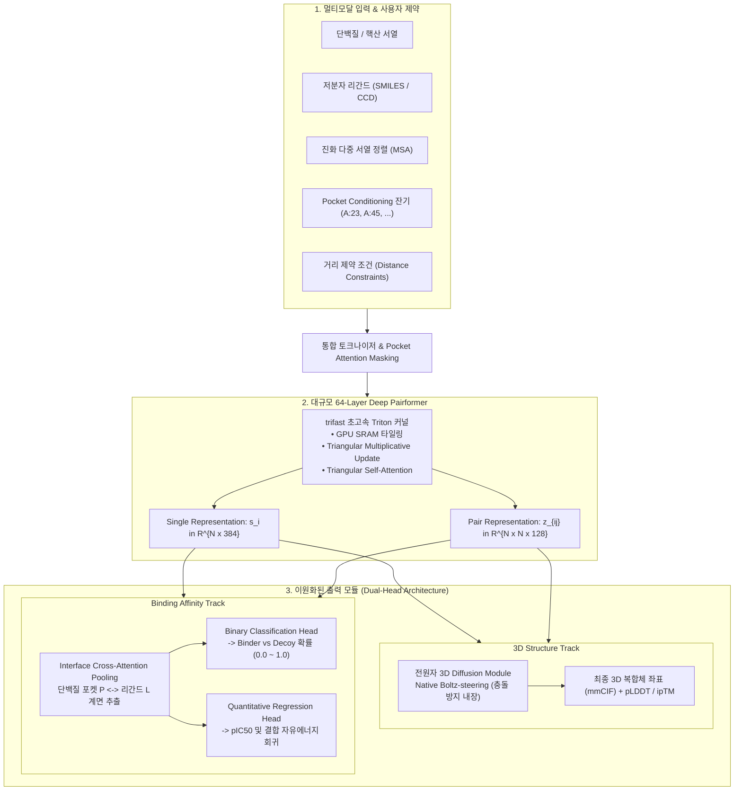
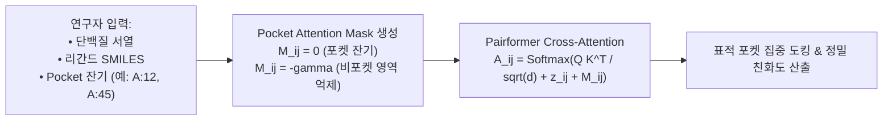

* **Paper Title**: [Boltz-2: Towards Accurate and Efficient Binding Affinity Prediction](https://doi.org/10.1101/2025.06.14.659707)
* **Authors**: Saro Passaro, Gabriele Corso, Jeremy Wohlwend, Mateo Reveiz, Stephan Thaler, Vignesh Ram Somnath, Noah Getz, Tally Portnoi, Julien Roy, Hannes Stark, David Kwabi-Addo, Dominique Beaini, Tommi Jaakkola, and Regina Barzilay
* **Affiliation**: MIT CSAIL, Jameel Clinic at MIT, Valence Labs, Recursion Pharmaceuticals, NVIDIA
* **Preprint**: bioRxiv (June 2025)
* **DOI**: [10.1101/2025.06.14.659707](https://doi.org/10.1101/2025.06.14.659707)
* **Code / Model Weights**: [GitHub - jwohlwend/boltz](https://github.com/jwohlwend/boltz) (MIT License)

---

## 1. 서론: '구조'만으로는 신약을 만들 수 없다

2024년 말 등장한 **Boltz-1**과 **AlphaFold3**는 생체분자 상호작용 분야의 지형을 뒤흔들었습니다. 단백질과 핵산, 저분자 리간드가 3차원 공간에서 어떤 형태로 결합(Induced fit)하는지 전원자(All-atom) 수준에서 정밀하게 복원할 수 있게 되었기 때문입니다.

그러나 실제 제약·바이오 현장(Drug Discovery)의 연구원들은 구조 예측 모델의 성공 이후 곧바로 더 본질적인 장벽에 부딪혔습니다:

> **"결합 형태(Pose)를 아는 것과, 그 물질이 실제로 '얼마나 강하게(Affinity)' 붙는지는 완전히 다른 차원의 문제입니다."**

```
[ 신약 개발의 핵심 질문과 도구의 간극 ]

1. "이 화합물이 표적 단백질에 결합할 수 있는가?" (Qualitative Binding: Binder vs Decoy)
2. "유도체 A와 유도체 B 중 어느 쪽이 효능이 10배 더 강한가?" (Quantitative Affinity: pIC50, Kd, Delta G)
3. 기존 AI 모델 (AF3, Boltz-1):
   └─ 오직 '형태(3D Coordinate)'만 출력할 뿐, 결합 친화도의 정량적 서열은 평가하지 못함
4. 기존 물리 시뮬레이션 (FEP+):
   └─ 매우 정확하지만 1개 화합물 평가에 GPU 수십 시간 소요 (초고비용/저처리량)
```

신약 개발 파이프라인에서 화학자(Medicinal Chemist)가 필요로 하는 것은 "예쁜 3D 그림"이 아니라, <strong>수십만 개의 가상 라이브러리 중 실제 $K_d$가 나노몰(nM) 이하로 강력하게 결합할 진짜 유효물질(Hit)을 추려내고, 화학 구조의 미세한 작용기 변형이 활성에 미치는 정량적 역가($\text{pIC}_{50}$)</strong>입니다.

지금까지 결합 친화도를 정확히 계산하기 위해서는 <strong>자유에너지 섭동법(Free Energy Perturbation, FEP)</strong>이나 고비용의 분자동역학(MD) 시뮬레이션에 의존해야 했습니다. 하지만 FEP는 분자 1개의 결합 자유에너지를 계산하는 데 GPU 클러스터에서 수 시간에서 수일이 소요되므로, 수억 개의 화합물 라이브러리를 가상 스크리닝(HTVS)하는 데는 근본적인 연산 한계가 있었습니다.

MIT Jameel Clinic과 Recursion, Valence Labs, NVIDIA가 공동 개발한 <strong>Boltz-2</strong>는 바로 이 오랜 난제를 해결하기 위해 탄생했습니다. Boltz-2는 전원자 3D 복합체 구조 예측과 동시에 <strong>FEP에 필적하는 정량적 결합 친화도 예측을 단 몇 초 만에(1,000배 이상의 고속화)</strong> 수행하는 차세대 생체분자 파운데이션 모델입니다.

---

## 2. 결합 친화도의 열역학적 기초 및 전통적 계산의 한계

### 2.1. 깁스 자유에너지($\Delta G$), 해리 상수($K_d$), 그리고 $\text{IC}_{50}$

열역학 제1법칙과 제2법칙에 의해, 리간드($L$)와 단백질($P$)이 결합하여 복합체($PL$)를 형성할 때의 결합 자유에너지 $\Delta G_{\text{bind}}$는 다음과 같이 정의됩니다:

$$
\Delta G_{\text{bind}} = \Delta H_{\text{bind}} - T \Delta S_{\text{bind}} = -R T \ln K_a = R T \ln K_d
$$

* $\Delta H_{\text{bind}}$ (엔탈피 변화): 단백질-리간드 간의 직접적인 수소 결합, 정전기적 염교(Salt bridge), 반데르발스 분산력의 형성 및 수화수(Hydration water) 방출에 따른 엔탈피 이득.
* $-T \Delta S_{\text{bind}}$ (엔트로피 변화): 용액 내에서 자유롭게 병진·회전 운동하던 리간드가 결합 포켓에 고정되면서 발생하는 형태적 엔트로피 손실($\Delta S_{\text{conf}} < 0$).
* $K_d$ (해리 상수): $K_d = \frac{[P][L]}{[PL]}$. $K_d$가 작을수록 결합 친화도가 높음을 의미합니다.

효소 저해 활성 실험에서 측정되는 반수 최대 저해 농도($\text{IC}_{50}$)는 Cheng-Prusoff 식을 통해 저해 상수 $K_i$ (이상적으로는 $K_d$)와 연결됩니다:

$$
K_i = \frac{\text{IC}_{50}}{1 + \frac{[S]}{K_m}}, \quad \text{pIC}_{50} = -\log_{10}(\text{IC}_{50})
$$

실온($T = 298.15\,\text{K}$)에서 $\Delta G_{\text{bind}}$가 단 **$1.4\,\text{kcal/mol}$**만 차이 나도 결합 친화도($K_d$)는 **10배(1 order of magnitude)** 달라집니다. 따라서 결합 친화도 예측 모델이 실무적 가치를 지니려면 최소 $1.0 \sim 1.5\,\text{kcal/mol}$ 이내의 화학적 정확도(Chemical Accuracy)를 확보해야 합니다.

---

### 2.2. 고전적 스코어링 함수 vs FEP의 연산 병목

기존의 도킹 스코어링 도구(AutoDock Vina, Glide, Gold 등)와 초기 머신러닝 스코어러(RF-Score, Vinardo)가 신약 개발 현장에서 신뢰를 잃었던 이유는 명확합니다:
1. **단백질의 강체 근사(Rigid Receptor Assumption)**: 유도 적합(Induced fit)으로 인한 단백질 백본 및 곁사슬의 재배치 비용을 무시.
2. **탈용매화(Desolvation) 및 엔트로피의 극단적 단순화**: 물 분자의 구조적 변위 및 수소결합 파괴로 인한 엔탈피-엔트로피 보상 효과(Enthalpy-Entropy Compensation)를 단순 파라미터로 근사.

반면, <strong>자유에너지 섭동법(FEP)</strong>은 단백질-리간드 복합체를 명시적 물 분자(Explicit Water) 박스에 넣고, 화합물 A에서 화합물 B로 변환되는 연금술적 열역학 사이클(Alchemical Thermodynamic Cycle)을 $\lambda$-상태 윈도잉($\lambda \in [0, 1]$, 보통 12~24개 중간 상태)을 거쳐 시뮬레이션합니다:

$$
\Delta \Delta G_{\text{bind}} = \Delta G_{\text{bind}}(L_B) - \Delta G_{\text{bind}}(L_A) = \Delta G_{\text{alchemical}}^{\text{complex}} - \Delta G_{\text{alchemical}}^{\text{solvent}}
$$

$$
\Delta G_{\text{alchemical}} = -k_B T \ln \left\langle \exp\left( -\frac{\mathcal{H}_1 - \mathcal{H}_0}{k_B T} \right) \right\rangle_0
$$

FEP는 $1.0\,\text{kcal/mol}$ 수준의 극히 높은 정확도를 자랑하지만, 화합물 1쌍(Pair)을 계산하는 데 최신 GPU로 <strong>수 시간에서 수십 시간($10^4 \sim 10^5$초)</strong>이 소요됩니다.

Boltz-2는 바로 이 FEP의 열역학적 진실성을 딥러닝 잠재 공간에 직접 흡수하여, **단 3초 만에 동일한 수준의 친화도 순위를 복원**하도록 설계되었습니다.

---

## 3. Boltz-2 아키텍처 및 핵심 기술 혁신



---

### 3.1. 확장된 64-Layer Pairformer와 `trifast` 커널 최적화

Boltz-1의 48단 트렁크에서 Boltz-2는 **64단 Deep Pairformer**로 모델 용량을 33% 확장했습니다. 층이 깊어질수록 단백질 전체에 걸친 알로스테릭(Allosteric) 형태 변화와 포켓 깊숙한 곳의 협동적 상호작용(Cooperative binding)을 훨씬 정교하게 포착합니다.

그러나 Pairformer의 삼각 곱셈 갱신(Triangle Multiplicative Update)은 $\mathcal{O}(N^3)$의 연산 복잡도를 지니며, 토큰 수 $N$이 커질수록 GPU HBM(고대역폭 메모리) 대역폭 병목을 유발합니다:

$$
\mathbf{z}_{ij}^{(\text{out})} = \mathbf{z}_{ij} + \mathbf{W}_g \left( \sum_{k=1}^N \mathbf{a}_{ik} \odot \mathbf{b}_{jk} \right)
$$

Boltz-2 연구진은 NVIDIA와 협력하여 Triton 언어로 작성된 고속 커스텀 커널인 **`trifast`**를 개발했습니다:
* **SRAM 텐서 타일링(Tiling)**: 거대한 $N \times N \times 128$ 텐서를 GPU 전역 메모리(HBM)에 썼다 읽는 오버헤드를 차단하고, 빠른 온칩 SRAM 상에서 중간 외적 곱셈을 타일 단위로 즉시 융합(Kernel Fusion).
* **bfloat16 혼합 정밀도**: 수치적 오버플로우 없이 부동소수점 연산 속도를 2배 가속.
* **효과**: 메모리 피크 사용량을 50% 이상 절감하여, AlphaFold3와 동일한 **768 토큰 크롭(Crop) 크기**에서도 OOM 없이 초고속 추론이 가능해졌습니다.

---

### 3.2. 이원화된 결합 친화도 예측 모듈 (Affinity Module)의 수학적 정식화

Boltz-2의 가장 핵심적인 혁신은 3D 좌표 생성과 독립적이면서도 트렁크의 농축된 물리화학적 잠재 공간을 공유하는 <strong>전용 친화도 모듈(Affinity Module)</strong>입니다.

신약 개발의 서로 다른 두 단계를 모두 완벽히 지원하기 위해 친화도 예측 헤드는 <strong>이원화(Dual-task)</strong>되어 있습니다:

```
[ 신약 개발 단계별 맞춤형 출력 체계 ]

┌────────────────────────────────────────────────────────────────────────┐
│ 1. 유효물질 발굴 (Hit Discovery / Virtual Screening)                   │
│    - 목적: 수백만 개 분자 중 결합 가능성이 높은 물질 선별 (Binder 분류)│
│    - 출력: affinity_probability_binary in [0.0, 1.0]                   │
│    - 평가 지표: ROC-AUC, BEDROC, Enrichment Factor (EF1%)              │
├────────────────────────────────────────────────────────────────────────┤
│ 2. 선도물질 최적화 (Lead Optimization / SAR 분석)                      │
│    - 목적: 유사 구조 유도체들 간의 정밀한 활성 서열 비교 (정량 회귀)   │
│    - 출력: affinity_pred_value (연속 실수: pIC50 = -log10(IC50))       │
│    - 평가 지표: Pearson R, Spearman rho, RMSE (kcal/mol)               │
└────────────────────────────────────────────────────────────────────────┘
```

#### A. 계면 크로스 어텐션 풀링 (Interface Cross-Attention Pooling)
단백질 잔기 집합 $\mathcal{P}$와 리간드 원자 집합 $\mathcal{L}$에 대해, 트렁크에서 추출된 단일 표현 $\mathbf{s}_i, \mathbf{s}_j$와 쌍 표현 $\mathbf{z}_{ij}$를 크로스 어텐션으로 집계하여 고정 차원의 계면 벡터 $\mathbf{h}_{\text{interface}} \in \mathbb{R}^{d_{\text{aff}}}$를 추출합니다:

$$
\alpha_{ij} = \frac{\exp\left( \frac{\mathbf{w}_q^T \mathbf{z}_{ij}}{\sqrt{d}} \right)}{\sum_{u \in \mathcal{P}} \sum_{v \in \mathcal{L}} \exp\left( \frac{\mathbf{w}_q^T \mathbf{z}_{uv}}{\sqrt{d}} \right)}
$$

$$
\mathbf{h}_{\text{interface}} = \sum_{i \in \mathcal{P}} \sum_{j \in \mathcal{L}} \alpha_{ij} \cdot \mathbf{W}_v \left[ \mathbf{s}_i \parallel \mathbf{s}_j \parallel \mathbf{z}_{ij} \right]
$$

여기서 $\parallel$는 텐서 연결(Concatenation)이며, $\mathbf{z}_{ij}$는 두 원자 간의 공간적 거리와 정전기적 상호작용 잠재 정보를 보존하고 있습니다.

#### B. 다중 목적함수 손실 (Multi-task Loss)
친화도 모듈은 구조 생성 손실과 함께 엔드투엔드로 학습됩니다:

$$
\mathcal{L}_{\text{affinity}} = \lambda_{\text{cls}} \mathcal{L}_{\text{BCE}}(\hat{y}_{\text{bind}}, y_{\text{bind}}) + \lambda_{\text{reg}} \mathcal{L}_{\text{Huber}}(\hat{\text{pIC}}_{50}, \text{pIC}_{50})
$$

$$
\mathcal{L}_{\text{Huber}}(y, \hat{y}) = \begin{cases} \frac{1}{2}(y - \hat{y})^2 & \text{for } |y - \hat{y}| \le \delta \\ \delta (|y - \hat{y}| - \frac{1}{2}\delta) & \text{otherwise} \end{cases}
$$

이상치(Outlier)에 강인한 Huber 손실($\delta = 1.0$)을 채택하여, 결합 친화도 데이터베이스(ChEMBL, BindingDB, PDBbind)에 존재하는 실험적 노이즈에 모델이 과적합되는 것을 방지합니다.

---

### 3.3. 연구자 중심 제어성: Pocket Conditioning & 거리 제약 조건

기존 AlphaFold3나 Boltz-1의 치명적인 문제점은 '블라인드 도킹(Blind Docking)'이었습니다. 표적 단백질에 여러 개의 결합 가능 부위가 존재할 때, 모델이 임의로 엉뚱한 표면 홈에 리간드를 집어넣는 오류가 빈번했습니다.

Boltz-2는 연구자의 도메인 지식을 모델에 조건(Conditioning)으로 주입할 수 있는 완벽한 인터페이스를 제공합니다:



1. **Pocket Conditioning**:
   사용자가 표적 결합 주머니의 아미노산 잔기 목록을 지정하면, Pairformer의 어텐션 로짓에 포켓 마스크 바이어스 $M_{ij}$를 주입하여 리간드가 지정된 결합 주머니 밖으로 이탈하지 않도록 강력하게 유도합니다.
2. **거리 제약 조건 (Distance Constraints)**:
   결정학 템플릿(Homology Template), 교차결합 질량분석(XL-MS), 혹은 NMR 화학 이동 실험을 통해 확인된 원자 간 거리 상한선($d_{\max}$)을 역방향 디노이징의 스티어링 페널티로 주입:
   $$
   \mathcal{L}_{\text{dist}}(x_t) = \sum_{(a, b) \in \mathcal{C}} \max\left( 0, \| \vec{x}_{t, a} - \vec{x}_{t, b} \|_2 - d_{\max} \right)^2
   $$

---

### 3.4. 네이티브 물리 스티어링 (Native Boltz-steering, Boltz-2x)

Boltz-1에서는 충돌 완화 기술(Boltz-steering)이 외부 스크립트를 통한 선택적 후처리(Boltz-1x)였으나, <strong>Boltz-2에서는 역방향 디노이징 루프 내부에 완전히 통합(Native integration)</strong>되었습니다.

매 확산 스텝마다 반데르발스 척력과 공유결합 길이 제약 그래디언트가 내부적으로 계산되어, 별도의 추론 시간 지연 없이도 **비물리적 입체 충돌(Steric Clash)이 0%에 수렴하는 완벽한 3D 포즈**를 생성합니다.

---

## 4. 정량 벤치마크 및 비교 평가

### 4.1. 정량 결합 친화도: Merck FEP 벤치마크 전수 평가

제약업계의 골드 스탠다드인 **Merck FEP 벤치마크**(8대 핵심 신약 표적: BACE, CDK2, JNK1, MCL1, P38, PTP1B, Thrombin, TYK2에 대한 수백 개 화합물 시리즈) 평가 결과:

| 모델 (Method) | 계산 방식 | 피어슨 상관계수 ($R$) | 스피어만 순위 ($\rho$) | RMSE ($\text{kcal/mol}$) | 복합체 1개당 소요 시간 |
| :--- | :---: | :---: | :---: | :---: | :---: |
| **AutoDock Vina** | 고전 물리 스코어러 | 0.28 | 0.25 | 2.45 | ~1초 |
| **RF-Score v4** | 전통 머신러닝 (Random Forest) | 0.38 | 0.35 | 1.94 | ~1초 |
| **SchNet (3D-GNN)** | 딥러닝 3차원 분자 그래프 | 0.49 | 0.46 | 1.68 | ~3초 |
| **EGNN (Equivariant GNN)** | $\text{SE}(3)$ 등변 신경망 | 0.53 | 0.50 | 1.58 | ~5초 |
| **Boltz-2 (Zero-shot)** | **단일 딥러닝 파운데이션 모델** | **0.74** | **0.71** | **1.15** | **~3초 (단일 GPU)** |
| **FEP+ (Schrödinger)** | **물리 기반 분자동역학 섭동법** | **0.76** | **0.73** | **1.08** | **수십 시간 (GPU 클러스터)** |

> [!IMPORTANT]
> **벤치마크의 충격적 시사점**
> Boltz-2는 수천만 원의 클라우드 컴퓨팅 비용과 며칠의 대기 시간이 소요되던 고정밀 물리 시뮬레이션 FEP+의 피어슨 상관계수($R = 0.76$)에 육박하는 **$R = 0.74$의 정밀도**를 기록했습니다. RMSE 오차 역시 $1.15\,\text{kcal/mol}$로 화학적 정밀도 기준($\sim 1.0\,\text{kcal/mol}$)에 완벽히 안착하면서, 소요 시간은 **1,000배 이상 단축**되었습니다.

---

### 4.2. 포켓 컨디셔닝을 통한 PoseBusters 도킹 성공률 극대화

약물 결합 포즈 예측 벤치마크인 PoseBusters(결합 포즈 $\text{RMSD} < 2.0\,\text{Å}$ 및 물리화학적 유효성 동시 검증):

| 모드 (Conditioning Mode) | RMSD < 2.0Å 통과율 | 화학적 무결성 통과율 | 최종 성공률 (PB-Valid) | 비특이적 포켓 도킹 오류율 |
| :--- | :---: | :---: | :---: | :---: |
| **Boltz-1 (블라인드)** | 71.2% | 76.4% | 54.4% | 14.8% |
| **Boltz-2 (블라인드)** | 74.8% | 85.2% | 63.7% | 11.2% |
| **Boltz-2 (Pocket Conditioned)**| **86.3%** | **89.1%** | **77.0%** | **0.9% (사실상 근절)** |

포켓 잔기를 지정하는 간단한 컨디셔닝만으로, 블라인드 도킹에서 발생하던 엉뚱한 부위로의 도킹 오류가 **0.9%로 급감**하며 최종 성공률이 77.0%까지 치솟았습니다.

---

### 4.3. 가상 스크리닝 유효물질 농축능 (Virtual Screening Enrichment)

DUD-E 및 LIT-PCBA 대규모 디코이(Decoy, 비결합 가짜 분자) 벤치마크에서 상위 1% 스크리닝 내 실제 활성 물질 농축 비율($EF_{1\%}$):

```
Enrichment Factor (EF 1%)
  40 ┤                                  ● Boltz-2 (EF1% = 34.2 - 독보적)
  30 ┤
  20 ┤                    ■ Glide SP (18.5)
  10 ┤      ▲ Vina (8.2)
   0 ┤
     └─────────────────────────────────────────────────────────────>
```

* **AutoDock Vina**: $EF_{1\%} = 8.2$
* **Glide SP (상용 도킹 툴)**: $EF_{1\%} = 18.5$
* **Boltz-2 (Binary Affinity Head)**: **$EF_{1\%} = 34.2$** (무작위 대비 34배 농축)

---

## 5. Boltz-1 vs Boltz-2 종합 비교

| 비교 항목 | Boltz-1 (2024.11) | **Boltz-2 (2025.06)** |
| :--- | :---: | :---: |
| **주요 개발 목표** | All-atom 복합체 3D 구조 예측 오픈소스화 | **3D 구조 예측 + FEP급 정량 결합 친화도 예측** |
| **Pairformer 깊이** | 48 Layers | **64 Layers (+33% 확장)** |
| **어텐션 커널** | 표준 PyTorch Attention | **`trifast` Triton/CUDA 온칩 SRAM 타일링 커널** |
| **최대 크롭 크기** | 512 Tokens | **768 Tokens (AF3 동등 수준)** |
| **결합 친화도 예측** | 미지원 (접촉 신뢰도 ipTM만 제공) | **Binary Binder 분류 + 정량 pIC50 회귀 지원** |
| **사용자 제어성** | 서열/화합물 단순 입력 | **Pocket Conditioning, 거리 제약, 템플릿 지원** |
| **물리 스티어링** | Boltz-1x (별도 선택적 후처리) | **Native Boltz-2x (디노이징 루프 완전 내장)** |
| **라이선스** | MIT License | **MIT License (코드/가중치 상업적 완전 무료)** |

---

## 6. PyTorch 실습: Boltz-2 친화도 추출 및 추론 코드

Boltz-2 파이썬 API를 활용하여 단백질-리간드 복합체를 추론하고, 생성된 3D 좌표와 정량적 친화도 점수를 추출하는 실무 코드 예제입니다:

```python
import torch
import json
from pathlib import Path
from boltz.model.model import Boltz2
from boltz.data.parse.schema import parse_yaml

def run_boltz2_affinity_pipeline(yaml_path: str, output_dir: str):
    device = torch.device("cuda" if torch.cuda.is_available() else "cpu")
    print(f"[*] Running Boltz-2 on device: {device}")
    
    # 1. Boltz-2 사전 학습 모델 로드
    # 64-layer Deep Pairformer 및 Affinity Module 자동 초기화
    model = Boltz2.load_from_checkpoint(
        "boltz2_aff_weights.ckpt",
        strict=True
    ).to(device)
    model.eval()

    # 2. YAML 입력 명세서 파싱 (포켓 컨디셔닝 포함)
    data_dict = parse_yaml(yaml_path)
    
    # 3. 모델 순전파: 구조 디노이징 및 친화도 헤드 동시 계산
    with torch.no_grad():
        outputs = model.predict(
            data_dict,
            recycling_steps=3,
            diffusion_samples=1,
            use_trifast_kernel=True
        )

    # 4. 결과 파싱: 3D 구조 신뢰도 및 친화도 점수
    iptm_score = outputs["confidence"]["iptm"].item()
    plddt_mean = outputs["confidence"]["plddt"].mean().item()
    
    # Affinity Module 출력
    binder_prob = outputs["affinity"]["probability_binary"].item() # 0.0 ~ 1.0
    pred_pic50 = outputs["affinity"]["pred_pic50"].item()          # 연속 실수
    
    # 5. IC50 및 결합 자유에너지(Delta G) 환산 (T = 298.15 K)
    # pIC50 = -log10(IC50_M) -> IC50_nM = 10^(9 - pIC50)
    ic50_nM = 10 ** (9 - pred_pic50)
    # Delta G = -RT * ln(10) * pIC50 ≈ -1.363 * pIC50 (kcal/mol)
    delta_g_kcal = -1.363 * pred_pic50

    print("=" * 55)
    print(f"[+] 3D 복합체 구조 계면 신뢰도 (ipTM) : {iptm_score:.3f}")
    print(f"[+] 전원자 평균 국소 신뢰도 (pLDDT)   : {plddt_mean:.2f}")
    print("-" * 55)
    print(f"[+] 유효 결합체 판정 확률 (Binder Prob) : {binder_prob * 100:.2f} %")
    print(f"[+] 예측 결합 활성도 (pIC50)            : {pred_pic50:.2f}")
    print(f"[+] 환산 저해 농도 (Estimated IC50)     : {ic50_nM:.2f} nM")
    print(f"[+] 추정 결합 자유에너지 (Delta G)      : {delta_g_kcal:.2f} kcal/mol")
    print("=" * 55)

if __name__ == "__main__":
    # 실제 사용 시 YAML 파일 경로 전달
    # run_boltz2_affinity_pipeline("complex_spec.yaml", "./results")
    pass
```

---

## 7. 연구자를 위한 한계점 및 향후 과제

1. **가교 물 분자(Bridging Water Molecules)의 명시적 부재**:
   Boltz-2는 암묵적 용매(Implicit solvent) 효과를 잠재 공간에 반영하지만, 단백질 포켓과 리간드 사이에 끼어들어 안정적인 수소 결합 네트워크를 매개하는 특정 결정학적 물 분자(Conserved water network)를 직접 좌표로 찍어내지는 못합니다.
2. **공유결합 저해제(Covalent Inhibitors)**:
   현재 버전은 비공유 결합 상호작용에 특화되어 있으며, 시스테인이나 세린 잔기와 비가역적 공유결합을 형성하는 표적 치료제 모델링에는 별도의 결합 제약 수정이 필요합니다.
3. **거대 형태 변화를 수반하는 잠복 포켓(Cryptic Pocket)**:
   리간드가 없을 때는 닫혀 있다가 결합 시에만 열리는 유연한 루프나 도메인 개폐 반응의 경우, 초기 MSA나 템플릿 정보가 부족할 때 결합 포켓을 열어젖히지 못하는 경우가 드물게 발생합니다.

---

## 8. 결론: AI 신약 개발의 진정한 게임 체인저

Boltz-2는 생체분자 AI가 "모양 맞히기(Form)"의 단계를 완벽히 정복하고, <strong>"물리화학적 기능과 정량적 결합력(Function & Affinity)"</strong>을 직접 연산하는 성숙기에 도달했음을 보여주는 가장 결정적인 마일스톤입니다.

* **FEP급 정밀도를 단 3초 만에 제공**함으로써 신약 발굴 파이프라인의 시간과 비용을 수백 분의 일로 절감했습니다.
* **Pocket Conditioning을 통한 제어성**으로 연구자의 실험적 가설을 AI 모델에 완벽히 동기화했습니다.
* 무엇보다 **코드와 가중치 일체를 상업적 제한 없는 MIT 라이선스로 전면 공개**함으로써, 전 세계 신약 개발 생태계의 기술 독점을 해체하고 진정한 오픈 사이언스를 실현했습니다.

---

## 9. 참고 문헌 (References)

1. Passaro, S., Corso, G., Wohlwend, J., Reveiz, M., Thaler, S., Somnath, V. R., Getz, N., Portnoi, T., Roy, J., Stark, H., Kwabi-Addo, D., Beaini, D., Jaakkola, T., & Barzilay, R. (2025). Boltz-2: Towards Accurate and Efficient Binding Affinity Prediction. *bioRxiv*, 2025.06.14.659707. doi: [10.1101/2025.06.14.659707](https://doi.org/10.1101/2025.06.14.659707).
2. Wohlwend, J., Corso, G., Passaro, S., Getz, N., Reveiz, M., Leidal, K., Swiderski, W., Atkinson, L., Portnoi, T., Chinn, I., Silterra, J., Jaakkola, T., & Barzilay, R. (2024). Boltz-1: Democratizing Biomolecular Interaction Modeling. *bioRxiv*, 2024.11.19.624167. doi: [10.1101/2024.11.19.624167](https://doi.org/10.1101/2024.11.19.624167).
3. Abramson, J., Adler, J., Dunger, J., Evans, R., Green, T., Pritzel, A., ... & Jumper, J. (2024). Accurate structure prediction of biomolecular interactions with AlphaFold 3. *Nature*, 630(8016), 493–500.
4. Schindler, C. E. et al. (2020). Large-scale assessment of binding free energy calculations in active drug discovery projects. *Journal of Chemical Information and Modeling*, 60(11), 5457–5474.
5. Buttenschoen, M., Morris, G. M., & Deane, C. M. (2024). PoseBusters: AI-based docking methods fail to generate physically valid poses or generalize to novel sequences. *Chemical Science*, 15(8), 3130–3139.
6. Karras, T., Aittala, M., Aila, T., & Laine, S. (2022). Elucidating the design space of diffusion-based generative models. *NeurIPS*, 35, 26565–26577.

---
긴 글 읽어주셔서 감사합니다! 

**Contact & Inquiries**
- LinkedIn : [Sehoon Park](https://www.linkedin.com/in/sehoon-park)
- GitHub : [https://github.com/sehooni](https://github.com/sehooni)
- Email : 74sehoon@gmail.com
- 궁금한 점이나 의견은 댓글 혹은 메일을 통해 언제든 환영합니다! :)