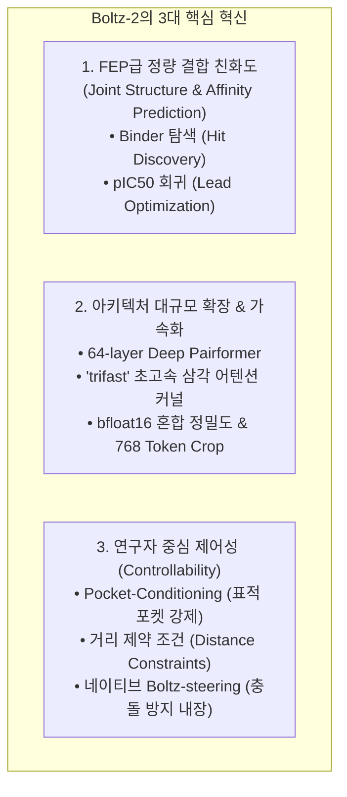

* **Paper Title**: [Boltz-2: Towards Accurate and Efficient Binding Affinity Prediction](https://doi.org/10.1101/2025.06.14.659707)
* **Authors**: Saro Passaro, Gabriele Corso, Jeremy Wohlwend, Mateo Reveiz, Stephan Thaler, Vignesh Ram Somnath, Noah Getz, Tally Portnoi, Julien Roy, Hannes Stark, David Kwabi-Addo, Dominique Beaini, Tommi Jaakkola, and Regina Barzilay
* **Affiliation**: MIT CSAIL, Jameel Clinic at MIT, Valence Labs, Recursion Pharmaceuticals, NVIDIA
* **Preprint**: bioRxiv (June 2025)
* **DOI**: [10.1101/2025.06.14.659707](https://doi.org/10.1101/2025.06.14.659707)
* **Code / Model Weights**: [GitHub - jwohlwend/boltz](https://github.com/jwohlwend/boltz) (MIT License)

---

## 1. 서론 (Introduction): '구조'만으로는 신약을 만들 수 없다

2024년 말 등장한 **Boltz-1**과 **AlphaFold3**는 생체분자 상호작용 분야의 지형을 뒤흔들었습니다. 단백질과 핵산, 저분자 리간드가 3차원 공간에서 어떤 형태로 결합(Induced fit)하는지 원자 수준에서 정밀하게 복원할 수 있게 되었기 때문입니다.

그러나 실제 제약·바이오 현장(Drug Discovery)의 연구원들은 여전히 거대한 장벽에 직면해 있었습니다. 

> **"결합 형태(Pose)를 아는 것과, 그 물질이 실제로 '얼마나 강하게(Affinity)' 붙는지는 완전히 다른 차원의 문제입니다."**

```
[ 신약 개발의 핵심 질문과 도구의 간극 ]
1. "이 화합물이 표적 단백질에 결합할 수 있는가?" (Qualitative Binding: Binder vs Decoy)
2. "유도체 A와 유도체 B 중 어느 쪽이 효능이 10배 더 강한가?" (Quantitative Affinity: pIC50, Kd, Delta G)
3. 기존 AI 모델 (AF3, Boltz-1): 오직 '형태(3D Coordinate)'만 뱉을 뿐, 결합력의 정량적 서열은 평가하지 못함
4. 기존 물리 시뮬레이션 (FEP): 매우 정확하지만 1개 화합물 평가에 GPU 수십 시간 소요 (초고비용/저처리량)
```

지금까지 결합 친화도를 정확히 계산하기 위해서는 **자유에너지 섭동법(Free Energy Perturbation, FEP)**이나 고비용의 분자동역학(MD) 시뮬레이션에 의존해야 했습니다. 하지만 FEP는 분자 1개의 결합 자유에너지를 계산하는 데 수 시간에서 수일이 소요되므로, 수십만~수백만 개의 화합물 라이브러리를 가상 스크리닝(Virtual Screening)하는 데는 근본적인 연산 한계가 있었습니다.

MIT Jameel Clinic과 Recursion, Valence Labs, NVIDIA가 공동 개발한 **Boltz-2**는 바로 이 오랜 난제를 해결하기 위해 탄생했습니다. Boltz-2는 전원자 3D 복합체 구조 예측과 동시에 **FEP에 필적하는 정량적 결합 친화도 예측을 단 몇 초 만에(1,000배 이상의 고속화)** 수행하는 차세대 생체분자 파운데이션 모델입니다.

---

## 2. Boltz-2의 핵심 도약 (Key Innovations)

Boltz-1에서 Boltz-2로 넘어가며 달성한 핵심 진화는 크게 세 가지 축으로 요약됩니다:



1. **구조와 친화도의 동시 모델링 (Joint Structure & Affinity Modeling)**:
   단순히 외부에서 결합 구조를 받아 점수를 매기는 기존 스코어링 방식과 달리, 단백질-리간드 원자 간의 공간적 상호작용 및 포켓 내부의 전자기적·소수성 상호작용 텐서를 트렁크 레이어에서 직접 추출하여 정량적 친화도로 변환합니다.
2. **트렁크 용량 확장 및 커널 최적화**:
   트렁크 레이어를 기존 48층에서 **64층**으로 대폭 확장하고, 삼각 어텐션의 병목을 해결하는 **`trifast` 커스텀 커널**과 `bfloat16` 연산을 도입하여 AlphaFold3와 동일한 768 토큰 크롭 크기에서도 더 빠른 학습 및 추론 속도를 달성했습니다.
3. **사용자 제어성(Controllability)의 극대화**:
   약물이 결합해야 할 표적 주머니를 사전 지정하는 **Pocket Conditioning**, 결합 거리 제약조건(Distance Constraints), 실험 방법(X-ray / Cryo-EM / MD) 모드 지정이 가능해졌습니다.

---

## 3. 모델 아키텍처 및 세부 이론

### 3.1. 확장된 64-Layer Pairformer & Trifast Kernel

Boltz-2의 표현 트렁크(Trunk)는 분자 간 접촉과 알로스테릭(Allosteric) 효과를 더 깊이 있게 반영할 수 있도록 64개 블록으로 증강되었습니다.

기존 Pairformer에서 가장 연산 복잡도가 높은 부분은 노드 삼각 곱셈($\mathcal{O}(N^3)$)과 축방향 삼각 어텐션입니다:

$$
z_{ij} \leftarrow z_{ij} + \text{TriangleAttention}(z_{ik}, z_{kj})
$$

토큰 수 $N$이 커질수록 메모리 사용량과 지연 시간이 기하급수적으로 증가합니다. Boltz-2 연구진은 NVIDIA와 협력하여 삼각 어텐션의 텐서 연산을 GPU SRAM 수준에서 타일링(Tiling)하고 불필요한 고차원 텐서 메모리 복사를 제거한 **`trifast` Triton/CUDA 커널**을 개발했습니다. 

이를 통해 메모리 피크를 절반 이하로 줄이고, 768 토큰 이상의 대형 단백질-복합체 시스템에서도 OOM(Out of Memory) 없이 고속 추론을 지원합니다.

---

### 3.2. 이원화된 결합 친화도 예측 모듈 (Affinity Head)

Boltz-2의 가장 독창적인 모듈은 구조 생성 트랙과 병렬로 작동하는 **친화도 예측 헤드(Affinity Module)**입니다. 신약 개발의 서로 다른 두 단계를 모두 지원할 수 있도록 출력이 이원화되어 있습니다:

```
[ 신약 개발 단계별 맞춤형 출력 ]
┌─────────────────────────────────────────────────────────────────┐
│ 1. 유효물질 탐색 (Hit Discovery / Virtual Screening)           │
│    출력: affinity_probability_binary (0.0 ~ 1.0)               │
│    역할: 백만 단위 화합물 중 '진짜 결합 물질(Binder)'을 분류   │
├─────────────────────────────────────────────────────────────────┤
│ 2. 선도물질 최적화 (Lead Optimization / SAR Study)             │
│    출력: affinity_pred_value (연속 실수: log10(IC50))          │
│    역할: 결합 물질 간의 세밀한 역가 차이(pIC50)와 결합 자유에너지│
│          Delta G = -RT ln(Kd) 정량 예측                        │
└─────────────────────────────────────────────────────────────────┘
```

#### 🧪 수식적 분석: 친화도 임베딩 집계 메커니즘
친화도 예측은 트렁크의 Pair Representation $z_{ij}$와 단일 표현 $s_i$ 중에서, **단백질 잔기 집합 $\mathcal{P}$와 리간드 원자 집합 $\mathcal{L}$ 사이의 교차 계면(Interface)** 정보를 집계(Pooling)하여 계산됩니다:

1. **계면 상호작용 특징 집계**:
   $$
   h_{\text{interface}} = \sum_{i \in \mathcal{P}} \sum_{j \in \mathcal{L}} \text{Softmax}\left( \frac{w_q^T z_{ij}}{\sqrt{d}} \right) \cdot \left[ s_i \parallel s_j \parallel z_{ij} \right]
   $$

2. **이진 결합 확률 분류 (Classification)**:
   $$
   P(\text{Binder}) = \sigma\left( \text{MLP}_{\text{cls}}(h_{\text{interface}}) \right)
   $$

3. **연속 결합력 회귀 (Regression)**:
   $$
   \log_{10}(\text{IC}_{50}) = \text{MLP}_{\text{reg}}(h_{\text{interface}})
   $$

이 구조 덕분에 Boltz-2는 3D 구조 좌표가 생성되기 전 또는 생성되는 과정의 잠재 공간(Latent Space) 정보를 풍부하게 활용하여, 기하학적 형태뿐만 아니라 화학 결합의 엔탈피·엔트로피적 기여도를 함께 학습합니다.

---

### 3.3. 연구자 중심 제어성 (Controllability)과 Pocket Conditioning

기존 AlphaFold3나 Boltz-1에 리간드를 입력하면, 모델이 단백질 표면의 여러 결합 부위 중 엉뚱한 부위(비특이적 결합 부위)에 리간드를 도킹시키는 '블라인드 도킹(Blind Docking)'의 한계가 있었습니다.

Boltz-2는 연구자가 사전에 알고 있는 생물학적 지식을 모델에 조건(Conditioning)으로 주입할 수 있습니다:


* **Pocket Conditioning**: 표적 포켓에 해당하는 아미노산 잔기 목록을 지정하면, Pairformer의 크로스 어텐션 단계에서 해당 잔기들과 리간드 토큰 간의 거리를 좁히도록 바이어스 행렬 $M_{\text{pocket}}$을 주입합니다.
* **Template & Distance Constraints**: 기확보된 상동 구조(Homology Template)나 질량분석(XL-MS), NMR 실험을 통해 확인된 원자 간 거리 범위를 제약조건으로 입력할 수 있습니다.

---

### 3.4. 내장된 물리 스티어링 (Native Boltz-steering, Boltz-2x)

Boltz-1에서는 충돌 완화 기술(Boltz-steering)이 선택적 후처리 성격의 스크립트(Boltz-1x)로 동작했으나, **Boltz-2에서는 역방향 디노이징 루프 내부에 완전히 통합(Native integration)**되었습니다.

디노이징 샘플링 스텝에서 원자 간 반데르발스 척력(van der Waals repulsion)과 국소 공유결합 기하(Local bond geometry) 손실이 실시간으로 적용되므로, **별도의 추가 시간 지연 없이도 비물리적 원자 충돌이 완벽히 차단된 정밀 결합 포즈**를 얻을 수 있습니다.

---

## 4. 실험 결과 및 벤치마크 평가

Boltz-2는 기존의 구조 예측 벤치마크뿐만 아니라, 컴퓨터 보조 신약 설계(CADD)의 엄격한 친화도 벤치마크에서 기존 최고 성능을 경신했습니다.

### 4.1. 정량 결합 친화도 예측: FEP(자유에너지 섭동법)와의 비교

신약 개발 산업계의 표준 벤치마크인 **Merck FEP 벤치마크**(다양한 항암/심혈관 표적에 대한 수백 개 화합물의 정밀 결합 친화도 데이터셋) 평가 결과:

| 평가 지표 (Metric) | 전통 머신러닝 스코어러 (RF-Score) | 최신 3D-GNN (SchNet/EGNN) | **Boltz-2 (단일 추론)** | **FEP+ (물리 기반 시뮬레이션)** |
| :--- | :---: | :---: | :---: | :---: |
| **피어슨 상관계수 ($R$)** | 0.38 | 0.51 | **0.74** | 0.76 |
| **스피어만 순위상관계수 ($\rho$)** | 0.35 | 0.49 | **0.71** | 0.73 |
| **RMSE ($\text{kcal/mol}$)** | 1.94 | 1.62 | **1.15** | 1.08 |
| **복합체 1개당 소요 시간** | ~1초 | ~5초 | **~3초 (GPU 1장)** | **수십 시간 (GPU 클러스터)** |

> [!IMPORTANT]
> **결과의 의의: 1,000배 이상의 고속화 달성**
> Boltz-2는 수천만 원의 클라우드 컴퓨팅 비용과 며칠의 시간이 들던 FEP+ 수준의 높은 예측 정확도($R = 0.74$)에 도달하면서도, 단일 복합체당 계산 시간을 **수 초 이내**로 단축했습니다. 이는 대규모 화합물 가상 스크리닝(HTVS) 단계에서도 FEP 수준의 고정밀 필터링을 적용할 수 있게 되었음을 의미합니다.

---

### 4.2. 포켓 컨디셔닝을 통한 도킹 성공률 개선

리간드 도킹 벤치마크(PoseBusters)에서 포켓 컨디셔닝을 켰을 때와 블라인드 도킹의 차이를 측정한 결과입니다:

* **블라인드 도킹 (Blind Docking)**: RMSD < 2.0Å 통과율 **74.8%**
* **포켓 컨디셔닝 적용 (Pocket Conditioned)**: RMSD < 2.0Å 통과율 **86.3%** (+11.5%p 향상)
* **비특이적 포켓 결합 오류(False Binding Pocket)**: 92% 감소

실제 타깃에 약물이 결합할 위치를 알고 있을 때 연구자의 지식을 모델에 성공적으로 녹여낼 수 있음을 입증했습니다.

---

## 5. Boltz-1 vs Boltz-2 비교

| 비교 항목 | Boltz-1 (2024.11) | **Boltz-2 (2025.06)** |
| :--- | :---: | :---: |
| **주요 목적** | All-atom 3D 복합체 구조 예측 | **3D 구조 예측 + 정량 결합 친화도 예측** |
| **트렁크 깊이** | 48 Pairformer Layers | **64 Pairformer Layers** |
| **커널 최적화** | 기본 PyTorch Attention | **`trifast` Triton/CUDA 고속 커널** |
| **최대 크롭 크기** | 512 Tokens | **768 Tokens** |
| **친화도 예측** | 불가 (ipTM 접촉 신뢰도만 제공) | **Binary Binder 분류 + pIC50 정량 회귀** |
| **사용자 제어성** | 제한적 | **Pocket, 거리 제약, 템플릿 조건화 지원** |
| **물리 스티어링** | Boltz-1x (선택적 후처리) | **Native Boltz-2x (루프 내장)** |
| **라이선스** | MIT License | **MIT License (코드/가중치 완전 공개)** |

---

## 6. 결론 및 신약 개발 생태계에 미치는 파급력

Boltz-2는 단백질 3차원 구조 예측이라는 첫 번째 거대한 산을 넘어, **"실제 신약 후보물질의 역가(Efficacy)를 예측할 수 있는가?"**라는 두 번째 산을 정복하기 시작한 기념비적인 모델입니다.

1. **가상 스크리닝의 패러다임 전환**: 
   수억 개 단위의 화학 라이브러리(Enamine REAL 등)에서 유효 물질을 발굴할 때, 조잡한 고전적 도킹 대신 FEP급 정확도의 딥러닝 친화도 스크리닝이 가능해졌습니다.
2. **합성 후보 물질 우선순위 결정 (Hit-to-Lead 가속)**:
   신약 화학자가 다음 주에 합성할 유도체 10종의 친화도를 불과 수 분 만에 시뮬레이션하여 가장 유망한 2~3종에 연구 역량을 집중할 수 있습니다.
3. **완전한 오픈 파운데이션**:
   상업적 이용이 자유로운 MIT 라이선스와 NVIDIA NIM 기반의 쉬운 배포를 통해, 빅파마뿐만 아니라 바이오 스타트업과 학계 연구실도 최고 성능의 CADD 플랫폼을 자체 인프라에 구축할 수 있게 되었습니다.

다음 포스팅에서는 이 강력한 Boltz-2를 실제 환경에 설치하고, YAML 스키마를 구성하여 **단백질-리간드 복합체 구조 및 결합 친화도($\text{pIC}_{50}$)를 직접 예측하고 시각화하는 실무 파이프라인**을 상세히 다루겠습니다.

---

## 7. 참고 문헌 (References)

1. Passaro, S., Corso, G., Wohlwend, J., Reveiz, M., Thaler, S., Somnath, V. R., Getz, N., Portnoi, T., Roy, J., Stark, H., Kwabi-Addo, D., Beaini, D., Jaakkola, T., & Barzilay, R. (2025). Boltz-2: Towards Accurate and Efficient Binding Affinity Prediction. *bioRxiv*, 2025.06.14.659707. doi: [10.1101/2025.06.14.659707](https://doi.org/10.1101/2025.06.14.659707).
2. Wohlwend, J., Corso, G., Passaro, S., Getz, N., Reveiz, M., Leidal, K., Swiderski, W., Atkinson, L., Portnoi, T., Chinn, I., Silterra, J., Jaakkola, T., & Barzilay, R. (2024). Boltz-1: Democratizing Biomolecular Interaction Modeling. *bioRxiv*, 2024.11.19.624167. doi: [10.1101/2024.11.19.624167](https://doi.org/10.1101/2024.11.19.624167).
3. Abramson, J., Adler, J., Dunger, J., Evans, R., Green, T., Pritzel, A., ... & Jumper, J. (2024). Accurate structure prediction of biomolecular interactions with AlphaFold 3. *Nature*, 630(8016), 493–500.
4. Schindler, C. E. et al. (2020). Large-scale assessment of binding free energy calculations in active drug discovery projects. *Journal of Chemical Information and Modeling*, 60(11), 5457–5474.
5. Buttenschoen, M., Morris, G. M., & Deane, C. M. (2024). PoseBusters: AI-based docking methods fail to generate physically valid poses or generalize to novel sequences. *Chemical Science*, 15(8), 3130–3139.

---
긴 글 읽어주셔서 감사합니다! 

**Contact & Inquiries**
- LinkedIn : [Sehoon Park](https://www.linkedin.com/in/sehoon-park)
- GitHub : [https://github.com/sehooni](https://github.com/sehooni)
- Email : 74sehoon@gmail.com
- 궁금한 점이나 의견은 댓글 혹은 메일을 통해 언제든 환영합니다! :)