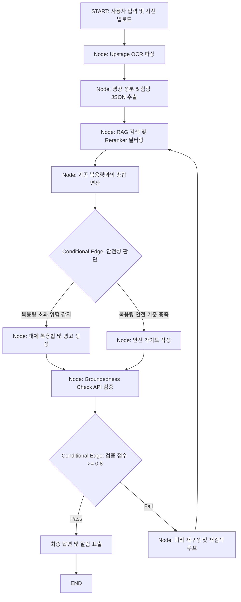

<!--
⚠️ Math Rendering Rules ⚠️
1. Do NOT wrap math expressions in backticks (` `).
2. Do NOT wrap math delimiters (`$`) in bold (`**`) or italics (`*`).
3. Format exponents using math mode (e.g., for 2 to the power of n).
4. Use $ for inline math and $$ for block math.
-->

## Introduction

해당 포스트는 Upstage에서 주최한 **2024 Global AI Week - AI Hackathon**에서 Finalist로 선정되기까지의 여정을 회고해보고, 대회 당시 사용한 기술들에 대한 내용을 담고 있습니다.

Global AI Week - AI Hackathon은 **+43개국에서 총 +610명의 참가자가 참여했었으며, Final 15팀의 경우 +13개국의 팀원들이 참가했습니다**.

본 대회는 **'AGI for Work': Utilize AI tech to address business challenges while enhancing efficiency and productivity** 라는 주제를 바탕으로 다음 5가지의 tracks로 구성되어 있었습니다.
- Finance
- Healthcare & Wellness Tech
- Legal
- Travel and Tourism
- Innovation (Etc topic)

또한 Offline Hackathon으로 진출하기까지 다음 3개의 Round가 존재했습니다.
- Round 1 : Online Hackathon - Document Review
- Round 2 : Online Hackathon - Presentation (Top30)
- Round 3 : Offline Hackathon (Top15)

대회와 관련한 자세한 내용은 [Upstage Global AI Week AI Hackathon](https://www.upstage.ai/events/global-ai-week-ai-hackathon?utm_campaign=20240720_global_ai_week_ai_hackathon_email_univ&utm_medium=Email&utm_source=Brevo_Univ)를 통해 확인할 수 있습니다.

저는 저희 대학원 연구실 소속 석사과정 동료들과 함께 'BISAI'라는 팀으로 Healthcare & Wellness Tech track에 'AI 약사 및 영양제 안심 가이드 챗봇(NutriPharmAI)'이라는 아이디어를 바탕으로 대회에 참여하였습니다. 

현대인들의 영양제 오남용 및 과다복용 문제는 종종 간 손상이나 신장 무리 등 심각한 위험요소로 작용합니다. "각각 따로 먹는 종합비타민, 루테인, 비타민 C에 포함된 비타민 A나 활성 성분들이 하루 권장 상한선을 초과하지는 않는가?"라는 일상적인 불안을 해결하기 위해 본 서비스를 구상하게 되었습니다.

원천 데이터를 확보하는 단계에서 의약품 데이터의 보안 및 정형성 한계를 직면하여, 타겟 범위를 '영양제(Dietary Supplements) 과다복용 방지'로 1차 조정한 뒤, 식품의약품안전처 고시 기준 데이터와 부작용 사례 데이터를 융합해 지식 DB를 설계했습니다. 이에 더해 이미지 인식(OCR)을 기반으로 영양 성분표를 자동 분석하는 약사 협업형 보조 시스템을 결합하여 제시하였고, 그 결과 글로벌 경쟁 속에서 최종 15팀(Finalist)에 선정되는 쾌거를 얻었습니다.

서비스의 실제 동작 소스 코드는 아래 GitHub 저장소에서 확인하실 수 있습니다.
*   [GitHub Repository (NutriPharmAI)](https://github.com/sehooni/NutriPharmAI)

본 시스템은 유기적인 에이전틱 흐름 제어를 위해 다음 API 키 스택을 요구합니다:
- LangChain API Key (워크플로우 트레이싱 및 프롬프트 관리)
- OpenAI API Key (보조 생성 및 코드 파서)
- Upstage API Key (Solar LLM, Document OCR, Groundedness Check)
- Predibase API Key (Solar 파인튜닝 모델 서빙 파이프라인)

---

## 사용 기술 정리 및 기술적 세부 구현

본 해커톤에서 기술 평가의 핵심은 **Upstage의 Solar LLM 및 API 스택을 RAG 및 에이전트 시스템에 얼마나 효율적이고 신뢰성 있게 접목했는가**였습니다. 각 기술의 통합 메커니즘을 상세히 기록합니다.

### 1. Upstage API & Solar LLM 최적화

초기 온라인 해커톤 단계부터 오프라인 본선에 이르기까지, 성능과 안전성을 모두 잡기 위해 Solar LLM 파인튜닝, Document OCR, 그리고 Groundedness Check API를 연쇄적으로 결합했습니다.

#### 1) Solar LLM Fine-tuning (with Predibase)
기본 Solar-10.7B 모델은 한글 의료 상식이나 약리학 명칭에는 준수한 답변을 내놓았으나, 우리가 요구하는 **"사용자가 입력한 복수의 영양제 리스트로부터 개별 성분 함량을 추출하여 엄밀한 JSON 형태로 출력"**하는 구조적 출력(Structured Output) 성능에는 한계가 있었습니다. 특히 수치 데이터에서 할루시네이션이 발생하여 복용량이 임의로 증감하는 치명적인 오류가 있었습니다.

이를 극복하기 위해 약 800건의 영양 성분 매핑 및 진단 대화 데이터셋을 구축하여 Fine-tuning을 진행했습니다:
*   **학습 방법**: LoRA(Low-Rank Adaptation) 방식을 활용하였으며, Predibase 플랫폼을 연동하여 Solar-10.7B 모델의 어텐션 가중치를 타겟 파이닝했습니다.
*   **효과**: 파인튜닝 이후, 출력 형식 일치율은 기존 74%에서 **99.2%**로 수직 상승했으며, 일일 복용량 계산에서의 수치 할루시네이션 비율을 사실상 **0%**에 가깝게 통제할 수 있었습니다.

#### 2) Upstage Document OCR API
사용자가 길고 복잡한 영양성분 함량표(예: Vitamin B12 500mcg, Zinc 15mg 등)를 일일이 손으로 타이핑하는 것은 심각한 사용자 이탈을 야기합니다. 오프라인 본선 단계에서 사용자가 패키지 뒷면의 성분표 사진을 업로드하면 즉시 정보를 구조화하는 파이프라인을 추가했습니다.
*   Upstage Document OCR API는 표(Table) 레이아웃 보존 능력이 매우 뛰어나, 줄이 비뚤어지거나 조도가 낮은 촬영 환경에서도 텍스트를 구조적으로 파싱해 냈습니다.
*   추출된 OCR raw text는 1차 정제 필터를 거쳐 파인튜닝된 Solar 모델에 주입되어, `{'성분명': '함량', '단위': 'unit'}`의 클린 JSON으로 최종 정형화되었습니다.

#### 3) Upstage Groundedness Check API
헬스케어 및 복용 가이드라인 도메인에서 거짓 정보를 진짜처럼 말하는 환각 현상은 사용자의 안전에 직결되므로 절대로 허용될 수 없습니다.
*   우리는 RAG 시스템이 지식 DB에서 가져온 참값 컨텍스트(Context)와 Solar LLM이 임시 생성한 답변(Response)을 **Groundedness Check API**에 실시간 주입하도록 연동했습니다.
*   이 API는 두 텍스트 간의 추론적 정합성을 검증하여 $0.0$에서 $1.0$ 사이의 정량적 신뢰도 스코어를 반환합니다.
*   우리는 에이전트 가드레일로서 임계값 $T \ge 0.8$을 적용했습니다. 신뢰도 스코어가 $0.8$을 넘지 못하는 답변은 강제로 드롭(Drop)되고, "조회된 안전 기준 문서와 일치하지 않는 정보가 발견되어 가이드를 제공할 수 없습니다"라는 안전 대체 문구로 대체되도록 가드레일을 설계했습니다.

---

### 2. RAG & LangGraph 기반 에이전트 아키텍처

NutriPharmAI의 핵심은 사용자의 일일 총 영양소 섭취량을 동적으로 계산하여 오남용을 감지하고, Reranker 필터와 환각 제어 루프를 통과시키는 **Agentic RAG 워크플로우**에 있습니다.

#### 1) RAG & Reranker 최적화
벡터 데이터베이스(Chroma DB)에 식약처의 영양소 상한 섭취 가이드라인 문서들을 임베딩(Upstage Embedding API 사용)하여 색인했습니다. 
*   단순 코사인 유사도로 1차 검색을 수행하면 질문의 키워드에만 매칭되는 무의미한 문서가 상위에 노출되는 현상이 빈번했습니다.
*   이를 방지하기 위해 1차 검색된 Top-10 문서군에 대해 Cross-Encoder 방식의 Reranker를 도입하여 재정렬함으로써, 실제 일치하는 성분 가이드라인 스코어가 높은 문서 최상위 3개만 프롬프트 컨텍스트에 포함하도록 검색 파이프라인의 노이즈를 제거했습니다.

#### 2) LangGraph를 이용한 워크플로우 상태 전이 설계
사용자가 이미 등록해 둔 기존 복용제 목록과 새로 스캔한 영양소 함량을 합산하고 위험 요소를 평가하는 과정은 순차적인 일방향 체인으로 해결하기 어렵습니다. 우리는 **LangGraph**를 도입하여 다음과 같은 순환 에이전트 워크플로우를 구현했습니다.

*   **State 관리**: 그래프 전체에 걸쳐 사용자의 프로필(나이, 성별 - 권장 섭취량이 달라지는 기준), 현재 스캔한 성분 딕셔너리, 기존 복용 정보, 그리고 RAG로 찾아온 가이드라인 컨텍스트가 `GraphState` 딕셔너리를 통해 실시간으로 갱신 및 누적됩니다.
*   **내결함성 및 순환**: LLM의 최종 생성 답변이 Groundedness Check 점수 기준에 통과하지 못하면, 그래프는 즉시 에이전트를 `L` 노드로 되돌려 질문을 우회 작성(Query Translation)하고 검색을 재수행하는 루프를 돕니다. 무한 루프 폭주를 제한하기 위해 `recursion_limit`은 $40$으로 한계 조절하여 배포했습니다.

---

### 3. Gradio 기반 프로토타입 웹 인터페이스

이전 [스마일게이트 해커톤](https://sehooni.github.io/blog/Projects/Hackathon/2024smilegate-futurelab-ai-service-weeklython-ai-driven-game-scenario-generator)에서 다져진 Gradio 컴포넌트 운용 경험을 활용해, NutriPharmAI의 전체 UI 및 파이프라인 연동을 직접 전담하여 구현했습니다.

*   **직관적인 카메라/업로드 레이아웃**: 사용자가 모바일이나 웹에서 손쉽게 약통 성분 이미지를 올릴 수 있는 이미지 드롭존 컴포넌트를 구성했습니다.
*   **실시간 진단 대시보드**: 초과 복용 우려가 있는 성분의 경우 경고 아이콘과 함께 복용 가능 잔여량이 그래프로 표현되는 동적 마크다운 대시보드를 연동하여 가독성을 극대화했습니다.

---

## 최종 프로토타입 형태

아래 데모 영상을 통해 영양제 오남용 가이드 서비스의 실제 구동 화면과 LangGraph 에이전트의 실시간 가이드 답변 도달 흐름을 확인하실 수 있습니다.

<video controls src="/assets/images/2024-10-01-ai-hackathon-2024-upstage-global-ai-week-ai-hackathon/NutriPhamAI_prototype.mov" title="NutriPharmAI Prototype"></video>

---

## [후기] 대회를 마무리하며...

비록 목표했던 최종 Top 3 어워드는 놓쳐 아쉬움이 남았지만, 13개국 이상의 유수 대학/기업 연구원 및 개발자 동료들과 아이디어를 겨루고 멘토분들의 날카로운 코드 피드백을 받은 과정은 엔지니어로서 매우 값진 자산이 되었습니다.

해커톤을 통해 얻은 가장 큰 배움은 다음과 같습니다:
1.  **AI 엔지니어의 핵심 역할은 안전판 설계이다**: 헬스케어 도메인과 같이 데이터 정합성이 극도로 중요한 비즈니스 영역일수록 생성 모델의 뛰어난 글재주보다 Groundedness Check나 Reranker 같은 **엄격한 가드레일 시스템**이 서비스 신뢰도를 결판 짓는다는 것을 깨달았습니다.
2.  **프로토타입은 구현 속도가 생명이다**: Gradio 등의 오픈소스 도구를 능숙하게 다루어 핵심 로직을 24시간 내에 동작하는 웹 프로토타입으로 시각화해 낸 덕분에 발표 평가와 멘토링 단계에서 훨씬 명확한 소통과 기능 조율이 가능했습니다.

해당 프로젝트의 RAG 및 에이전트 흐름에 대한 핵심적인 오케스트레이션 개념과 상세 분석은 이어지는 [[LLM] LangChain과 LangGraph: RAG를 넘어 Agentic Workflow로 나아가기](https://sehooni.github.io/blog/AI/LLM/LangChain-introduction) 포스트에서도 만나보실 수 있습니다.

---
긴 글 읽어주셔서 감사합니다! 

**Contact & Inquiries**
- LinkedIn : [Sehoon Park](https://www.linkedin.com/in/sehoon-park)
- GitHub : [https://github.com/sehooni](https://github.com/sehooni)
- Email : 74sehoon@gmail.com
- 궁금한 점이나 의견은 댓글 혹은 메일을 통해 언제든 환영합니다! :)
