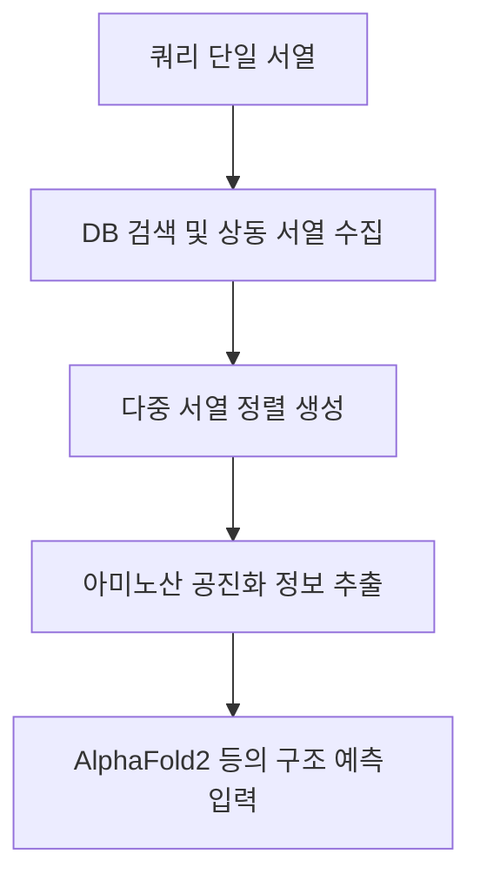
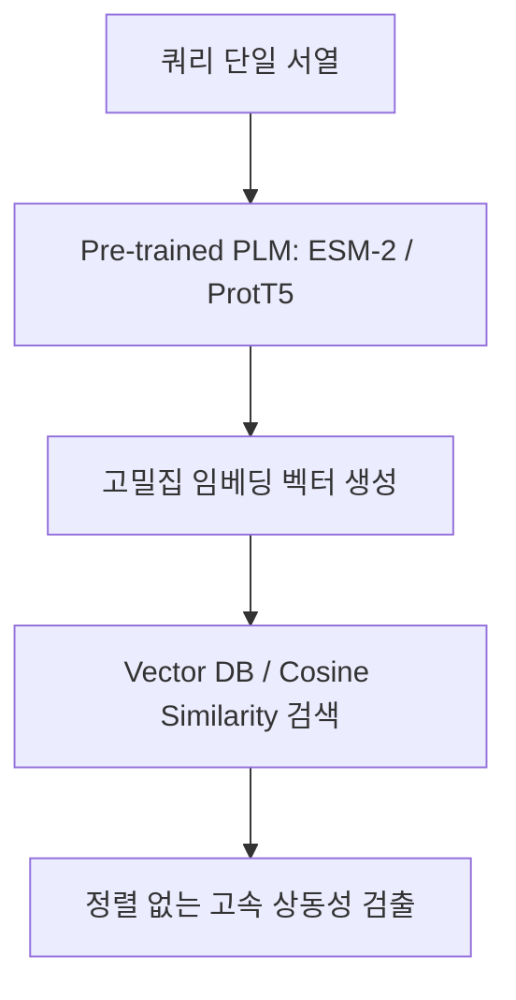

단백질 생명정보학(Bioinformatics) 및 단백질체학(Proteomics) 분야에서 **상동성 탐색(Homology Search)은** 새로운 단백질의 기능을 예측하고 3차원 구조를 규명하는 데 있어 가장 기초적이면서도 핵심적인 과정입니다. 

자연계의 모든 생명 활동은 **서열(Sequence) $\rightarrow$ 구조(Structure) $\rightarrow$ 기능(Function)이라는** 분자생물학의 중심 원리(Central Dogma)를 따릅니다. 따라서 미지의 단백질 서열을 발견했을 때, 기존 데이터베이스에서 이와 진화적 연관성을 가지는 상동 단백질(Homologue)을 정확하고 빠르게 찾아내는 기술은 신약 개발, 백신 설계, 생물학적 메커니즘 규명의 성패를 가릅니다.

전통적인 서열 비교 방식인 BLAST에서 시작하여 다중 서열 정렬(MSA)을 거쳐, 단백질 구조 데이터의 급증으로 인한 구조 템플릿 탐색(Template Search), 그리고 최근 딥러닝 기반의 단백질 언어 모델(Protein Language Model, PLM)을 활용한 임베딩 탐색에 이르기까지 탐색 패러다임은 끊임없이 진화해 왔습니다.

본 포스팅에서는 단백질 분석 연구에 사용되는 **세 가지 핵심 탐색 패러다임(MSA, Template, PLM Search)의** 구체적인 방법론과 장단점, 대표적인 도구들을 전문가와 입문자 모두 이해하기 쉽도록 깊이 있게 비교 분석해 보겠습니다.

---

## 1. 다중 서열 정렬 탐색 (MSA Search)

### 1.1. 생물학적 배경: 공진화(Co-evolution) 정보의 중요성
단백질이 세대를 거치며 진화할 때, 아미노산 서열(1차 구조)에는 수많은 돌연변이가 발생합니다. 하지만 단백질의 3차원 구조와 고유 기능은 생명체의 생존에 직결되기 때문에 강한 선택 압력(Selective Pressure)을 받아 보존됩니다.

이때 중요한 개념이 바로 **공진화(Co-evolution)입니다.** 단백질 3차원 접힘 구조 내에서 물리적으로 밀착하여 상호작용하는 두 아미노산 잔기(Residue)가 있다고 가정해 봅시다. 
* 예컨대 잔기 A(양전하를 띤 Lysine)와 잔기 B(음전하를 띤 Aspartate)가 이온 결합(Salt Bridge)을 형성하고 있다면, 진화 과정에서 잔기 A가 전하를 잃은 Alanine으로 돌연변이될 때 단백질 구조가 무너지지 않으려면 잔기 B 역시 이에 대응하여 보완적인 형태로 함께 변이(Covariation)해야 합니다.

이러한 수많은 진화 이력을 여러 상동 서열들을 수직으로 나란히 정렬하여 통계적으로 포착해 낸 것이 **다중 서열 정렬(Multiple Sequence Alignment, MSA)입니다.** AlphaFold2와 같은 현대 구조 예측 모델은 이 MSA에 기록된 열(Column) 간의 상관관계를 추출함으로써 단백질 3차원 공간 상의 거리와 각도를 정밀하게 복원합니다.

---

### 1.2. 세부 방법론 (Methodology)

#### A. 프로필 은닉 마르코프 모델 (Profile-HMM)
단순한 1대1 서열 비교(예: BLAST)는 아미노산 하나하나가 독립적으로 변환된다고 가정하며, BLOSUM62와 같은 범용 치환 행렬(Substitution Matrix)을 사용합니다. 반면 **Profile-HMM은** 서열 패밀리 내에서 특정 위치가 가지는 독특한 진화적 자유도를 확률 정보로 공식화합니다.

HMM 모델은 정렬된 MSA의 각 열(Column) 마다 다음 세 가지 상태(State)를 부여합니다:
1.  **Match State ($M_i$)**: 해당 위치에서 특정 아미노산이 관찰될 방출 확률(Emission Probability $e_{M_i}(a)$).
2.  **Insertion State ($I_i$)**: 해당 위치 사이에 새로운 아미노산이 삽입될 확률 및 전이 확률.
3.  **Deletion State ($D_i$)**: 진화 과정에서 해당 위치의 아미노산이 결실될 확률.

이러한 수학적 모델 설계를 통해 특정 위치가 루프(Loop) 영역이라 변이가 자유로운지, 아니면 활성 부위(Active Site)라 극도로 보존되어야 하는지를 확률적으로 표현하여 탐색의 민감도를 극대화합니다.

#### B. HMM-HMM 프로필 비교 (Profile-Profile Alignment)
**HHsearch** 및 **HHblits로** 대표되는 이 기법은 단일 서열을 프로필에 정렬하는 것을 넘어, **두 개의 Profile-HMM 자체를 정렬합니다.** 즉, 쿼리 단백질을 기반으로 구축한 HMM 확률 분포와 데이터베이스 내 서열 패밀리들의 HMM 확률 분포 간의 유사성을 Viterbi 알고리즘 등을 통해 동적 계획법(Dynamic Programming)으로 계산합니다. 이는 두 단백질 그룹의 진화적 경로(Evolutionary Trajectory) 자체를 비교하는 것이기에, 단순 서열 정렬로는 도저히 찾을 수 없는 머나먼 조상 단백질(Remote Homologue)을 찾아낼 수 있습니다.

#### C. k-mer 인덱싱 필터링 (MMseqs2)
Profile-HMM 비교는 민감도가 높지만 계산 복잡도가 극도로 높습니다. **MMseqs2**는 이 한계를 해결하기 위해 초고속 2단계 필터링 시스템을 도입했습니다:
1.  **k-mer 검색**: 데이터베이스의 모든 서열을 단어 단위(k-mer, 보통 7개 아미노산 크기)로 쪼개어 인덱싱합니다. 쿼리 서열에서 추출한 k-mer들과 유사도 점수가 문턱값(Threshold) 이상인 서열들을 해시 테이블을 통해 빛의 속도로 스캔합니다.
2.  **정밀 정렬**: 이 1차 필터를 통과한 극소수의 후보 서열에 대해서만 지연 평가(Lazy Evaluation)를 적용하여 Smith-Waterman 로컬 정렬을 수행합니다. 이로 인해 HMMER 대비 수백~수천 배 빠른 속도로 대량의 MSA를 추출할 수 있게 되었으며, 이는 **ColabFold**가 AlphaFold2 서비스를 대중화하는 중추적인 기술이 되었습니다.

---

### 1.3. 장점과 한계
*   **장점**:
    *   **풍부한 진화 기하학적 단서**: 단순 유사도를 넘어 잔기 간의 물리적 거리, 접촉 지도(Contact Map)를 유추할 수 있는 공진화 변이 행렬을 얻을 수 있어 고정밀 3D 구조 예측에 필수적입니다.
    *   **정밀한 잔기 정렬**: 잔기 단위(Residue-level)의 1대1 매칭이 제공되므로 활성 부위의 아미노산 돌연변이(Single Amino Acid Variant, SAV)가 기능에 미치는 영향을 완벽히 모사할 수 있습니다.
*   **한계**:
    *   **데이터베이스 정체와 계산 지연**: 메타게노믹스 데이터의 급증으로 서열 DB 크기가 페타바이트 단위로 증가함에 따라 탐색 속도가 파이프라인의 극심한 병목이 됩니다.
    *   **고아 단백질(Orphan Protein) 장벽**: 진화적 역사에서 홀로 떨어져 나와 상동 서열이 발견되지 않는 고아 단백질이나 완전히 새롭게 인공 설계된 단백질(De novo designed proteins)은 MSA를 아예 만들 수 없어 예측 신뢰도가 급락합니다.

---

## 2. 구조 템플릿 탐색 (Template Search)

### 2.1. 생물학적 배경: 서열의 황혼 지대(Twilight Zone)와 구조 보존성
생명정보학에는 서열 유사도가 약 20~35% 이하로 떨어지면 기존의 시퀀스 정렬 알고리즘들이 무작위 매칭과 구별하기 힘들어지는 구역을 **'황혼 지대(Twilight Zone)'** 혹은 **'암흑 지대(Midnight Zone, 유사도 < 10%)라고** 부릅니다. 

하지만 놀랍게도 이 지대에 속한 단백질 중 상당수는 3D 공간 상에서 겹쳐 보았을 때 거의 완벽히 동일한 접힘(Fold) 모양을 지니고 있습니다. 이는 자연이 단백질을 진화시킬 때 서열은 자유롭게 바꾸되 물리적으로 기능할 수 있는 뼈대 구조는 보존하기 때문입니다. 구조 템플릿 탐색은 바로 이러한 기하학적 형태의 불변성을 이용해 황혼 지대를 우회합니다.

---

### 2.2. 세부 방법론 (Methodology)

#### A. 기하학적 3D 중첩 및 TM-score
전통적인 구조 비교는 3차원 좌표계 상에서 두 단백질 구조의 탄소 백본($C_\alpha$ atoms)을 겹치는 방식으로 진행됩니다. 대표적인 도구인 **TM-align**은 Kabsch 알고리즘(특이값 분해, SVD 기반)을 사용하여 회전 변환 행렬 $R$과 평행 이동 벡터 $T$를 구해 아래 식과 같은 **TM-score**를 최대화합니다:

$$TM\text{-score} = \max \left[ \frac{1}{L_{\text{target}}} \sum_{i=1}^{L_{\text{common}}} \frac{1}{1 + \left(\frac{d_i}{d_0(L_{\text{target}})}\right)^2} \right]$$

여기서 $d_i$는 최적 중첩 후 두 단백질의 $i$번째 잔기 쌍 사이의 유클리드 거리이며, $d_0$는 단백질 길이에 따른 정규화 인자입니다. RMSD와 달리 TM-score는 단백질 길이에 독립적이며, 국소적 루프 영역의 에러에 과도하게 흔들리지 않습니다. 일반적으로 **TM-score가 0.5 이상이면 동일한 글로벌 접힘(Fold) 구조를** 공유한다고 판단합니다.

#### B. 3Di 구조 알파벳 이산화 (Structural Alphabet)
TM-align은 모든 잔기 쌍의 거리를 탐색해야 하므로 구조 데이터베이스가 수백만 개만 되어도 탐색이 불가능할 정도로 느립니다. **Foldseek**는 이 연산을 1D 서열 매칭으로 변환하기 위해 **3Di (3D-interaction) structural alphabet** 기법을 제안했습니다.

1.  **로컬 기하 구조 추출**: 임의의 잔기 $i$에 대해, 단백질 내부 3D 공간 상에서 가장 가까이 맞닿아 있는 잔기 $j$를 찾습니다. 두 잔기의 주쇄($N, C_\alpha, C, O$) 좌표를 바탕으로 가상의 가상 이면각(Dihedral Angles)과 두 잔기 간의 거리를 추출하여 총 10차원의 기하 벡터를 구성합니다.
2.  **가우시안 혼합 모델(GMM) 기반의 양자화**: 이 10차원 연속체 기하 정보를 미리 정의된 20개의 대표적인 3D 물리적 상태(States)로 군집화하여 알파벳 문자 `a`부터 `t`까지로 맵핑합니다.
3.  **1차원 서열화**: 이 과정을 통해 3D 단백질은 `ADCEH...`와 같은 **3Di 문자열로** 변환됩니다. 이후 기존의 강력한 MMseqs2 정렬 알고리즘을 3Di 문자열에 바로 적용함으로써, 기하학적 3D 비교 연산을 1차원 문자열 매칭 속도로 처리합니다.

---

### 2.3. 장점과 한계
*   **장점**:
    *   **황혼 지대의 원격 상동성 규명**: 서열 매칭이 아예 불가능한 상동 단백질조차 3D 백본 모양의 일치성을 토대로 잡아낼 수 있어 생명의 역사적 연결고리를 밝히는 강력한 수단이 됩니다.
    *   **가상 물리 시뮬레이션 활용**: 실제 3D 템플릿의 공간 좌표가 확보되므로 신약 후보 물질과의 도킹 시뮬레이션(Molecular Docking)이나 결합 부위 분석에 즉시 매핑할 수 있습니다.
*   **한계**:
    *   **예측/실험 구조 정보 선행 요구**: 탐색을 시작하기 위해 쿼리 단백질의 정확한 3D 좌표 정보가 반드시 존재해야 합니다. (다행히 AlphaFold의 등장으로 고품질 예측 구조가 많이 보급되어 이 한계는 많이 완화되었습니다.)
    *   **유연한 도메인 정렬 실패**: 두 개의 안정된 도메인이 연결 루프에 의해 자유롭게 꺾이는 구조(Domain hinge motion)의 경우, 정적 3D 비교에서는 다른 폴드로 오인될 가능성이 큽니다.

---

## 3. 단백질 언어 모델 탐색 (PLM Search)

### 3.1. 생물학적 배경: 단백질 서열 독해와 의미론적 표상(Semantic Representation)
최근 인공지능 분야의 트랜스포머(Transformer) 기술은 단백질 공학에도 깊숙이 침투했습니다. 생명체의 단백질 서열을 하나의 '문장', 아미노산들을 '단어'로 간주하여 수억 개의 서열 데이터셋(예: UniRef50)으로 모델을 학습시킵니다. 

이때 사용되는 대표적인 기법이 **Masked Language Modeling (MLM)입니다.** 서열의 일부 아미노산을 무작위로 빈칸 처리(`M-A-[MASK]-L-K...`)하고 모델에게 앞뒤 문맥을 바탕으로 빈칸에 들어갈 아미노산을 맞추도록 강제합니다. 신경망은 이 문제를 푸는 과정에서 아미노산들의 전하, 친수성/소수성 정보뿐 아니라 나선/병풍 등의 2차 구조 형성 경향성, 그리고 장거리 결합 조건과 같은 단백질 우주의 규칙들을 **모델 내부의 Attention 가중치에 자연스럽게 내재화하게** 됩니다.

---

### 3.2. 세부 방법론 (Methodology)

#### A. 고차원 밀집 벡터(Embedding) 표상 및 Global Pooling
단백질 서열(길이 $L$)을 사전 학습된 대형 PLM(예: ESM-2)에 통과시키면 각 아미노산 잔기 위치마다 신경망의 히든 레이어 값인 $D$차원(ESM-2의 경우 보통 1280차원)의 벡터가 출력됩니다. 이 결과물은 단백질 전체에 대해 $[L, 1280]$ 크기의 텐서가 됩니다.

전체 단백질 간의 고속 탐색을 수행하기 위해 이 텐서를 단일 벡터로 축소하는 **Average Pooling**을 수행합니다:
$$\mathbf{v}_{\text{protein}} = \frac{1}{L} \sum_{i=1}^{L} \mathbf{x}_i$$
이렇게 얻어진 1280차원의 단일 밀집 벡터 $\mathbf{v}_{\text{protein}}$는 단백질 전체의 물리화학적·진화적 상태를 압축 표현한 고유 좌표 역할을 합니다.

#### B. 임베딩 벡터 검색 (Vector Search & Alignment-free)
두 단백질 벡터 $\mathbf{A}$와 $\mathbf{B}$ 사이의 상동성을 평가할 때, 더 이상 루프를 돌며 정렬을 계산하지 않고 단순한 벡터 기하 연산인 **코사인 유사도(Cosine Similarity)**를 측정합니다:

$$\text{Similarity}(\mathbf{A}, \mathbf{B}) = \frac{\mathbf{A} \cdot \mathbf{B}}{\|\mathbf{A}\| \|\mathbf{B}\|}$$

데이터베이스에 있는 수억 개의 단백질 서열들을 미리 이 고차원 벡터로 변환하여 **Faiss**나 **Milvus** 같은 고속 벡터 라이브러리에 저장(Vector Indexing)해 두면, 쿼리 벡터 하나와의 코사인 유사도가 가장 높은 상위 1% 단백질들을 밀리초(ms) 단위로 완벽하게 스캔할 수 있습니다. 이것이 **정렬이 필요 없는(Alignment-free) 탐색의** 실체입니다.

#### C. 임베딩 기반 로컬 정렬 (pLM-BLAST) 및 PLMSearch
전체 유사도 매칭 외에 잔기 단위의 정밀한 매핑이 필요한 경우를 보완하기 위한 도구들도 등장했습니다.
*   **pLM-BLAST**: 두 단백질 서열의 잔기 벡터인 $[L_1, 1280]$과 $[L_2, 1280]$ 간의 코사인 유사도를 계산하여 크기가 $[L_1, L_2]$인 유사도 점수 매트릭스를 만듭니다. 여기에 Smith-Waterman 동적 계획법 알고리즘을 얹어 최적의 정합 경로를 추적합니다. 이는 아미노산 기호 매칭 대신 신경망이 이해한 문맥적 유사도를 매칭하는 것이기에 훨씬 부드럽고 유연한 로컬 얼라인먼트가 가능해집니다.
*   **PLMSearch**: 2024년 발표된 최신 연구로, ESM-2 임베딩 공간에서 **SSV (Shared Similarity Vector)** 방식을 도입해 대형 벡터 DB 서열들 중 원격 상동성(Remote Homologue) 후보들을 1차 압축하고 필터링합니다. 서열 분석만으로 Foldseek 수준의 정확도를 냄으로써 구조 없이 원격 상동성을 찾아내는 최고 수준의 성능을 구현했습니다.

---

### 3.3. 장점과 한계
*   **장점**:
    *   **속도의 기적**: 1대1 정렬 동적 계획법 연산을 완벽히 생략하고 행렬 곱 연산과 근사 최근접 이웃(ANN) 알고리즘으로 대체하여 대규모 데이터베이스 검색 성능을 극한으로 올릴 수 있습니다.
    *   **구조가 필요 없는 구조적 통찰**: 사용자는 단순 서열 정보만 입력하지만, PLM 모델 내부의 기학습된 생물학적 지식을 끌어다 쓰기 때문에 구조 모델링 없이도 3D 구조 보존 수준의 원격 상동성을 발견할 수 있습니다.
*   **한계**:
    *   **미세 돌연변이 필터링 한계**: 임베딩 벡터의 평균(Pooling) 과정에서 전체 정보가 뭉개지기 때문에, 활성 부위에 단 하나의 아미노산 변이로 단백질 활성이 완전히 꺼지거나 켜지는 국소적인 기능적 변환을 감지하기는 무리가 있습니다.
    *   **GPU 인프라 의존성**: ESM-2(30억 개 파라미터 등)와 같은 초거대 인공지능 모델을 구동하고 실시간 임베딩을 추론하려면 고가의 GPU와 메모리 연산 인프라가 상시 요구됩니다.

---

## 4. 세 가지 탐색 패러다임 심층 비교 매트릭스

| 비교 지표 | MSA Search (다중 서열 정렬) | Template Search (구조 템플릿) | PLM Search (언어 모델 임베딩) |
| :--- | :--- | :--- | :--- |
| **원리와 메커니즘** | HMM 확률 통계 모델링 기반의 위치 특이적 정렬 | 물리적 3D 원자 좌표 중첩 연산 또는 3Di 구조 알파벳 정렬 | 트랜스포머 기반 신경망 임베딩 벡터 간 코사인 유사도 연산 |
| **핵심 입력 정보** | 쿼리 단일 서열 (Query Sequence) | 3차원 백본 구조 정보 (PDB/mmCIF) | 쿼리 단일 서열 (Query Sequence) |
| **탐색 대상 데이터베이스** | UniRef90, ColabFold DB, BFD | PDB, AlphaFold DB, ESMAtlas | 사전 계산된 단백질 임베딩 DB |
| **원격 상동성 감지 (Sensitivity)** | 보통~좋음 (상동체 깊이가 얕으면 실패) | **최상** (구조적 불변성 덕분에 완벽 작동) | **우수** (서열만으로 구조 정보 유추 가능) |
| **시간 복잡도 (Speed)** | **매우 느림 ($O(N \cdot L^2)$ 등 대형 DB 정체)** | **매우 빠름** (Foldseek 3Di 기준 $O(N \cdot L)$) | **최고 속도** (벡터 연산 및 ANN 가속화 적용) |
| **대표적인 생물 정보 도구** | HMMER, HHblits, MMseqs2 | TM-align, Foldseek, HHsearch | PLMSearch, pLM-BLAST |
| **가장 권장하는 유스케이스** | 정밀 잔기 보존성 평가 및 AlphaFold2 구조 예측을 위한 공진화 데이터 수집 | 신약 개발 시 도킹 템플릿 확보, 황혼 지대 원격 유사 단백질 발견 | 메타게노믹스 유래 수억 개 미지의 유전자 고속 분류 및 기능 클러스터링 |

---

## 5. 결론 및 연구 인사이트: 단백질 분석의 미래 트렌드

현대 단백질 생명정보학 연구의 트렌드는 단일 패러다임에 고착되지 않고, 각 탐색 기술의 이점을 결합하는 **하이브리드 파이프라인(Hybrid pipeline orchestration)의** 정립으로 나아가고 있습니다.

1.  **Orphan Protein의 해결**: 
    전통적인 MSA Search 방식은 메타게노믹스 연구에서 쏟아져 나오는 수많은 '미지의 유전자 암흑 물질(Biological dark matter)' 앞에 속수무책이었습니다. 하지만 **PLM Search를** 통해 단일 서열만으로 1차 유사 기능 군집을 선별하고, 곧바로 ESMFold 등으로 고속 3D 구조를 생성한 뒤 **Foldseek(Template Search)로** 최종 확인을 거쳐 새로운 신종 도메인의 기능 주석(Functional Annotation)을 완수하고 있습니다.
2.  **구조 예측의 진화**:
    구조 예측 모델 역시 MSA 생성의 병목을 생략하기 시작했습니다. ESMFold, OmegaFold 등은 MSA Search 없이 PLM 임베딩의 특징(Representation) 자체를 아키텍처에 통과시켜 단 수 초 만에 구조를 예측해 냅니다. 이는 언어 모델이 단백질 우주의 규칙을 충분히 학습했음을 입증하는 대표적인 사례입니다.
3.  **데이터베이스 관리와 인덱싱**:
    앞으로 데이터베이스가 수십 배 더 증가하더라도 생물정보 분석가들은 하드웨어 제약을 피할 것입니다. PLM 임베딩 데이터는 일종의 해시 인덱스처럼 활용되고 있으며, 고품질 검증이 필요할 때만 선별적으로 MSA 및 물리적 3D structural alignment를 수행하는 적응형 검색 시스템이 대세가 될 것입니다.

결국 단백질 탐색에 완벽한 만능 열쇠(Silver bullet)는 없습니다. 각 기술 패러다임의 계산 비용, 입력 요구 사항, 그리고 도출하고자 하는 해상도(Residue-level vs Global fold-level)를 명확히 정의하고 파이프라인을 설계하는 분석 능력이 단백질 디자이너들에게 가장 강력한 경쟁력이 될 것입니다.

---

### 참고 문헌 및 자료 출처
1.  **HHblits / HHsearch (Profile-HMM)**: Remmert, M., Biegert, A., Hauser, A., & Söding, J. (2011). HHblits: lightning-fast iterative protein sequence searching by HMM-HMM alignment. *Nature Methods*, 9(2), 173-175. [https://doi.org/10.1038/nmeth.1818](https://doi.org/10.1038/nmeth.1818)
2.  **MMseqs2 (k-mer Index Filtering)**: Steinegger, M., & Söding, J. (2017). MMseqs2 enables sensitive protein sequence searching for the analysis of massive datasets. *Nature Biotechnology*, 35(11), 1026-1028. [https://doi.org/10.1038/nbt.3988](https://doi.org/10.1038/nbt.3988)
3.  **Foldseek (3Di Structural Alphabet)**: van Kempen, M., Reinhard, S. S., Alva, V., Kryshtafovych, A., & Steinegger, M. (2023). Fast and accurate protein structure search with Foldseek. *Nature Biotechnology*, 41(8), 1161–1169. [https://doi.org/10.1038/s41587-023-01773-0](https://doi.org/10.1038/s41587-023-01773-0)
4.  **PLMSearch (Shared Similarity Vector Search)**: Liu, W., Wang, Z., You, R., Xie, C., Wei, H., Xiong, Y., Yang, J., & Zhu, S. (2024). PLMSearch: Protein language model powers accurate and fast sequence search for remote homology. *Nature Communications*, 15, 2785. [https://doi.org/10.1038/s41467-024-46808-5](https://doi.org/10.1038/s41467-024-46808-5)
5.  **pLM-BLAST (Residue Embedding Local Alignment)**: Kamiński, K., Ludwiczak, J., Pawlicki, K., Alva, V., & Dunin-Horkawicz, S. (2023). pLM-BLAST: distant homology detection based on direct comparison of sequence representations from protein language models. *Bioinformatics*, 39(10), btad579. [https://doi.org/10.1093/bioinformatics/btad579](https://doi.org/10.1093/bioinformatics/btad579)

---
긴 글 읽어주셔서 감사합니다! 

**Contact & Inquiries**
- LinkedIn : [Sehoon Park](https://www.linkedin.com/in/sehoon-park)
- GitHub : [https://github.com/sehooni](https://github.com/sehooni)
- Email : 74sehoon@gmail.com
- 궁금한 점이나 의견은 댓글 혹은 메일을 통해 언제든 환영합니다! :)
